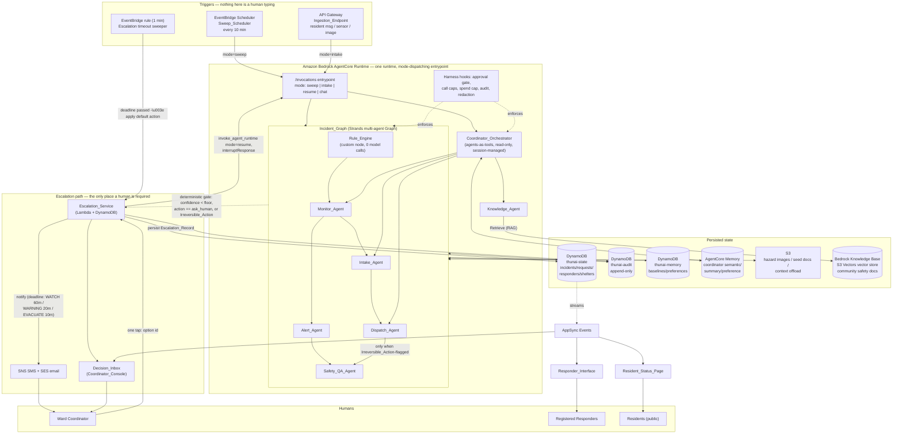
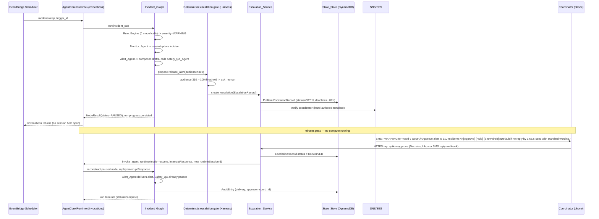
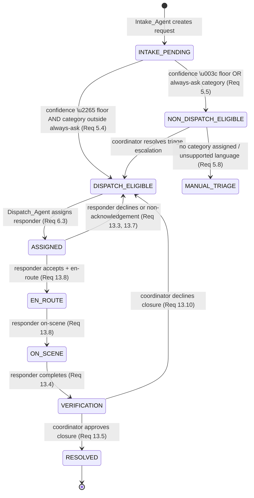

# Design Document: ThunAI Neighbourhood Emergency Response Agent

## Overview

ThunAI is a background multi-agent system that runs the flood-response coordination work for the Kollidam Ward-7 Neighbourhood Flood Committee (1 coordinator, 14 responders, 3 shelters / 120 spaces, ~900 residents on a monitored river reach). It is a **Good Neighbor Agents** entry for the AWS "Agents for Humans" hackathon, built on the Strands Agents SDK and deployed to Amazon Bedrock AgentCore.

The judged premise this design is built around: *the agent runs autonomously and only surfaces when there's a real decision to make.* Concretely:

- Nothing in the demo starts because a human typed a prompt. Runs start from `Sweep_Scheduler` (EventBridge Scheduler) or `Ingestion_Endpoint` (API Gateway, receiving resident messages, sensor payloads, and hazard images).
- Safety-critical thresholds (`Rule_Engine`) are evaluated by deterministic Python code with **zero model invocations** — the point at which the ward is "at risk" is not an LLM's opinion.
- Everything else — interpreting readings, understanding a resident's free-text message, choosing a responder, composing multilingual alerts, reviewing outbound content — is genuinely a job for a language model, and is done by a small set of narrowly-scoped Strands agents, each justified in §3.1.
- Every typed decision the system produces carries a `confidence` field and a closed `action` enum that includes an explicit `ask_human` value (Req 10.3). A **single deterministic authority** — the `Escalation_Policy` module, enforced through Strands hooks and a deterministic HITL classifier, never through free-form model judgement — decides whether that decision executes or pauses for a human (§3.4).
- When it pauses, it uses Strands' interrupt/resume mechanism to return control cleanly rather than blocking a compute session for hours, persists everything needed to resume in a **different process**, and delivers a hand-authored (not model-generated) message to the coordinator with what was decided, why they're being asked, the stakes, the default if ignored, and one-tap options (Req 11.3).
- The coordinator's tap resumes the paused run, the run finishes, and every step — automatic or escalated — lands in an append-only `Audit_Ledger`.

The resident records and the hazard-sensor readings used in the seed dataset, tests, and the recorded demo are synthetic — but the AWS services holding, acting on, and displaying them are live (the only synthetic *backend* anywhere is the sensor feed; see design principle 5). ThunAI is a coordination aid for a volunteer committee, not an official emergency service, and this disclaimer is surfaced on every resident-facing view (Req 18.1, 18.6).

### Design principles carried through every section below

1. **One authority per decision.** A given autonomy decision is gated by exactly one deterministic mechanism. Section 3.4 makes this explicit because Req 10 and Req 16 both speak to it and a design that let two mechanisms disagree would be a correctness bug, not just an architecture smell.
2. **Deterministic code for anything safety-critical or auditable; a model only where free text, trade-offs, or natural language genuinely require one.** This is `idea.md`'s own framing (§8–9) and it is treated as load-bearing, not decorative.
3. **Pause is "return and persist", never "block".** An AgentCore Runtime session has a default 900s idle timeout; a paused escalation can legitimately sit for up to two hours (`WATCH` deadline). The architecture therefore never holds a runtime session open across a human decision.
4. **Every write is idempotent, every schedule tick is bounded, every failure is recorded — never silent.** Req 1.6, 15.2–15.11, 16.7–16.9.
5. **Real by default; only the sensor feed is synthetic.** ThunAI is a full-fledged cloud-deployed system: State_Store, the `Knowledge_Base` (Bedrock Knowledge Base on an S3 Vectors vector store), `Notification_Provider` (SNS SMS + SES email), the real-time push interface, authentication, and the agent runtime all run against live AWS services in the demonstrated system. The **only** interface with a synthetic backend is `Sensor_Provider`, selected by the `Synthetic_Sensor_Flag`, because a real flood cannot be summoned on demand — every other tool queries and mutates real data (Req 19.5). Synthetic *data* (synthetic resident records, synthetic hazard readings) is distinct from synthetic *backends*: the data is synthetic for privacy and demonstrability, but the stores holding it and the tools acting on it are real. CI tests use in-process test doubles for every interface (Req 21.10) — a testing mechanism, not the deployed system.

---

## Architecture

### High-level component diagram



**Escalation rule shown on this diagram** (the label the architecture diagram export must carry, per Req 22.8): *escalate when `confidence < 0.75`, OR the decision's `action == ask_human`, OR the action is a member of `always_ask` (evacuation order, mass broadcast to \>100 recipients, shelter closure, request closure, dispatch to a non-ambulatory occupant) — otherwise execute autonomously and log it.*

### Design Question 1 — Runtime topology: one AgentCore Runtime, mode-dispatched

**Decision: a single AgentCore Runtime**, fronted by one `bedrock_agentcore.runtime.BedrockAgentCoreApp` with one `@app.entrypoint`. The payload carries a `mode` discriminator (`sweep`, `intake`, `resume`, `chat`) and the entrypoint dispatches to `run_incident_graph()`, `run_coordinator_chat()`, or `resume_paused_node()`.

This is not a default reached by omission — it is required by the requirements and it is also the better engineering answer:

- **Req 19.3 is singular**: "expose **exactly one** invocation endpoint and exactly one health endpoint." A one-runtime-per-agent-role design would need either N runtimes (violating 19.3 outright) or a router service in front of N runtimes (adding a network hop and a second thing to keep healthy, for no requirement that asks for it).
- **IAM least privilege (Req 18.3)** is enforced at the *tool* level, not the *runtime* level, in this design: each agent role gets its own system prompt and its own tool set (§3.1), and the single execution role is the union of what those tools need — scoped to named DynamoDB tables, named S3 prefixes, named model IDs, and nothing else. Splitting into multiple runtimes would not shrink that union; it would just duplicate the role N times.
- **Cold start and latency budgets.** Every latency-bearing requirement (Req 1.2–1.4: 10s to start a run; Req 4.4: 120s per node) is dominated by model call latency, not by which runtime received the request. A `CodeZip` Python build on AgentCore Runtime has a cold start in the low single-digit seconds; splitting agents across runtimes would multiply cold starts (one per role touched in a run) instead of paying it once per run.
- **Session isolation** (the property multiple runtimes might seem to buy you) is already provided per-conversation by `runtimeSessionId`, not by the runtime resource itself. `Coordinator_Orchestrator`'s long-lived chat session and a `sweep` run's short-lived session are already isolated because they use different `runtimeSessionId` values against the same runtime.
- **Audit correlation.** One `run_id` per invocation, one runtime, one place to look up `GetAgentRuntime`/CloudWatch traces for a given run — this directly serves Req 1.7 and Req 20.1–20.3.

The tradeoff accepted: all agent roles share one execution role and one container image, so a bug in one role's dependency set can in principle affect the deploy of all roles. This is mitigated by keeping the image small (Python 3.13 slim, arm64 wheels only) and by CI running the full Eval_Suite (§7) against every change before it reaches the default branch.

### Design Question 2 — Where the graph runs vs. where escalation waiting happens

**The rule: nothing ever blocks inside `/invocations` waiting on a human.** `Incident_Graph` always runs start-to-either-completion-or-pause inside a single invocation; the *waiting* happens entirely in DynamoDB + EventBridge/SNS, outside any compute session.



Mechanically, three things happen at the pause point, all inside the *same* invocation before it returns:

1. The deterministic gate (§3.4) decides `ask_human` and calls `Escalation_Service.create_escalation(...)` directly — a plain Python call, not a Strands SDK primitive. This persists the `Escalation_Record` (Req 11.1) and fires the notification (Req 11.2) synchronously, before the invocation returns.
2. The node's own **run progress** is persisted to `State_Store` under the incident's `Idempotency_Key` (Req 15.5): which node paused, what its inputs were, and — if that node was mid-tool-call inside a Strands `Agent` using `HumanInTheLoop` — the `interruptId` from `result.interrupts[0].id`.
3. The Incident_Graph's own thin execution driver (see below) stops advancing further nodes and returns a `MultiAgentResult` with a `paused` status; the entrypoint function serialises that as its response and returns. No thread, session, or microVM is held waiting.

Resume is a **separate, later invocation** (`mode=resume`), triggered either by the coordinator's tap (via `Escalation_Service`) or by the timeout sweeper applying the default action. It supplies the persisted `run_id`/`incident_id` and the `interruptId` + response. The entrypoint looks up run progress, reconstructs the paused node (a fresh Strands `Agent` object — cheap, no model call, built from the same static config every time), and either:
- replays `agent([{"interruptResponse": {"interruptId": ..., "response": <option>}}])` if that node used `HumanInTheLoop` interrupt/resume, or
- simply calls the next step in the graph driver with the recorded decision if the pause was raised by the deterministic gate directly (no SDK interrupt object involved at all — see the `HumanInTheLoop`-vs-plain-persistence split below).

**Why the Incident_Graph is driven by our own thin scheduler rather than one bare `graph(...)` call.** `GraphBuilder` gives us the declared node/edge/entry-point structure Req 4.1 requires, and we use it as the source of truth for that structure and for `result.execution_order`. But whether a Strands `Graph`'s built-in execution can itself be suspended mid-run and resumed in a different process, with only *some* member nodes interrupt-capable, is **not confirmed** by the documentation available (open item, §9). Rather than depend on unverified behaviour for something this central to the demo, ThunAI executes the declared graph with an explicit driver: `run_graph_step(graph_spec, incident_ctx) -> NodeOutcome` that walks `graph_spec.execution_order_for(ready_nodes)`, invokes each ready node (which may itself be a full `Agent.__call__` or `MultiAgentBase.invoke_async`), and stops the whole run the moment any node reports `paused`. This driver still reports `execution_order` (Req 4.5) and still honours the timeouts and max-node-count from `GraphBuilder`'s config (Req 4.4) — those are read from the same `GraphBuilder` object and enforced by the driver — so the declared-topology guarantees of Req 4.1/4.2 hold, while pause/resume is implemented with primitives we can fully verify.

### Design Question 3 — Reconciling `Escalation_Policy` with `HumanInTheLoop`: exactly one authority

Two things must never disagree about whether a given action needs a human, so there is exactly one place that decides:

**`thunai.policy.escalation.decide(decision: TypedDecision) -> Verdict`** — pure, deterministic Python (§3.4 has the full listing). It reads `confidence`, `action`, the request/incident category, and irreversibility, against the one `Escalation_Policy` module, and returns `EXECUTE` or `ASK_HUMAN` plus the reason. Nothing else in the codebase is allowed to hold a threshold value (Req 10.8).

Every agent node that can call a write tool wires this function in as the **classifier** for `HumanInTheLoop`:

```python
from strands.vended_interventions.hitl import HumanInTheLoop
from thunai.policy.escalation import decide, Verdict

def deterministic_classifier(tool_use: dict, agent_output) -> "ClassifierResult":
    """The ONLY function anywhere that decides ask-human vs. execute.
    Never an LLM call. See thunai.policy.escalation.decide.
    """
    from strands.vended_interventions.hitl.classifier import ClassifierResult
    verdict = decide(agent_output.structured_output)
    return ClassifierResult(
        requires_human_in_the_loop=(verdict.outcome is Verdict.ASK_HUMAN),
        reason=verdict.reason,
    )

dispatch_agent = Agent(
    name="dispatch_agent",
    tools=[find_candidate_responders, assign_responder, ...],
    interventions=[HumanInTheLoop(
        allowed_tools=["find_candidate_responders"],   # reads bypass the classifier entirely
        classifier=deterministic_classifier,             # writes are gated by OUR code, never the model
    )],
)
```

`HumanInTheLoop`'s `classifier` parameter accepts a plain callable returning a `ClassifierResult` — the SDK's LLM-judged `classifier=True` mode is **never used** in ThunAI. This gives ThunAI the SDK's interrupt/resume mechanics (`stop_reason == "interrupt"`, `result.interrupts[0]`) for the ergonomics of pausing a tool call mid-agent-loop, while the actual gating decision is 100% our deterministic code — satisfying Req 16.11 ("no system prompt instruction for enforcement... identical inputs produce identical enforcement decisions") *and* Req 11.4/11.5's requirement to use the SDK's interrupt/resume mode, without letting the two mechanisms become two independent judges of the same question.

The separate **Harness** hooks (Req 16, §6) are a different, additive layer: they don't decide *ask vs. execute*, they decide *is this call allowed to happen at all this run* (invocation caps, spend cap, notification cap) and *record it* (audit, redaction) — orthogonal to the escalation question and enforced on literally every tool call, escalated or not, via `BeforeToolCallEvent`/`AfterToolCallEvent`.

**Gateway tool name prefixing.** Tools exposed through an AgentCore Gateway target are named `${target_name}___${tool_name}` (three underscores). Where a node's `allowed_tools` list must reference a gateway-backed tool (e.g. the real, non-fixture sensor feed wrapped as `sensor-live___get_river_level`), the `allowed_tools` entries are generated from the same tool-registration list the agent is built with, never hand-typed, so a target rename can't silently create an unlisted, unguarded tool. `allowed_tools` also supports negation (`!tool_name`); ThunAI does not use negation, to keep the allow-list the single source of truth for "does not need human approval."

### Repository layout

```
ThunAI/
├── README.md
├── LICENSE                          # MIT, unmodified text
├── ARCHITECTURE.md                  # optional long-form companion to README diagram
├── docs/
│   └── architecture.png             # exported from the Mermaid diagram above
├── requirements.txt                 # pinned: strands-agents==1.54.0, strands-agents-tools==0.8.7, ...
├── .env.example                     # SYNTHETIC_SENSORS=1 by default; every var listed, no real values
├── .gitignore
├── agents/
│   ├── __init__.py
│   ├── config.py                    # ONE module: model ids, region, per-role temperature/max_tokens
│   ├── rule_engine.py                # custom MultiAgentBase node, 0 model calls
│   ├── monitor_agent.py
│   ├── intake_agent.py
│   ├── dispatch_agent.py
│   ├── alert_agent.py
│   ├── safety_qa_agent.py
│   ├── knowledge_agent.py
│   ├── coordinator_orchestrator.py
│   └── incident_graph.py             # GraphBuilder wiring + the thin pause-aware driver
├── tools/
│   ├── sensor_tools.py               # get_river_level / get_rainfall / get_dam_release
│   ├── incident_tools.py             # create/update incident, read baselines
│   ├── intake_tools.py               # resolve_location, detect_language, dedupe_check
│   ├── dispatch_tools.py             # find_candidate_responders, assign_responder
│   ├── alert_tools.py                # get_channel_limits, get_shelter_capacity, deliver_alert
│   ├── knowledge_tools.py            # retrieve_passages (live Bedrock KB, S3 Vectors)
│   └── escalation_tools.py           # create_escalation (called by the deterministic gate, not the model)
├── harness/
│   ├── hooks.py                      # ApprovalAuditHook, CallCountCap, SpendCap, NotificationCap
│   ├── redaction.py                  # field-level redaction before any log/trace/audit write
│   └── audit.py                      # append_audit_entry(), append-only enforcement helpers
├── policy/
│   ├── escalation_policy.py           # THE one module: thresholds, rationale, response deadlines
│   ├── rule_engine_rules.py           # threshold table + Rule_Set_Version
│   └── safety_policy.py               # Safety_QA policy identifiers + PII patterns
├── schemas/
│   ├── decisions.py                   # HazardAssessment, EmergencyRequest, DispatchDecision,
│   │                                   # AlertDraft, SafetyReview (Pydantic, all carry confidence+action)
│   ├── entities.py                    # Incident, Responder, Shelter, EscalationRecord, AuditEntry
│   └── lifecycle.py                   # Request_Lifecycle transition table + validator
├── integrations/
│   ├── __init__.py                    # provider resolver + live-resource/credential absent abort (Req 19.13)
│   ├── sensor_provider.py             # Protocol + SyntheticSensorProvider + LiveSensorProvider (SYNTHETIC_SENSORS)
│   ├── notification_provider.py       # Protocol + SnsSesNotificationProvider (LIVE ONLY, no synthetic backend)
│   └── knowledge_provider.py          # Protocol + BedrockKBKnowledgeProvider (LIVE, S3 Vectors KB, no synthetic backend)
├── memory/
│   ├── state_store.py                 # thunai-state DynamoDB access (entities, idempotency)
│   ├── audit_ledger.py                # thunai-audit DynamoDB access (append-only)
│   └── memory_store.py                # thunai-memory via strands_dynamodb_storage.DynamoDBStorage
├── surface/
│   ├── escalation_service.py          # create/resolve/timeout Escalation_Record, resume invocation
│   └── entrypoint.py                  # BedrockAgentCoreApp, mode dispatch, /invocations, /ping
├── triggers/
│   ├── sweep_lambda.py                 # EventBridge Scheduler target
│   ├── ingestion_lambda.py             # API Gateway target (resident msg / sensor / image)
│   ├── timeout_sweeper_lambda.py       # EventBridge (1 min) — apply default action past deadline
│   └── stream_publisher_lambda.py      # DynamoDB Streams -> AppSync Events
├── infra/                              # ONE Python CDK app
│   ├── app.py
│   ├── checks/arch_guard.py            # pre-synth arm64 verification (Req 19.2)
│   └── stacks/
│       ├── data_stack.py
│       ├── auth_stack.py
│       ├── knowledge_stack.py         # Bedrock Knowledge Base + S3 Vectors vector store + doc-source bucket + ingestion
│       ├── agentcore_stack.py
│       ├── triggers_stack.py
│       ├── escalation_stack.py
│       ├── realtime_stack.py
│       ├── observability_stack.py
│       └── frontend_stack.py
├── frontend/                           # React + TypeScript + Vite, deployed to Amplify Hosting
│   ├── src/
│   │   ├── coordinator/                # Coordinator_Console: Decision_Inbox, incident list, audit view
│   │   ├── responder/                  # Responder_Interface
│   │   ├── resident/                   # Resident_Status_Page (public)
│   │   └── shared/                     # AppSync Events client, auth, i18n
│   └── amplify.yml
├── seed/
│   ├── seed_dataset.json               # synthetic residents/responders/shelters — REAL rows written to DynamoDB by seed.sh
│   ├── hazard_readings/                # 35-day synthetic sensor series (replayed by SyntheticSensorProvider)
│   ├── knowledge_docs/                 # curated community safety documents ingested into the S3 Vectors KB
│   └── sample_messages/                # multilingual resident message samples (sent through the real ingestion endpoint)
├── evals/
│   ├── scenarios/                      # 20+ recorded scenarios (Req 21.1)
│   └── results/
├── tests/
│   ├── unit/
│   ├── property/                       # Hypothesis-based, one file per Correctness Property
│   └── integration/
├── scripts/
│   ├── seed.sh
│   ├── demo.sh
│   └── scan_credentials.sh
└── .github/workflows/ci.yml
```

---

## Components and Interfaces

### 3.1 Agent roles and why each one exists (Req 4.14, 4.12, 4.13)

Every role below gets a distinct `agent_id` and a distinct system prompt. Only `Coordinator_Orchestrator` is constructed with a session manager attached (Req 4.13); every `Incident_Graph` member agent is built fresh per node invocation with no session manager, consistent with the Strands rule that member agents in a Graph/Swarm must not carry one.

| Role | Why it exists as its own agent rather than folded into another | Justification detail |
|---|---|---|
| `Rule_Engine` | Not an LLM agent at all — a deterministic `MultiAgentBase` node. Exists separately so that **zero model invocations** touch the safety threshold decision (Req 2.1), which could not be guaranteed if threshold logic lived inside a prompt-driven agent's tool. | Single conflicting responsibility if merged: "compute an auditable, repeatable severity band" vs. "reason about noisy multi-source context" are different reliability requirements — one must never call a model, the other must. |
| `Monitor_Agent` | Owns "is this reading pattern a meaningful change." | Distinct tool surface (sensor + memory-baseline reads, incident create/update) from Intake (7 tools) and a distinct prompt responsibility ("interpret sensor time series") vs. Intake's ("interpret resident free text") — folding them gives one prompt two incompatible jobs and ~13 tools, past the ~15-20 tool selection-accuracy ceiling once Dispatch/Alert tools are added too. |
| `Intake_Agent` | Owns "turn one resident message into a typed, categorised request." | Needs image-reading and language-detection tools Monitor/Dispatch never touch; its prompt must actively resist inferring facts not stated (safety property, Req 5), a constraint that would leak into and weaken Monitor's inference-friendly prompt if merged. |
| `Dispatch_Agent` | Owns "match a request to a responder under capacity/equipment constraints." | Its tool set (candidate search, capacity read, assignment write) and its correctness obligations (no double-assignment, capacity floor — Req 6.4, 6.7) are unrelated to Intake's language-understanding job; a merged agent would need conflicting instructions "extract facts conservatively" + "commit to a specific resource allocation." |
| `Alert_Agent` | Owns "compose channel- and language-specific outbound content." | Needs a fan-out generation loop (channels × languages) that has nothing in common with Dispatch's single-decision job; keeping it separate is also what makes the required **parallel** alert/dispatch branches (Req 4.3) natural in the graph rather than forced. |
| `Safety_QA_Agent` | Owns "review proposed outbound content or irreversible actions against policy," independently of whoever produced them. | Must be structurally independent of the producing agent (Alert_Agent, Dispatch_Agent) — a self-review by the same agent that wrote the content is not a credible safety gate. This is the strongest "named conflicting responsibility" case: "produce persuasive, useful content" vs. "adversarially check that content for policy violations" are opposed goals that must not share one prompt. |
| `Knowledge_Agent` | Owns "answer a grounded question from a curated knowledge source with citations." | Different tool (Bedrock KB retrieve) and different failure mode (must refuse to answer ungrounded — Req 8.3) than any operational agent; merging would put "always cite or refuse" instructions in the same prompt as "propose the best available action," which are different postures. |
| `Coordinator_Orchestrator` | The one front door for ad-hoc coordinator questions ("what's the status of shelter B"), routed to specialists as tools. | Explicitly forbidden by Req 4.10 from holding any write tool — a single-agent alternative that both chatted with the coordinator *and* wrote incident/dispatch/alert data would violate that separation-of-power requirement directly; it exists to give Req 4.10/4.11 something to attach to. |

`Coordinator_Orchestrator` wraps the read-capable specialists as `@tool`-decorated functions:

```python
# agents/coordinator_orchestrator.py
from strands import Agent, tool

@tool
def ask_monitor(query: str) -> str:
    """Ask about current hazard readings, severity band, or recent trend for a river reach.
    Use for: "what's the river level", "is it rising", "what's the current severity".
    Do NOT use to create or modify an incident — this tool is read-only.
    """
    specialist = Agent(name="monitor_agent_ro", agent_id="monitor_ro",
                        system_prompt=MONITOR_READONLY_PROMPT,
                        tools=[get_current_readings, get_open_incidents])  # no create_incident/update_incident
    return str(specialist(query))

# ask_intake, ask_dispatch, ask_knowledge follow the same read-only-tool-subset pattern.

coordinator_orchestrator = Agent(
    name="coordinator_orchestrator",
    agent_id="coordinator_orchestrator",
    system_prompt=(
        "You answer the ward coordinator's questions by routing to the right specialist tool. "
        "You hold no tool that creates, modifies, or deletes incident, dispatch, or alert data. "
        "If no specialist tool fits the request, say so explicitly and change nothing."
    ),
    tools=[ask_monitor, ask_intake, ask_dispatch, ask_knowledge],
    session_manager=coordinator_session_manager,   # the ONLY agent in the system with one
)
```

Req 4.11's "unroutable request" behaviour is the prompt's explicit instruction above, verified by an eval scenario (§7) asserting the response contains the unroutable-indication and that no write occurred — this is deliberately a prompt-level behaviour (not hook-enforced) because "can this be routed" is a judgement call about fit, not a safety gate; the *actual* safety property ("this agent never writes") is separately, deterministically enforced by giving it no write tool at all and by the Harness's write-tool detection (§3.3) treating any tool from this agent as automatically outside the write category since none exist.

### 3.2 The Incident_Graph

```python
# agents/incident_graph.py
from strands.multiagent import GraphBuilder

def build_incident_graph() -> "GraphBuilder":
    b = GraphBuilder()
    b.add_node(RuleEngineNode(), "rule_engine")
    b.add_node(build_monitor_agent(), "monitor")
    b.add_node(build_intake_agent(), "intake")
    b.add_node(build_dispatch_agent(), "dispatch")
    b.add_node(build_alert_agent(), "alert")
    b.add_node(build_safety_qa_agent(), "safety_qa")

    b.add_edge("rule_engine", "monitor")
    # Alert branch: only reachable when Monitor created/updated an incident at WATCH+
    b.add_edge("monitor", "alert", condition=lambda ctx: ctx.node_output("monitor").severity_band != "NORMAL")
    # Dispatch branch: only reachable when Intake produced a dispatch-eligible request
    # (Intake runs on the intake-trigger path, not the sweep path; "monitor" -> "intake" edge
    #  exists so a sweep that reveals a new hazard can be cross-referenced against open requests)
    b.add_edge("intake", "dispatch", condition=lambda ctx: ctx.node_output("intake").dispatch_eligible)
    b.add_edge("alert", "safety_qa")
    b.add_edge("dispatch", "safety_qa", condition=lambda ctx: ctx.node_output("dispatch").is_irreversible_action)

    b.set_entry_point("rule_engine")
    b.set_execution_timeout(600)          # Req 4.4 default
    b.set_node_timeout(120)               # Req 4.4 default
    b.set_max_node_executions(25)         # Req 4.4 default
    return b
```

For an **intake-triggered** run (a resident message just arrived, no sweep), the entrypoint invokes the graph with `entry_point="intake"` instead of `"rule_engine"` — `GraphBuilder` supports declaring the single entry point per build; ThunAI builds two `GraphBuilder` instances from the same node/edge factory functions (`build_incident_graph(entry="rule_engine")` and `build_incident_graph(entry="intake")`) so that "the node set, directed edges... remain unchanged for the duration of that run" (Req 4.1) still holds per-run, while the two legitimate starting conditions (sweep vs. inbound message) are both served. Req 4.9's "exactly one of the alert-composition branch and dispatch branch reachable" is handled by the `condition=` callables above: whichever branch's condition evaluates false has every one of its nodes recorded `skipped` by the graph driver.

The **pause-aware driver** wrapping `GraphBuilder`'s declared structure (§ Design Question 2):

```python
# agents/incident_graph.py (continued)
from enum import Enum
from dataclasses import dataclass

class NodeStatus(str, Enum):
    SUCCEEDED = "succeeded"; FAILED = "failed"; TIMED_OUT = "timed_out"
    SKIPPED = "skipped"; NOT_EXECUTED = "not_executed"; PAUSED = "paused"

class RunOutcome(str, Enum):
    COMPLETE = "complete"; PARTIAL = "partial"; HALTED = "halted"; FAILED = "failed"; PAUSED = "paused"

@dataclass
class GraphRunResult:
    run_id: str
    execution_order: list[str]
    node_statuses: dict[str, NodeStatus]
    outcome: RunOutcome
    pause: "PauseState | None" = None   # set when outcome == PAUSED

def execute_incident_graph(graph_spec, incident_ctx, run_id: str) -> GraphRunResult:
    """Thin driver over a declared GraphBuilder spec. Honours the spec's own timeouts/limits
    (Req 4.4) but adds pause/resume semantics not guaranteed by bare Strands Graph execution.
    """
    order: list[str] = []
    statuses: dict[str, NodeStatus] = {}
    node_count = 0
    run_deadline = time.monotonic() + graph_spec.execution_timeout
    ready = {graph_spec.entry_point}

    while ready:
        if time.monotonic() > run_deadline or node_count >= graph_spec.max_node_executions:
            return _halt(run_id, order, statuses, reason="timeout_or_max_nodes")
        node_id = _pick_ready(ready, graph_spec)
        node_count += 1
        try:
            outcome = _invoke_with_timeout(graph_spec.node(node_id), incident_ctx,
                                            timeout=graph_spec.node_timeout)
        except NodeTimeout:
            statuses[node_id] = NodeStatus.TIMED_OUT
            order.append(node_id)
            _mark_downstream_not_executed(graph_spec, node_id, statuses)
            if graph_spec.is_terminal(node_id):
                return GraphRunResult(run_id, order, statuses, RunOutcome.FAILED)
            continue
        order.append(node_id)
        if outcome.paused:
            statuses[node_id] = NodeStatus.PAUSED
            persist_run_progress(run_id, order, statuses, outcome.pause_state)  # Req 15.5
            return GraphRunResult(run_id, order, statuses, RunOutcome.PAUSED, outcome.pause_state)
        if outcome.failed:
            statuses[node_id] = NodeStatus.FAILED
            _mark_downstream_not_executed(graph_spec, node_id, statuses)
            if graph_spec.is_terminal(node_id):
                return GraphRunResult(run_id, order, statuses, RunOutcome.FAILED)
            ready |= graph_spec.next_ready(node_id, statuses)   # continue independent branches, Req 4.6
            continue
        statuses[node_id] = NodeStatus.SUCCEEDED
        incident_ctx.record_node_output(node_id, outcome.result)
        ready |= graph_spec.next_ready(node_id, statuses)

    for n in graph_spec.unreached_nodes(statuses):
        statuses[n] = NodeStatus.SKIPPED    # Req 4.9
    outcome = RunOutcome.COMPLETE if all(s == NodeStatus.SUCCEEDED or s == NodeStatus.SKIPPED
                                          for s in statuses.values()) else RunOutcome.PARTIAL
    return GraphRunResult(run_id, order, statuses, outcome)
```

`_invoke_with_timeout` runs the node (a full `Agent.__call__` for LLM nodes, `RuleEngineNode.invoke_async` for the deterministic node) and inspects `AgentResult.stop_reason`: if it is `"interrupt"`, the node reports `outcome.paused = True` with `pause_state = {interrupt_id, node_id, agent_id, session_id}`; otherwise, and for the deterministic node, `outcome.paused` is only set when the classifier (§ Design Question 3) itself decides `ASK_HUMAN` and the node function calls `escalation_service.create_escalation(...)` and returns a `paused` `NodeResult` directly — no Strands interrupt object involved for that path, since `Rule_Engine` never runs inside an `Agent` loop at all.

### 3.3 The `Rule_Engine` custom graph node (Req 2, deterministic, zero model calls)

```python
# agents/rule_engine.py
from strands.multiagent.base import MultiAgentBase, MultiAgentResult, NodeResult, Status
from strands.agent.agent_result import AgentResult
from strands.types.content import Message, ContentBlock
from policy.rule_engine_rules import THRESHOLDS, RULE_SET_VERSION, STALENESS_LIMIT_S

SEVERITY_ORDER = ["NORMAL", "WATCH", "WARNING", "EVACUATE"]

class RuleEngineNode(MultiAgentBase):
    """Deterministic threshold evaluator. Performs 0 model invocations (Req 2.1)."""
    name = "rule_engine"

    async def invoke_async(self, task, invocation_state, **kwargs) -> MultiAgentResult:
        readings = invocation_state["readings"]          # {type: {"value":..., "unit":..., "ts":...}}
        now = invocation_state["now"]
        triggered: list[str] = []
        band_per_reading: dict[str, str] = {}
        availability: dict[str, dict] = {}

        for reading_type, spec in THRESHOLDS.items():
            r = readings.get(reading_type)
            if r is None or not _is_numeric(r["value"]) or not _in_range(r["value"], spec.valid_range) \
               or (now - r["ts"]).total_seconds() > STALENESS_LIMIT_S:
                availability[reading_type] = {"available": False, "reason": _unavailable_reason(r, spec, now)}
                continue
            availability[reading_type] = {"available": True}
            band = "NORMAL"
            for rule in spec.rules_ascending:               # e.g. WATCH@3.5m, WARNING@4.2m, EVACUATE@5.0m
                if r["value"] >= rule.threshold:
                    band = rule.band
                    triggered.append(rule.rule_id)
            band_per_reading[reading_type] = band

        available_bands = [b for k, b in band_per_reading.items() if availability[k]["available"]]
        if not available_bands:
            # Req 2.9: total outage -> return most recent stored band, mark unverified, never decrease
            severity = invocation_state["last_known_band"]
            unverified = True
        else:
            severity = max(available_bands, key=SEVERITY_ORDER.index)   # highest band wins, Req 2.3
            unverified = False

        message = Message(role="assistant", content=[ContentBlock(
            text=f"Rule_Engine: severity={severity} rule_set={RULE_SET_VERSION} "
                 f"triggered={triggered} unverified={unverified}")])
        agent_result = AgentResult(stop_reason="end_turn", message=message,
                                    metrics=None, state={
                "severity_band": severity, "triggered_rules": triggered,
                "readings": readings, "availability": availability,
                "model_invocations": 0, "rule_set_version": RULE_SET_VERSION,
                "unverified": unverified, "evaluation_ts": now.isoformat(),
            })
        return MultiAgentResult(status=Status.COMPLETED,
                                 results={self.name: NodeResult(result=agent_result)})
```

**Monotonicity (Req 2.8) is structural, not tested-in**: `band_per_reading[reading_type]` is computed by scanning `spec.rules_ascending` — thresholds sorted ascending — and taking the *highest* threshold met; since threshold membership is monotone in the input value (a larger value meets every rule a smaller value met, plus possibly more), `band` is a non-decreasing function of `r["value"]` for fixed `spec`. The property test in §7 exercises this claim rather than merely asserting the implementation's intent, generating paired inputs including exact threshold boundaries and their immediate neighbours per Req 21.3.

`Rule_Set_Version` (Req 2.7, 15.10-adjacent) is a content hash of `THRESHOLDS` computed at module load (`hashlib.sha256(repr(sorted(THRESHOLDS.items())).encode()).hexdigest()[:12]`), so it changes automatically and exactly when any threshold value changes, with no separate manual bump to forget.

### 3.4 The `Escalation_Policy` module (Req 10) — the single source of every threshold

```python
# policy/escalation_policy.py
"""THE one place every autonomy threshold lives (Req 10.8). Nothing else in the
source tree may hold a threshold value used in an autonomy decision."""
from dataclasses import dataclass
from enum import Enum

class Verdict(str, Enum):
    EXECUTE = "execute"
    ASK_HUMAN = "ask_human"

@dataclass(frozen=True)
class PolicyEntry:
    value: float | int
    unit: str
    valid_range: tuple[float, float]
    rationale: str

POLICY_VERSION = "v1"   # bump (or hash, see Rule_Set_Version pattern) whenever an entry changes

CONFIDENCE_FLOOR = PolicyEntry(
    value=0.75, unit="probability", valid_range=(0.0, 1.0),
    rationale="Below this, misclassification risk on a safety-relevant decision outweighs the "
              "coordinator's 90-second cost to confirm; tuned against the eval suite's decision distribution.")

MASS_NOTIFICATION_AUDIENCE_THRESHOLD = PolicyEntry(
    value=100, unit="recipient_count", valid_range=(1, 10_000),
    rationale="Below Ward-7's ~900-resident population, 100 recipients is the point a bad message "
              "becomes reputationally and logistically costly to walk back, so it gets a human look.")

ANOMALY_RATIO_THRESHOLD = PolicyEntry(
    value=1.25, unit="ratio_of_30day_baseline", valid_range=(1.0, 10.0),
    rationale="25% above the 30-day baseline is the smallest deviation the committee, in practice,"
              " treats as worth a look rather than normal river variability.")

RESPONSE_DEADLINE_MINUTES = {          # Req 10.1: per severity band, monotonically tighter at higher severity
    "NORMAL":   PolicyEntry(120, "minutes", (1, 120), "Routine items can wait for the coordinator's next check-in."),
    "WATCH":    PolicyEntry(60,  "minutes", (1, 120), "A watch-level item still allows an hour before default applies."),
    "WARNING":  PolicyEntry(20,  "minutes", (1, 120), "Warning-level stakes tighten the window sharply."),
    "EVACUATE": PolicyEntry(10,  "minutes", (1, 120), "Evacuate-level communications cannot wait long, but still "
                                                       "require a human before mass release (never-auto-send)."),
}

ALWAYS_ASK_CATEGORIES = frozenset({
    "evacuation_order", "mass_broadcast", "dispatch_non_ambulatory",
    "shelter_closure", "request_closure",
})   # == Irreversible_Action categories (Req 12 of Escalation_Policy: default action is withhold, Req 10.12)

NEVER_ASK_CATEGORIES = frozenset({
    "routine_dispatch_ambulatory", "routine_alert_below_threshold", "knowledge_answer_grounded",
})

DEFAULT_ACTION = {
    "alert_release": "withhold",
    "dispatch_assignment": "withhold",
    "request_triage": "withhold",
    "data_outage": "withhold",
    "no_capacity": "withhold",
    "shelter_capacity": "withhold",
    "state_write_failure": "withhold",
    "memory_unavailable": "withhold",
    "manual_triage": "withhold",
    "config_fault": "withhold",
    "credential_unavailable": "withhold",
    "request_closure": "withhold",
    # every entry withholds by default (Req 10.12 for Irreversible_Action, and ThunAI applies the same
    # conservative default to every escalation type: "do nothing" is always reversible, "do something" may not be)
}

def validate_policy() -> list[str]:
    """Req 10.10: detect an unusable policy before any run uses it."""
    defects = []
    if ALWAYS_ASK_CATEGORIES & NEVER_ASK_CATEGORIES:
        defects.append("category listed in both always_ask and never_ask")
    bands = ["NORMAL", "WATCH", "WARNING", "EVACUATE"]
    deadlines = [RESPONSE_DEADLINE_MINUTES[b].value for b in bands]
    if any(deadlines[i] < deadlines[i + 1] for i in range(len(deadlines) - 1)):
        defects.append("higher severity band declares a longer deadline than a lower band")
    for entry in [CONFIDENCE_FLOOR, MASS_NOTIFICATION_AUDIENCE_THRESHOLD, ANOMALY_RATIO_THRESHOLD]:
        if not (entry.valid_range[0] <= entry.value <= entry.valid_range[1]):
            defects.append(f"{entry} outside declared range")
    return defects

@dataclass
class Verdict_:
    outcome: Verdict
    reason: str

def decide(decision) -> "Verdict_":
    """decision: any typed model in schemas/decisions.py — all share confidence: float, action: str,
    category: str, is_irreversible_action: bool. This function is the ONLY place these fields are
    interpreted for autonomy purposes (Design Question 3)."""
    if decision.is_irreversible_action:
        return Verdict_(Verdict.ASK_HUMAN, "irreversible action always escalates (Req 10.6, 10.12)")
    if decision.action == "ask_human":
        return Verdict_(Verdict.ASK_HUMAN, "model explicitly requested human input (Req 10.5)")
    if decision.category in ALWAYS_ASK_CATEGORIES:
        return Verdict_(Verdict.ASK_HUMAN, f"category '{decision.category}' is always-ask (Req 5.5/6.5/7.6)")
    if decision.confidence < CONFIDENCE_FLOOR.value:
        return Verdict_(Verdict.ASK_HUMAN, f"confidence {decision.confidence} below floor {CONFIDENCE_FLOOR.value} (Req 10.4)")
    if decision.category in NEVER_ASK_CATEGORIES:
        return Verdict_(Verdict.EXECUTE, f"category '{decision.category}' is never-ask and not irreversible (Req 10.7)")
    return Verdict_(Verdict.EXECUTE, "no escalation trigger met")
```

`validate_policy()` runs once at process start (entrypoint cold start) and its result is cached; Req 10.10's behaviour ("execute no action without human approval... notify the coordinator that the policy is unusable") is implemented by having `decide()` unconditionally return `ASK_HUMAN` for every call for the remainder of the process if `validate_policy()` found any defect, and by the entrypoint sending one `config_fault` escalation notification per cold start when that happens — this is deliberately a fail-safe global switch rather than a per-call check, so a defect can never be missed by one call path and caught by another.

**Tuning against the seeded demo (Req 11.9 — exactly one Escalation_Record per routine sweep run).** The seed dataset (§3.9) is constructed so that, over one sweep: (a) five to six requests/updates resolve with confidence ≥ 0.75 in never/neutral categories and execute silently, and (b) exactly one dispatch decision involves a `mobility-assistance` or `medical-need` indicator (an always-ask category per Req 6.5), producing the run's single escalation. This is verified by an eval scenario, not left to chance (§7, scenario `sweep_single_escalation`).

### 3.5 Hand-authored escalation templates (Req 11.3 — no field is model-generated)

```python
# surface/escalation_service.py
"""Every field interpolated below comes from the persisted EscalationRecord or the
EscalationPolicy — never from a model call. Req 11.3."""

TEMPLATES = {
    "dispatch_assignment": (
        "ThunAI wants to send {responder_name} to {location} for {occupant_count} people "
        "({category}). {mobility_note}"
        "I'm asking you first because {reason}.\n"
        "Stakes: {stakes}\n"
        "Options: [1] Approve dispatch  [2] Choose different responder  [3] Hold\n"
        "If I hear nothing by {deadline_local}, I will {default_action_human} to avoid delay."
    ),
    "alert_release": (
        "ThunAI drafted a {severity_band} alert for {affected_areas} reaching {audience_count} residents.\n"
        "I'm asking you first because {reason}.\n"
        "Stakes: {stakes}\n"
        "Options: [1] Send now  [2] Show me the draft  [3] Hold\n"
        "If I hear nothing by {deadline_local}, I will {default_action_human} (nothing is sent by default)."
    ),
}

# Example rendered instance — mobility-assistance dispatch (Req 6.5, this is the escalation the seeded
# demo raises; see 3.4's tuning note):
#
#   "ThunAI wants to send Karthik R. (Responder #4, boat-equipped) to 14 Kanal Street for 5 people
#   (RESCUE). One occupant needs mobility assistance.
#   I'm asking you first because mobility-assistance requests always need your sign-off before dispatch.
#   Stakes: this occupant cannot self-evacuate; the boat is the only equipped responder within radius.
#   Options: [1] Approve dispatch  [2] Choose different responder  [3] Hold
#   If I hear nothing by 14:52 IST, I will hold the assignment and keep searching for capacity."
#
# Example rendered instance — EVACUATE alert release (Req 7.6, 9 of severity bands; illustrative, not
# necessarily the demo's triggered path since Req 11.9 caps the demo at one escalation):
#
#   "ThunAI drafted an EVACUATE alert for Ward-7 South, Riverside Colony reaching 310 residents.
#   I'm asking you first because EVACUATE-level releases always need your sign-off before sending.
#   Stakes: this is a mass evacuation notice; sending it wrongly costs trust, not sending it in time
#   costs response time.
#   Options: [1] Send now  [2] Show me the draft  [3] Hold
#   If I hear nothing by 14:42 IST, I will hold (nothing is sent by default)."

def render_template(record: "EscalationRecord") -> str:
    tmpl = TEMPLATES[record.escalation_type]
    return tmpl.format(**record.template_fields())   # template_fields() returns ONLY persisted values
```

### 3.6 Harness hooks (Req 16)

```python
# harness/hooks.py
from strands.hooks import HookProvider, HookRegistry
from strands.hooks.events import BeforeToolCallEvent, AfterToolCallEvent

WRITE_TOOLS = {"create_incident", "update_incident", "assign_responder", "deliver_alert",
                "create_escalation", "close_request", "update_shelter_capacity"}  # explicit allowlist,
                                                                                    # never inferred from name

class ApprovalGateHook(HookProvider):
    """Req 16.2: block any write tool call outside never-ask categories with no recorded approval
    bound to this run_id + tool_call_id."""
    def register_hooks(self, registry: HookRegistry) -> None:
        registry.add_callback(BeforeToolCallEvent, self.check)

    def check(self, event: BeforeToolCallEvent) -> None:
        name = event.tool_use["name"]
        if name not in WRITE_TOOLS:
            return
        if approval_store.has_recorded_approval(event.run_id, event.tool_use["toolUseId"]):
            return
        if escalation_policy.tool_category(name) in escalation_policy.NEVER_ASK_CATEGORIES:
            return
        event.cancel_tool = (
            f"Blocked: '{name}' requires a recorded human approval for this run before it can execute. "
            f"Escalate via create_escalation instead of retrying this call directly."
        )

class ToolCallCapHook(HookProvider):
    """Req 16.4: max invocations per tool per run, default 5, range 1-50."""
    def __init__(self, max_calls: int = 5):
        self.max_calls = max_calls
        self._counts: dict[tuple[str, str], int] = {}   # (run_id, tool_name) -> count

    def register_hooks(self, registry: HookRegistry) -> None:
        registry.add_callback(BeforeToolCallEvent, self.check)

    def check(self, event: BeforeToolCallEvent) -> None:
        key = (event.run_id, event.tool_use["name"])
        self._counts[key] = self._counts.get(key, 0) + 1
        if self._counts[key] > self.max_calls:
            event.cancel_tool = f"Stop calling {event.tool_use['name']}; run limit of {self.max_calls} reached."
            _record_limit_breach(event.run_id, "tool_call_cap", event.tool_use["name"])   # Req 16.7

class SpendCapHook(HookProvider):
    """Req 16.5: max estimated spend per run, minor currency units, default 200 (= $2.00), range 1-100000."""
    def __init__(self, max_minor_units: int = 200):
        self.max_minor_units = max_minor_units
        self._spent: dict[str, int] = {}

    def register_hooks(self, registry: HookRegistry) -> None:
        from strands.hooks.events import BeforeModelCallEvent
        registry.add_callback(BeforeModelCallEvent, self.check)

    def check(self, event) -> None:
        spent = self._spent.get(event.run_id, 0)
        if spent >= self.max_minor_units:
            event.cancel_model_call = "Run spend cap reached; escalate instead of continuing."
            _record_limit_breach(event.run_id, "spend_cap", None)
        else:
            self._spent[event.run_id] = spent + estimate_call_cost_minor_units(event)

class NotificationCapHook(HookProvider):
    """Req 16.6: max outbound notifications per run, default 20, range 1-100."""
    # same shape as ToolCallCapHook, scoped to the notification tool set only.

class AuditHook(HookProvider):
    """Req 16.8, 16.9, 16.10: append one entry per tool call (including blocked calls) within 1s,
    redact PII/secret fields first, and BLOCK the tool if the audit append itself fails."""
    def register_hooks(self, registry: HookRegistry) -> None:
        registry.add_callback(BeforeToolCallEvent, self.before)
        registry.add_callback(AfterToolCallEvent, self.after)

    def before(self, event: BeforeToolCallEvent) -> None:
        event.state["audit_started_at"] = time.time()

    def after(self, event: AfterToolCallEvent) -> None:
        redacted_input = redact_fields(event.tool_use["input"])          # Req 16.10
        ok = append_audit_entry(
            run_id=event.run_id, tool_call_id=event.tool_use["toolUseId"],
            tool_name=event.tool_use["name"], inputs=redacted_input,
            outcome=event.result if not event.cancelled else f"blocked: {event.cancel_tool}",
            approving_human_id=approval_store.approver_for(event.run_id, event.tool_use["toolUseId"]),
            model_id=event.model_id, input_tokens=event.input_tokens, output_tokens=event.output_tokens,
        )
        if not ok and event.tool_use["name"] in WRITE_TOOLS:
            event.cancel_tool = "Audit capture failed; write withheld pending investigation."  # Req 16.9
            escalation_service.notify_audit_capture_failure(event.run_id)

# All four hooks registered on every agent construction:
HARNESS_HOOKS = [ApprovalGateHook(), ToolCallCapHook(), SpendCapHook(), NotificationCapHook(), AuditHook()]
```

`redact_fields()` (Req 16.10) walks a configured field-name list (`resident_name`, `resident_contact`, `resident_address`, any key matching `*_secret`, `*_credential`, `*_api_key`) recursively through the input dict and replaces matched values with `"[REDACTED]"` before the dict ever reaches a log call, a trace attribute, or `append_audit_entry` — applied at the hook layer so no individual tool author can forget it (this is the mechanism, independent per-call from any tool's own code, that makes redaction "complete" in the correctness-property sense of §7).

### 3.7 Backend seam — real by default, synthetic only for the sensor feed (Req 19.5, 19.6)

The integration seam is **asymmetric on purpose**. Only `Sensor_Provider` has a synthetic backend (a real flood cannot be summoned for a demo); `Notification_Provider` and `Knowledge_Provider` are **live in every environment** and have no synthetic implementation. This is the concrete expression of design principle 5: ThunAI is a deployed cloud system, not a local mock.

```python
# integrations/sensor_provider.py — THE ONLY interface with a synthetic backend
from typing import Protocol
import os

class SensorProvider(Protocol):
    async def get_river_level(self, reach_id: str) -> "Reading": ...
    async def get_rainfall_rate(self, reach_id: str) -> "Reading": ...
    async def get_dam_release(self, reach_id: str) -> "Reading": ...

class SyntheticSensorProvider:
    """Replays seed/hazard_readings/*.json — the committed synthetic time series.
    Selected ONLY by SYNTHETIC_SENSORS=1. Deterministic, no sensor network call."""
    def __init__(self, dataset_path: str): ...
    async def get_river_level(self, reach_id): return self._lookup(reach_id, "river_level")
    # ...

class LiveSensorProvider:
    """Wraps an AgentCore Gateway target (Lambda or REST) exposing the same three readings.
    Selected when SYNTHETIC_SENSORS=0 and the Gateway target credentials resolve."""
    def __init__(self, gateway_tool_prefix: str): ...
    async def get_river_level(self, reach_id): ...

def sensor_provider() -> SensorProvider:
    # SYNTHETIC_SENSORS is the ONE flag; it selects the sensor backend and nothing else (Req 19.5).
    if os.environ.get("SYNTHETIC_SENSORS", "1") == "1":
        return SyntheticSensorProvider(dataset_path=os.environ["SENSOR_FIXTURE_PATH"])
    return LiveSensorProvider(gateway_tool_prefix=os.environ["SENSOR_GATEWAY_TARGET"])
```

```python
# integrations/knowledge_provider.py — LIVE ONLY, no synthetic backend
class KnowledgeProvider(Protocol):
    async def retrieve(self, question: str, top_k: int) -> list["Passage"]: ...

class BedrockKBKnowledgeProvider:
    """Queries the Bedrock Knowledge Base (S3 Vectors vector store) via the live
    bedrock-agent-runtime Retrieve API. There is no synthetic KB — the demo shows real RAG."""
    def __init__(self, knowledge_base_id: str, region: str): ...
    async def retrieve(self, question, top_k):
        resp = await self._client.retrieve(
            knowledgeBaseId=self.kb_id,
            retrievalQuery={"text": question},
            retrievalConfiguration={"vectorSearchConfiguration": {"numberOfResults": top_k}},
        )
        return [Passage(id=r["location"], text=r["content"]["text"],
                        score=r["score"], source_version=r["metadata"]["source_version"])
                for r in resp["retrievalResults"]]

def knowledge_provider() -> KnowledgeProvider:
    return BedrockKBKnowledgeProvider(
        knowledge_base_id=os.environ["THUNAI_KNOWLEDGE_BASE_ID"],   # from the deployed KB stack
        region=os.environ.get("AWS_REGION", "us-west-2"))
```

```python
# integrations/notification_provider.py — LIVE ONLY, no synthetic backend
class NotificationProvider(Protocol):
    async def send_sms(self, phone: str, body: str, idempotency_key: str) -> "SendResult": ...
    async def send_email(self, address: str, subject: str, body: str, idempotency_key: str) -> "SendResult": ...

class SnsSesNotificationProvider:
    """Real Amazon SNS (SMS) + Amazon SES (email). Idempotent per key so a resumed run
    never re-notifies (Req 16.6 notification cap + idempotency)."""
    def __init__(self, region: str, sender_email: str): ...
    # send_sms -> sns.publish(PhoneNumber=...); send_email -> ses.send_email(...)

def notification_provider() -> NotificationProvider:
    return SnsSesNotificationProvider(
        region=os.environ.get("AWS_REGION", "us-west-2"),
        sender_email=os.environ["THUNAI_SES_SENDER"])
```

**Credential/resource-absent abort (Req 19.13).** `integrations/__init__.py` resolves each provider once at cold start; for the live providers it asserts the required resource identifier/credential is present (`THUNAI_KNOWLEDGE_BASE_ID`, `THUNAI_SES_SENDER`, the state-table names, the Cognito pool id) and aborts the run naming each absent value **before** the first call to that interface, leaving State_Store unchanged. Only `SYNTHETIC_SENSORS=1` removes the requirement for a live sensor credential — it removes nothing else.

**`SYNTHETIC_SENSORS=1` is the default in `.env.example` (Req 19.6)**, so the demonstrated sweep replays the committed rising-river series while State_Store, the Knowledge_Base, SNS/SES, AppSync, and Cognito are all live. `scripts/demo.sh` triggers the loop by invoking the **deployed** agent runtime (not a local process), and the only outbound calls it avoids are to a live *sensor* source — every other call is real.

**Amazon SNS SMS / SES sandbox note (Req 19.10a).** A new AWS account starts with SNS SMS and SES in sandbox mode, which only deliver to verified recipients. The README documents the one-time verification of the coordinator's own phone number (SNS) and email address (SES) so the demonstrated escalation-notification path works without requesting production sending access — sandbox is sufficient for a demo to your own verified contacts.

### 3.8 Frontend architecture (Req 12, 13, 14)

**Stack**: React 18 + TypeScript, built with **Vite**, deployed to **AWS Amplify Hosting** via `frontend/amplify.yml` (build: `npm ci && npm run build`, artifact: `dist/`). Amplify Hosting is chosen over a bespoke S3+CloudFront setup because it gives branch-based preview deploys and env-var injection for the AppSync endpoint/Cognito pool IDs with no extra CDK plumbing beyond `App`/`Branch` L2 constructs — a good fit for a 16-day build.

**Routing** (`react-router-dom`), three route groups matching the three named surfaces:

```
/                     -> redirect to /status (public)
/status               -> Resident_Status_Page   (no auth — Req 14.1)
/console/*            -> Coordinator_Console     (Cognito group: coordinators — Req 12.9)
  /console/inbox         Decision_Inbox (default landing view)
  /console/incidents     open incident list
  /console/incidents/:id audit trail for one incident (Req 12.7)
  /console/runs          recent runs + cost/latency (Req 12.8)
  /console/chat          Coordinator_Orchestrator conversational panel (Req 12.11, secondary surface)
/responder/*          -> Responder_Interface     (Cognito group: responders — Req 13.6)
```

`shared/auth.ts` wraps `aws-amplify/auth` (`signIn`, `fetchAuthSession`) and a route guard component that checks the authenticated user's Cognito group claim against the route's required group, denying with an authorisation-required message and disclosing no protected data on mismatch (Req 12.10) — the guard runs client-side for UX but the *actual* authorization boundary is server-side: AppSync Events channel authorization and the API Gateway/Lambda authorizer both re-check the same Cognito group claim, so a client-side bypass discloses nothing.

**Real-time**: `shared/realtime.ts`

```typescript
import { events } from 'aws-amplify/data';

export function useIncidentUpdates(onUpdate: (evt: IncidentEvent) => void) {
  const [stale, setStale] = useState(false);
  useEffect(() => {
    let lastMessageAt = Date.now();
    const channel = events.connect('/incidents/*');   // wildcard subscription
    const sub = channel.then(ch => ch.subscribe({
      next: (data) => { lastMessageAt = Date.now(); setStale(false); onUpdate(data); },
      error: (err) => setStale(true),
    }));
    const staleTimer = setInterval(() => {
      if (Date.now() - lastMessageAt > 15_000) setStale(true);   // Req 12.6: >15s no update -> staleness indicator
    }, 5_000);
    return () => { sub.then(s => s.unsubscribe()); channel.then(ch => ch.close()); clearInterval(staleTimer); };
  }, []);
  return { stale };
}
```

`stream_publisher_lambda.py` subscribes to DynamoDB Streams on `thunai-state` and publishes to AppSync Events channels namespaced by entity type (`/incidents/{incident_id}`, `/escalations/{escalation_id}`, `/shelters/{shelter_id}`) — this is what turns a DynamoDB commit into the ≤5s Coordinator_Console update (Req 12.5) and the ≤10s Decision_Inbox publish (Req 11.2) and the ≤15s Resident_Status_Page update (Req 14.3); the differing latency budgets are met by the same publish path, the numbers differing only because Resident_Status_Page's public channel batches slightly more conservatively to bound public fan-out cost.

**Decision_Inbox one-tap submission** (Req 12.2, 12.3):

```typescript
async function submitOption(escalationId: string, optionId: string) {
  setControlsDisabled(escalationId, true);           // Req 12.2: disable immediately on activation
  try {
    const res = await fetch(`${API_BASE}/escalations/${escalationId}/respond`,
      { method: 'POST', body: JSON.stringify({ optionId }), signal: AbortSignal.timeout(10_000) });
    if (!res.ok) throw new Error(await res.text());
    // success: AppSync event will move this record out of the open list; no local mutation needed
  } catch (e) {
    setError(escalationId, "Response was not recorded — please try again.");   // Req 12.3
    setControlsDisabled(escalationId, false);                                    // re-enable for retry
  }
}
```

**Accessibility (Req 12.12, 14.7)**: semantic HTML landmarks (`<nav>`, `<main>`, `<button>` not `<div onClick>`), a shared `FocusRing` visible on `:focus-visible`, a design-token colour palette pre-checked for ≥4.5:1 text contrast (documented in `frontend/src/shared/a11y-tokens.md`), every icon-only control given an `aria-label`, every image (`Resident_Status_Page` map/diagram assets) given `alt` text, and keyboard-only click-through verified in CI via `@axe-core/react` assertions on each route in `tests/integration` (not a substitute for manual assistive-technology testing — full WCAG conformance still requires that, and the README says so explicitly per this workflow's own rule about accessibility claims).

**i18n**: `shared/i18n.ts`, a small keyed dictionary per `Community_Language_Configuration` entry (Tamil, English at minimum), with a documented "translation unavailable, falling back to default language" indicator per field when a key is missing (Req 14.10) — this is static UI-chrome translation, distinct from the LLM-composed resident-facing *content* which is generated per-language by `Alert_Agent`/`Knowledge_Agent` at agent runtime, not by this dictionary.

### 3.9 Seed dataset contents (Req 19.5–19.7, 18.1)

The seed data is **synthetic content written into real stores**, not a synthetic backend. `scripts/seed.sh` writes these rows into the live `thunai-state` DynamoDB table and ingests the knowledge docs into the live S3 Vectors Knowledge_Base — the agents then query and mutate real data.

`seed/seed_dataset.json` (all synthetic, no identifiable living resident — Req 18.1):
- 14 responders: id, name (synthetic), home coordinates, equipment (`boat`, `4x4`, `none`), availability.
- 3 shelters: id, name, coordinates, total capacity summing to 120 (e.g. 50/40/30), current placements = 0 at seed.
- ~900 synthetic resident location points along the reach (used only for aggregate affected-area counts, Req 14.5 — never individually exposed).
- 6-8 pre-authored resident message samples spanning Tamil and English, RESCUE/MEDICAL/SHELTER/INFORMATION categories, one with a mobility-assistance phrase, one ambiguous-location message (resolves to 2+ candidates), one off-topic (routes to manual triage). These are fed through the **real** ingestion endpoint during the demo, not injected directly.
- `seed/knowledge_docs/`: the curated community flood-safety documents (water safety, shelter guidance, what-to-take, etc.) that `seed.sh` ingests into the S3 Vectors Knowledge_Base so `Knowledge_Agent` answers from a real, populated vector index.
- `seed/hazard_readings/`: a 35-day synthetic time series per reading type (30 days of baseline + 5 days including the demo's rising-river scenario), replayed by `SyntheticSensorProvider` — the one and only synthetic backend (Req 19.5) — so `Memory_Store`'s 30-day baseline requirement (Req 3.1, 17.3) is satisfiable without a live sensor.

`scripts/seed.sh` (Req 19.7) is one idempotent command against the deployed account: it writes the responder/shelter/resident rows into `thunai-state` (conditional puts, so re-running produces the same state), starts the S3 Vectors Knowledge_Base ingestion job over `seed/knowledge_docs/`, and re-points `SENSOR_FIXTURE_PATH` at `seed/hazard_readings/`. `scripts/demo.sh` triggers `mode=sweep` by invoking the **deployed** agent runtime end to end (real State_Store, real KB, real SNS/SES, real AppSync), asserts the single-escalation property, and exits non-zero naming the first incomplete step on failure (Req 19.12).

### 3.10 Design Question 4 — Memory design: three distinct stores for three distinct jobs

Req 17 conflates several different memory concerns under "Memory_Store" in the glossary; the design deliberately separates them into three mechanisms because they have different consistency needs, different owners in the SDK, and different lifetimes:

| Concern | Mechanism | Why this one |
|---|---|---|
| (a) Agent conversation state — the message history a Strands `Agent` needs to keep reasoning coherently across tool calls within and across invocations of `Coordinator_Orchestrator`'s long-lived chat session | `AgentCoreMemorySessionManager` (`bedrock_agentcore.memory.integrations.strands`), backed by an AgentCore Memory resource with a `summaryMemoryStrategy` (namespace `/summaries/{actorId}/{sessionId}`) | This is exactly the SDK-managed, model-friendly conversational memory AgentCore Memory is built for, and it is attached **only** to `Coordinator_Orchestrator` (Req 4.13) — the one agent in the system that has an actual multi-turn conversation with a human. |
| (b) Durable operational state — incidents, requests, responders, shelters, the 30-day hazard-reading baseline, coordinator preferences | `State_Store` (DynamoDB `thunai-state`, §4.4) read/written directly by tools, never through a Strands session manager | This state is queried by non-agent code too (React frontend via AppSync, the timeout sweeper Lambda) — it must not be locked inside a Strands session's serialization format. It is "durable facts we own," in the SDK docs' own framing, not agent-managed memory. |
| (c) LLM-managed long-term memory *about the community* that benefits from semantic extraction (e.g. "this responder prefers night shifts," free-text patterns worth remembering across incidents) | `AgentCoreMemoryConfig` with a `userPreferenceMemoryStrategy` (namespace `/preferences/{actorId}`) attached to the same AgentCore Memory resource as (a), retrieved via `RetrievalConfig(top_k=5, relevance_score=0.6)` and injected into `Monitor_Agent`/`Dispatch_Agent` prompts as retrieved context, not as session history | This is optional LLM-extracted memory, distinct from (b)'s exact operational records — a preference is a *tendency* the model infers, not a fact `State_Store` asserts. Using AgentCore Memory's extraction strategy here means ThunAI doesn't hand-roll a summarisation pipeline for something the platform already does. |

Mapping Req 17's specific obligations onto these three mechanisms:

- **17.1 one session id + distinct agent id per role, committed before completion**: satisfied structurally — only `Coordinator_Orchestrator` has a session manager at all (agent id `coordinator_orchestrator`), and its `AgentCoreMemorySessionManager` commits synchronously as part of the SDK's own turn-completion flow, so "before the run reports completion" holds by construction, not by an extra step ThunAI must remember to add.
- **17.2 cross-process retrieval of prior readings/outcomes/preferences within 10s**: prior readings/outcomes come from **(b)** `State_Store` (a plain DynamoDB `GetItem`/`Query`, trivially fast and available to any process); preferences come from **(c)**'s retrieval config. Both are looked up by `Monitor_Agent`'s tool functions at the *start* of its turn (not via session continuity), which is what makes this genuinely cross-process — a fresh `Agent` object in any process, given the same `river_reach_id`, retrieves the same state.
- **17.3 30-day rolling baseline + reading count**: stored in **(b)**, a dedicated item per `river_reach_id` per reading type (`pk = "BASELINE#{reach_id}#{reading_type}"`) holding a capped 30-day ring buffer (oldest entries evicted on write) plus a `reading_count` attribute, read by `Monitor_Agent`'s baseline tool.
- **17.4 coordinator preference supersession**: written to **(c)** through `AgentCoreMemoryConfig`'s preference strategy *and* mirrored into **(b)** as a plain `PREFERENCE#{category}` item carrying `responding_coordinator_id`/`response_timestamp`, because Req 17.4's exact-field obligations ("carrying its category, the responding coordinator identifier, and the response timestamp") are auditable, queryable facts that belong in (b); the AgentCore Memory copy is what makes the preference *retrievable as context* for a future model turn without ThunAI re-implementing semantic recall.
- **17.5 apply preference to identical future readings**: `Monitor_Agent`'s prompt includes the retrieved preference (from **(c)**) as context; the *decision* to apply it and produce the directed outcome is deterministic application code (a plain `if applicable_preference: outcome = preference.directive` branch checked against the (b)-stored preference, not a hope that the model "remembers" — auditable behaviour must not depend on retrieval recall quality).
- **17.6 concurrent-session rejection**: enforced by `AgentCoreMemorySessionManager`'s underlying AgentCore Memory session semantics for **(a)**; for **(b)**, `State_Store` writes are per-entity conditional updates (§4.4) so there is no session-level lock to violate in the first place — concurrency safety for operational state comes from item-level conditions, not session exclusivity.
- **17.7 context-budget reduction preserving decisions/preferences/open-escalation refs**: `Coordinator_Orchestrator` is built with a Strands conversation manager (`SummarizingConversationManager`, sliding-window fallback) configured with a `preserve_recent` window sized to keep the most recent decision and any open-escalation reference un-summarised; recorded decisions and preferences themselves live in **(b)**/**(c)**, so summarising the *conversation* never loses them — only the turn-by-turn chat text is compacted.
- **17.8/17.9 absent prior state / insufficient baseline (\<7 readings)**: both are read-time checks in the baseline-retrieval tool against **(b)**'s ring-buffer item (`reading_count < 7` ⇒ `insufficient_baseline=True`, excluded from anomaly comparison; no item at all ⇒ `absent=True`, alert-suppression-by-baseline withheld for that run) — no special-casing needed in **(a)** or **(c)**.
- **17.10 retrieval failure after retry**: applies uniformly to whichever of **(b)** or **(c)** failed; both are wrapped by the same retry-then-escalate helper (`retrieve_with_retry(fn, retries=3)`) so the failure-handling code path is shared regardless of which store failed.

### 3.11 CDK stack decomposition (Design Question 11, Req 19.1)

**One Python CDK `App`** (`infra/app.py`) instantiating eight stacks in dependency order, so `cdk deploy --all` — invoked with no manual console step — provisions everything Req 19.1 lists:

```python
# infra/app.py
app = App()
data = DataStack(app, "ThunaiData")                          # DynamoDB tables + Streams, S3 buckets
auth = AuthStack(app, "ThunaiAuth")                            # Cognito user pool + coordinator/responder groups
knowledge = KnowledgeStack(app, "ThunaiKnowledge")            # Bedrock Knowledge Base + S3 Vectors vector store
                                                               #   + doc-source S3 bucket + ingestion data source
agentcore = AgentCoreStack(app, "ThunaiAgentCore",             # Runtime, Memory, Gateway, Identity
                            state_table=data.state_table, audit_table=data.audit_table,
                            memory_table=data.memory_table, cognito_pool=auth.user_pool,
                            knowledge_base_id=knowledge.knowledge_base_id)   # KB id injected into runtime env
triggers = TriggersStack(app, "ThunaiTriggers",                # EventBridge Scheduler, API Gateway, Lambdas
                          runtime_arn=agentcore.runtime.attr_agent_runtime_arn)
escalation = EscalationStack(app, "ThunaiEscalation",          # Escalation_Service Lambda, SNS/SES, timeout sweeper
                              state_table=data.state_table, runtime_arn=agentcore.runtime.attr_agent_runtime_arn)
realtime = RealtimeStack(app, "ThunaiRealtime",                # AppSync Events API + channel namespaces + stream publisher
                          state_table_stream_arn=data.state_table.table_stream_arn, cognito_pool=auth.user_pool)
observability = ObservabilityStack(app, "ThunaiObservability", # Transaction Search enablement, budget alarm
                                    agent_runtime_name=agentcore.runtime_name)
frontend = FrontendStack(app, "ThunaiFrontend",                # Amplify App + Branch, env vars wired from other stacks
                          appsync_endpoint=realtime.api.attr_dnsname,
                          cognito_pool_id=auth.user_pool.user_pool_id,
                          escalation_api_url=escalation.api_url)
# explicit deps beyond what construct props already force, for clarity in `cdk diff`:
agentcore.add_dependency(data); agentcore.add_dependency(auth); agentcore.add_dependency(knowledge)
triggers.add_dependency(agentcore); escalation.add_dependency(agentcore)
realtime.add_dependency(data); frontend.add_dependency(realtime); frontend.add_dependency(auth)
app.synth()
```

**`KnowledgeStack` — Bedrock Knowledge Base on Amazon S3 Vectors (resolves Open Question 6).** The vector store is **Amazon S3 Vectors**, chosen deliberately over OpenSearch Serverless: for a small curated document set (tens of community safety documents), S3 Vectors has no always-on baseline cost, which matters against the $50 hackathon credit — OpenSearch Serverless bills a minimum OCU baseline continuously even when idle. The stack provisions a document-source S3 bucket (seeded from `seed/knowledge_docs/`), an S3 Vectors vector bucket + vector index, a Bedrock Knowledge Base with an S3 Vectors storage configuration and a Titan/Nova-family embedding model, and a data source pointing at the document bucket; `seed.sh` starts the ingestion job. `Knowledge_Provider` (§3.7) queries it through the live `bedrock-agent-runtime` `Retrieve` API — the `strands-agents-tools` `retrieve` tool is **not** used (it is deprecated). The KB id is a stack output injected into the AgentCore runtime environment as `THUNAI_KNOWLEDGE_BASE_ID`. This stack has no dependency on `data`/`auth`, so it deploys in parallel with them; `agentcore` depends on it because the runtime needs the KB id at deploy time.

**arm64 pre-create check (Req 19.2)** — `infra/checks/arch_guard.py` runs during `agentcore_stack.py`'s construction, *before* the `CfnRuntime` L1 is instantiated, so a bad artefact fails `cdk synth` rather than reaching `CREATE_FAILED` in AWS:

```python
# infra/checks/arch_guard.py
import subprocess, sys

def verify_arm64_or_abort(package_dir: str) -> None:
    """Req 19.2: abort BEFORE the Runtime resource is created if the built artefact
    targets any architecture other than arm64."""
    so_files = list(Path(package_dir).rglob("*.so"))
    bad = [f for f in so_files if _elf_machine(f) != "AArch64"]
    if bad:
        print(f"ARCHITECTURE MISMATCH: {len(bad)} non-arm64 shared object(s) found, e.g. {bad[0]}.\n"
              f"Rebuild with: uv pip install --python-platform aarch64-manylinux2014 "
              f"--python-version 3.13 --target={package_dir} --only-binary=:all: -r pyproject.toml",
              file=sys.stderr)
        sys.exit(1)   # cdk synth aborts here, before CfnRuntime is ever instantiated

def _elf_machine(path: Path) -> str:
    """Reads the ELF header's e_machine field. AArch64 == 0xB7."""
    with open(path, "rb") as f:
        f.seek(18); e_machine = int.from_bytes(f.read(2), "little")
    return "AArch64" if e_machine == 0xB7 else f"other(0x{e_machine:x})"
```

`agentcore_stack.py` calls `verify_arm64_or_abort(BUNDLE_DIR)` as the first line inside its constructor, before building the `CfnRuntime`'s `agentRuntimeArtifact` property — so a `cdk synth`/`cdk deploy` on a bad build fails locally with the specific remediation command, never reaching the AWS API at all.

**Local dev-loop vs. deploy path**: `@aws/agentcore`'s CLI (`agentcore dev`, `agentcore invoke --dev`) is used only for the fast local iteration loop against a running `BedrockAgentCoreApp` — it is **not** the deploy mechanism. Deploys go exclusively through `cdk deploy` against `infra/app.py`, satisfying Req 19.1's "one Python AWS CDK application... no manual console step" without contradicting the CLI's own recommended local workflow. This tradeoff is stated explicitly because the two tools' deploy paths could otherwise silently diverge (e.g. someone runs `agentcore deploy` once, creating a resource the CDK app doesn't know about) — the team convention documented in the README is: **`agentcore dev`/`agentcore invoke --dev` for iteration, `cdk deploy` is the only path that ever touches the real AWS account.**

---

## Data Models

### 4.1 Typed decision models (`schemas/decisions.py`)

Every model below carries `confidence: float` (0.0–1.0) and `action: Literal[...]` including `"ask_human"`, satisfying Req 10.3, and adds `category: str` + `is_irreversible_action: bool` so `policy.escalation_policy.decide()` (§3.4) can gate any of them uniformly.

```python
from typing import Literal
from pydantic import BaseModel, Field

class HazardAssessment(BaseModel):
    severity_band: Literal["NORMAL", "WATCH", "WARNING", "EVACUATE"]
    rate_of_change: dict[str, float | None]        # {"river_level_m_per_hr": 0.3, ...}, None if unavailable
    anomaly_indicator: dict[str, float | None]      # ratio to 30-day baseline per reading type
    confidence: float = Field(ge=0.0, le=1.0)
    action: Literal["execute", "ask_human"]
    category: Literal["hazard_monitoring"] = "hazard_monitoring"
    is_irreversible_action: bool = False
    rationale: str = Field(max_length=200)
    unavailable_readings: list[str] = Field(default_factory=list)

class EmergencyRequest(BaseModel):
    request_category: Literal["RESCUE", "MEDICAL", "SHELTER", "SUPPLIES", "INFORMATION", "OTHER"]
    occupant_count: int | Literal["unknown"] = Field(default="unknown")
    location_reference: str
    location_candidates: list[str] = Field(default_factory=list, max_length=5)   # Req 5.6
    mobility_assistance: Literal[True, False, "unknown"]
    medical_need: Literal[True, False, "unknown"]
    source_language: str
    urgency_band: Literal["IMMEDIATE", "URGENT", "ROUTINE"]
    confidence: float = Field(ge=0.0, le=1.0)
    action: Literal["execute", "ask_human"]
    category: str                                    # e.g. "routine_dispatch_ambulatory", "manual_triage"
    is_irreversible_action: bool = False
    rationale: str = Field(max_length=200)
    dispatch_eligible: bool

    @property
    def is_always_ask(self) -> bool:
        return self.mobility_assistance is True or self.medical_need is True

class DispatchDecision(BaseModel):
    selected_responder_id: str | None
    alternative_responder_ids: list[str] = Field(default_factory=list, max_length=3)
    selection_rationale: str = Field(max_length=200)
    confidence: float = Field(ge=0.0, le=1.0)
    action: Literal["execute", "ask_human"]
    category: Literal["routine_dispatch_ambulatory", "dispatch_non_ambulatory", "no_capacity",
                       "shelter_capacity"]
    is_irreversible_action: bool = False

class AlertDraft(BaseModel):
    channel: str
    language: str
    affected_areas: list[str]
    recommended_action: str
    nearest_shelter: str                              # or configured no-capacity guidance text
    validity_start: str                                # ISO-8601 with tz
    validity_end: str
    confidence: float = Field(ge=0.0, le=1.0)
    action: Literal["execute", "ask_human"]
    category: Literal["alert_release"] = "alert_release"
    is_irreversible_action: bool                       # True whenever severity == EVACUATE (set by Alert_Agent)
    audience_count: int

class SafetyReview(BaseModel):
    reviewed_content_id: str
    pass_indicator: bool
    violated_policy_ids: list[str] = Field(default_factory=list)
    suggested_revisions: list[str] = Field(default_factory=list)
    policy_version: str
    confidence: float = Field(ge=0.0, le=1.0, default=1.0)   # deterministic-leaning check; still typed uniformly
    action: Literal["execute", "ask_human"] = "execute"
    category: Literal["safety_review"] = "safety_review"
    is_irreversible_action: bool = False
```

**Validation failure handling (Req 10.11)**: every node invocation wraps `agent(prompt, structured_output_model=X)` in a helper `safe_structured(agent, prompt, model_cls)` that catches Pydantic `ValidationError` (including the case the SDK's own retry-on-validation-failure gives up), and on failure constructs a synthetic instance with `action="ask_human"`, `confidence=0.0`, `category="validation_failure"`, and records the raw model output + validation error in the audit entry — this is what makes "the decision is treated as an ask-human decision" (Req 10.11) a real code path rather than an unhandled exception.

### 4.2 Entity models (`schemas/entities.py`)

```python
class Incident(BaseModel):
    incident_id: str                      # pk: derived from river_reach_id (Idempotency_Key basis)
    river_reach_id: str
    severity_band: Literal["NORMAL", "WATCH", "WARNING", "EVACUATE"]
    status: Literal["OPEN", "CLOSED"]
    affected_areas: list[str]
    created_at: str; updated_at: str
    last_readings: dict
    triggered_rule_ids: list[str]
    rule_set_version: str

class Responder(BaseModel):
    responder_id: str
    name: str                             # synthetic in fixtures
    home_coords: tuple[float, float]
    equipment: list[Literal["boat", "4x4", "none"]]
    availability_status: Literal["AVAILABLE", "ASSIGNED"]
    active_assignment_id: str | None

class Shelter(BaseModel):
    shelter_id: str
    name: str
    coords: tuple[float, float]
    total_capacity: int
    available_capacity: int = Field(ge=0)         # invariant: 0 <= available_capacity <= total_capacity

class EscalationRecord(BaseModel):
    escalation_id: str
    incident_id: str | None
    escalation_type: str                            # key into DEFAULT_ACTION / TEMPLATES
    status: Literal["OPEN", "RESOLVED", "RESOLVED_BY_DEFAULT"]
    decision_summary: str = Field(max_length=200)
    reason: str
    stakes: str
    options: list["EscalationOption"] = Field(min_length=2, max_length=5)
    default_action: str
    response_deadline: str                          # ISO-8601 with tz
    interrupt_id: str | None                        # set only when the pausing node used HumanInTheLoop
    run_id: str
    resolved_option_id: str | None = None
    responding_human_id: str | None = None
    resolution_timestamp: str | None = None
    resolved_by_default: bool = False

    def template_fields(self) -> dict:
        """Returns ONLY persisted values, for render_template() -- Req 11.3."""
        return {"reason": self.reason, "stakes": self.stakes,
                "deadline_local": _to_local(self.response_deadline),
                "default_action_human": _humanize(self.default_action), **self._type_specific_fields()}

class EscalationOption(BaseModel):
    option_id: str
    label: str

class AuditEntry(BaseModel):
    entry_id: str
    run_id: str
    timestamp: str
    tool_call_id: str | None
    tool_name: str
    inputs: dict                                     # already redacted before this model is constructed
    outcome: str
    approving_human_id: str | None
    model_id: str | None
    input_tokens: int | None
    output_tokens: int | None
```

### 4.3 `Request_Lifecycle` state machine (Req 15.7)



```python
# schemas/lifecycle.py
REQUEST_TRANSITIONS: dict[str, set[str]] = {
    "INTAKE_PENDING":        {"DISPATCH_ELIGIBLE", "NON_DISPATCH_ELIGIBLE"},
    "NON_DISPATCH_ELIGIBLE": {"DISPATCH_ELIGIBLE", "MANUAL_TRIAGE"},
    "MANUAL_TRIAGE":         {"DISPATCH_ELIGIBLE"},     # after a coordinator manually categorises it
    "DISPATCH_ELIGIBLE":     {"ASSIGNED"},
    "ASSIGNED":              {"DISPATCH_ELIGIBLE", "EN_ROUTE"},
    "EN_ROUTE":              {"ON_SCENE"},
    "ON_SCENE":              {"VERIFICATION"},
    "VERIFICATION":          {"RESOLVED", "DISPATCH_ELIGIBLE"},
    "RESOLVED":              set(),                      # terminal
}

def validate_transition(current: str, requested: str) -> None:
    if requested not in REQUEST_TRANSITIONS.get(current, set()):
        raise InvalidTransitionError(current=current, requested=requested)   # Req 15.7 / 13.9
```

### 4.4 DynamoDB single-table design (Req 15.1, Design Question 5)

**Decision: two DynamoDB tables**, `thunai-state` and `thunai-audit`, plus `thunai-memory` used exclusively through `strands_dynamodb_storage.DynamoDBStorage`. They are kept separate from each other (rather than one mega-table) for one concrete reason each:

- `thunai-audit` is **append-only** (Req 15.6) — an entirely different write-access pattern (`PutItem` with a condition that the item does not already exist, never `UpdateItem`/`DeleteItem`) from `thunai-state`'s frequent conditional updates. Separating them means the audit table's IAM policy can omit `dynamodb:UpdateItem`/`dynamodb:DeleteItem` entirely at the *permission* level (Req 18.3's least-privilege), not just the application level — a stronger guarantee than "our code doesn't call it."
- `thunai-memory` is owned by `strands_dynamodb_storage.DynamoDBStorage`'s own `pk`/`sk` convention (first two `/`-segments → `pk`, remainder → `sk`) and is written to by the Strands SDK's session/state machinery directly. Reusing `thunai-state`'s table with a `MEM#` key prefix was considered, but `DynamoDBStorage` owns 100% of the keys under its prefix and has no `CreateTable` permission — giving it its own table keeps its IAM policy scoped to exactly that table with no risk of a key-prefix collision against `thunai-state`'s own item design as both evolve independently over the build.

`thunai-state` key schema (single table, entity-prefixed `pk`):

| Entity | `pk` | `sk` | Notes |
|---|---|---|---|
| Incident | `INCIDENT#{incident_id}` | `META` | `incident_id` derived from `river_reach_id` (Idempotency_Key basis, Req 3.3) |
| Emergency Request | `REQUEST#{request_id}` | `META` | `request_id` = inbound message id (Idempotency_Key, Req 5.4) |
| Responder | `RESPONDER#{responder_id}` | `META` | |
| Shelter | `SHELTER#{shelter_id}` | `META` | |
| Escalation Record | `ESCALATION#{escalation_id}` | `META` | |
| Processed trigger event | `EVENT#{trigger_source_id}` | `RECEIVED#{iso_ts}` | TTL 72h (Req 15.3, 1.9) |
| Idempotency record | `IDEMPOTENCY#{idempotency_key}` | `META` | stores the recorded outcome of the first write, TTL 72h (Req 15.2) |
| Run progress | `RUN#{run_id}` | `NODE#{node_id}` | one item per completed/paused node, for resume (Req 15.5) |

GSIs on `thunai-state`:
- `GSI1` (`gsi1pk = "INCIDENT_BY_SEVERITY"`, `gsi1sk = "{severity_rank}#{updated_at}"`) — serves Req 12.4 (open incidents ordered by severity desc, then recency).
- `GSI2` (`gsi1pk = "REQUEST_BY_STATE#{state}"`, `gsi1sk = "{created_at}"`) — serves dispatch-eligible request lookups (Req 6.1) and Decision_Inbox-adjacent triage queries.
- `GSI3` (`gsi1pk = "ESCALATION_BY_STATUS#OPEN"`, `gsi1sk = "{response_deadline}"`) — serves Decision_Inbox ordering by soonest deadline (Req 12.1) and the timeout sweeper's "find everything past deadline" scan-avoidance query.
- `GSI4` (`gsi1pk = "RESPONDER_BY_AVAILABILITY#AVAILABLE"`) — serves Dispatch_Agent's candidate search (Req 6.1) alongside an application-side haversine filter on `home_coords` (no geo-index service; §"Suggested composition" justifies this — 14 responders over one ward does not need Amazon Location Service).

`thunai-audit` key schema: `pk = "RUN#{run_id}"`, `sk = "{iso_timestamp}#{entry_id}"` — supports Req 12.7's "entries for a selected incident ordered oldest to newest" via a `GSI` (`gsi1pk = "INCIDENT#{incident_id}"`, `gsi1sk = "{iso_timestamp}"`) populated whenever an entry carries an `incident_id`. Every write is `PutItem` with `ConditionExpression="attribute_not_exists(pk)"` — Req 15.6's append-only guarantee is a **table-level condition on every write**, not a convention; an `UpdateItem`/`DeleteItem` call against this table is never issued anywhere in the codebase, and the audit-writer IAM policy grants `PutItem`/`Query`/`GetItem` only.

**Idempotency enforcement (Req 15.2, 15.10)** — every state-mutating call goes through one helper:

```python
# memory/state_store.py
async def idempotent_write(idempotency_key: str, perform: Callable[[], Awaitable[T]]) -> T:
    if not idempotency_key:
        raise MissingIdempotencyKeyError()                                    # Req 15.10
    existing = await _get_idempotency_record(idempotency_key)
    if existing is not None:
        return existing.recorded_outcome                                      # Req 15.2: replay, no re-execution
    try:
        result = await perform()
    except Exception:
        raise
    await _put_idempotency_record(idempotency_key, result, ttl_hours=72)      # first-writer-wins via condition below
    return result
```

`_put_idempotency_record` uses `ConditionExpression="attribute_not_exists(pk)"` so that two concurrent callers racing on the same key still only let one `perform()`'s result win the record (the loser's `perform()` side effect — e.g. a duplicate `assign_responder` — must itself be written under a *second*, conditional guard, per entity, described next), rather than relying on the idempotency wrapper alone to prevent double-execution under a race.

**Capacity invariant under concurrency (Req 15.8, 6.7, 6.4)** — implemented as a single conditional `UpdateItem`, not read-then-write:

```python
# memory/state_store.py
async def decrement_shelter_capacity(shelter_id: str, amount: int, idempotency_key: str) -> "Shelter":
    return await idempotent_write(idempotency_key, lambda: _conditional_decrement(shelter_id, amount))

async def _conditional_decrement(shelter_id: str, amount: int) -> "Shelter":
    try:
        resp = await ddb.update_item(
            TableName="thunai-state",
            Key={"pk": f"SHELTER#{shelter_id}", "sk": "META"},
            UpdateExpression="SET available_capacity = available_capacity - :amt",
            ConditionExpression="available_capacity >= :amt",          # atomic floor check, Req 15.8
            ExpressionAttributeValues={":amt": amount},
            ReturnValues="ALL_NEW",
        )
    except ConditionalCheckFailedException:
        raise ShelterCapacityExceededError(shelter_id, amount)          # caller escalates (Req 6.11)
    return Shelter(**resp["Attributes"])

async def assign_responder_atomic(responder_id: str, request_id: str, idempotency_key: str) -> "Responder":
    """No-double-assignment (Req 6.4) via the same pattern: the UpdateExpression only succeeds if
    availability_status is currently AVAILABLE."""
    return await idempotent_write(idempotency_key, lambda: _conditional_assign(responder_id, request_id))

async def _conditional_assign(responder_id: str, request_id: str) -> "Responder":
    try:
        resp = await ddb.update_item(
            TableName="thunai-state",
            Key={"pk": f"RESPONDER#{responder_id}", "sk": "META"},
            UpdateExpression="SET availability_status = :assigned, active_assignment_id = :rid",
            ConditionExpression="availability_status = :available",     # Req 6.10: fails if already reassigned
            ExpressionAttributeValues={":assigned": "ASSIGNED", ":available": "AVAILABLE", ":rid": request_id},
            ReturnValues="ALL_NEW",
        )
    except ConditionalCheckFailedException:
        raise ResponderNoLongerAvailableError(responder_id)             # Dispatch_Agent falls back to next
                                                                          # ranked alternative, Req 6.10
    return Responder(**resp["Attributes"])
```

This is the concrete mechanism behind every "correctness property" callout in Req 6.4, 6.7, 6.9, 6.10, 15.8: DynamoDB's single-item conditional-update atomicity is the actual enforcement; the idempotency wrapper around it is what makes a *retry* of the same logical write safe on top of that.

---

## Correctness Properties

*A property is a characteristic or behavior that should hold true across all valid executions of a system — essentially, a formal statement about what the system should do. Properties serve as the bridge between human-readable specifications and machine-verifiable correctness guarantees.*

### Consolidation Rationale (Redundancy Elimination)

The acceptance-criteria prework above identified well over a hundred individually-testable criteria. Many are genuinely the same underlying property expressed at different layers (e.g. Req 6.9's dispatch idempotence and Req 15.2's general write idempotence are the same mechanism — `idempotent_write()` — exercised through two different call sites), or are static/structural checks with no meaningful input variation (config schemas, IAM policy shape, README content) that belong in unit tests or CI checks, not property-based tests. The consolidation applied:

- **All idempotence claims** (Req 5.9, 6.9, 7.10, 11.7, 15.2, 21.4) collapse to **Property 2** (general `idempotent_write` semantics) plus **Property 3** (append-only ledger, a distinct invariant — rejection, not replay). Domain-specific idempotence (dispatch assignment, alert delivery, escalation resolution) is verified by unit/integration tests that call the *same* underlying property-tested helper, so re-proving idempotence per call site would be redundant.
- **All "produces a typed decision with required fields" claims** (Req 3.2, 5.1, 6.2, 7.1, 9.1) collapse into **Property 9** (schema round-trip + field-presence, parameterised over all five decision model types) rather than five near-identical properties.
- **All "closed-set / conditional-assignment" claims** (Req 5.2 category, 5.3 urgency) are logically implied by **Property 9**'s schema validation (Pydantic `Literal` types make an out-of-set value a construction error, not a runtime check) plus a **single Property 10** for the two genuinely conditional rules (IMMEDIATE-if-mobility-or-medical; INFORMATION-only-if-no-physical-assistance) — the "exactly one value assigned" half is subsumed by the type system and not re-tested as a property.
- **Every "escalate when X" claim across Req 5, 6, 7, 9, 10** (5.4/5.5, 6.3/6.5, 7.6, 9.2, 10.4/10.5/10.6/10.7, 21.9) is the *same* function — `policy.escalation_policy.decide()` — called with different typed inputs. These collapse to **Property 6** (one comprehensive property over `decide()`'s full decision table) rather than eight separate properties that would all just be re-deriving the same truth table through different call sites.
- **The redaction claims in Req 16.10 and Req 20.2** (audit/log/trace redaction vs. span-attribute redaction) are the same `redact_fields()` function applied at two call sites; collapsed to **Property 15**.
- **The "no-double-assignment" (6.4) and "capacity floor" (6.7, 15.8) claims** are two distinct invariants (identity vs. quantity) over two distinct conditional-update functions and are kept as separate properties (**Property 12, 13**) rather than merged, since merging them would obscure which invariant a counterexample violates.
- **The monotonicity property (2.8) and the determinism property (2.4)** are kept separate (**Property 1, 4**) — determinism is about repeatability of *identical* inputs, monotonicity is about ordering across *related-but-different* inputs; conflating them would weaken the counterexample-reduction value of each.
- **List-ordering/truncation claims across surfaces** (1.7 runs, 12.1 decision inbox, 12.4 incidents, 12.8 runs-with-cost) collapse to **Property 20** (one parameterised ordering-and-truncation property applied to each of the four list types via the generator's `sort_key` parameter).
- **Grounded-content claims** (8.3 knowledge answers, 11.3 escalation templates, 18.6 advisory disclaimers) collapse to **Property 16** (no token in the rendered output traces to anything outside the declared source set — passages for Knowledge_Agent, `EscalationRecord` fields for templates, the fixed disclaimer string for advisory content) since all three are the identical "output is grounded in a bounded, inspectable source" shape.
- Everything marked **no** in the prework (static config/IAM/README/CI/manual-a11y/manual-video checks — the large majority of Req 4, 18, 19, 20, 22's structural criteria) is **not** turned into a property test. These become unit tests, `cdk synth` assertions, or documented manual/CI checks, listed in the Testing Strategy section instead, per this workflow's own guidance not to force PBT onto configuration and IaC concerns.

This yields 20 properties, each earning its place, each mapped to at least one requirement and to the concrete function it exercises.

### Property 1: Rule_Engine determinism (repeatability)

*For any* two evaluations that receive identical readings, identical source timestamps, identical availability states, and an identical `Rule_Set_Version`, the returned severity band and the returned set of triggered rule identifiers are identical between the two evaluations.

**Validates: Requirements 2.4**
**Generator**: random reading sets (values, units, timestamps) fed through `RuleEngineNode.invoke_async` twice with a cloned `invocation_state`; module under test: `agents/rule_engine.py::RuleEngineNode`.

### Property 2: Idempotent write replay

*For any* write operation type registered in `memory/state_store.py` and *for any* `Idempotency_Key`, applying that write between 2 and 10 times produces an end state equal in every persisted field to the end state produced by applying it once, and every call after the first returns the exact outcome recorded for the first call.

**Validates: Requirements 5.9, 6.9, 7.10, 11.7, 15.2, 21.4**
**Generator**: Hypothesis strategy generating (write-function, arguments, repeat-count 2-10) triples across `assign_responder_atomic`, `decrement_shelter_capacity`, `create_incident`, `create_escalation`, `resolve_escalation`; module under test: `memory/state_store.py::idempotent_write`.

### Property 3: Audit ledger append-only invariant

*For any* existing `AuditEntry` and *for any* attempted update or delete operation against it, the operation is rejected with an append-only error and the existing entry's fields are unchanged.

**Validates: Requirements 15.6**
**Generator**: random existing entries + random field-level "update" and "delete" attempts; module under test: `harness/audit.py`, `memory/audit_ledger.py` (asserts only `PutItem` with `attribute_not_exists` is ever issued — no `UpdateItem`/`DeleteItem` code path exists to call).

### Property 4: Rule_Engine monotonicity

*For all* pairs of hazard reading sets that differ in exactly one reading and share the same `Rule_Set_Version`, where the differing reading's value in the second set is greater than or equal to its value in the first set, the severity band of the second set is at or above the severity band of the first set in the ordered set NORMAL < WATCH < WARNING < EVACUATE.

**Validates: Requirements 2.8, 21.3**
**Generator**: paired reading sets spanning each reading type's configured valid range, mandatorily including the configured minimum, maximum, every threshold boundary value, and the representable values immediately below/above each boundary (per Req 21.3's explicit generator requirement); module under test: `agents/rule_engine.py::RuleEngineNode`.

### Property 5: Reading unavailability and degraded evaluation

*For any* reading that is absent, non-numeric, outside its configured valid range, or older than the 15-minute staleness limit, the Rule_Engine marks that reading unavailable with a reason, computes the severity band from the remaining available readings only, and — when every reading is unavailable — returns the last known band marked `unverified` and never decreases the severity band of an open incident.

**Validates: Requirements 2.5, 2.9**
**Generator**: reading sets with 0-N unavailable readings (each unavailability cause represented), paired with a prior open-incident severity for the total-outage branch; module under test: `agents/rule_engine.py::RuleEngineNode`.

### Property 6: Escalation decision table correctness

*For any* typed decision (any of `HazardAssessment`, `EmergencyRequest`, `DispatchDecision`, `AlertDraft`) with any combination of `confidence`, `action`, `category`, and `is_irreversible_action`, `policy.escalation_policy.decide()` returns `ASK_HUMAN` if and only if at least one of: `is_irreversible_action` is true, `action == "ask_human"`, `category` is in `ALWAYS_ASK_CATEGORIES`, or `confidence < CONFIDENCE_FLOOR`; and returns `EXECUTE` only when none of those hold, including when `category` is in `NEVER_ASK_CATEGORIES`.

**Validates: Requirements 5.4, 5.5, 6.3, 6.5, 7.6, 9.2, 10.4, 10.5, 10.6, 10.7, 21.9**
**Generator**: exhaustive combination of the four boolean/categorical drivers crossed with confidence values including 0.0, 1.0, the exact floor, and the largest representable value below the floor (per Req 21.9); module under test: `policy/escalation_policy.py::decide`.

### Property 7: Policy validation catches defects

*For any* generated `Escalation_Policy` configuration that omits a required entry, sets an entry outside its declared range, lists a category in both `ALWAYS_ASK_CATEGORIES` and `NEVER_ASK_CATEGORIES`, or declares a higher-severity response deadline longer than a lower-severity one, `validate_policy()` reports at least one defect, and — for every decision evaluated while a defect is active — `decide()` returns `ASK_HUMAN` regardless of the decision's own fields.

**Validates: Requirements 10.10**
**Generator**: mutated copies of a valid baseline policy, each with exactly one class of defect injected; module under test: `policy/escalation_policy.py::validate_policy`, `decide`.

### Property 8: Policy version changes iff any entry changes

*For any* pair of `Escalation_Policy` configurations, the computed `POLICY_VERSION` differs between them if and only if at least one named entry's value differs between them.

**Validates: Requirements 10.2**
**Generator**: pairs of policy configurations with 0-N entries mutated; module under test: `policy/escalation_policy.py` version-hash function (same content-hash pattern as `Rule_Set_Version`, §3.3).

### Property 9: Decision model schema round-trip and field completeness

*For any* generated instance of `HazardAssessment`, `EmergencyRequest`, `DispatchDecision`, `AlertDraft`, or `SafetyReview` — including instances with `confidence` at exactly 0.0 and 1.0, every optional field absent, and text fields at their configured maximum length — serialising the instance to JSON and deserialising it produces an instance whose every field equals the corresponding field of the original, and every instance carries a `confidence` in `[0.0, 1.0]` and an `action` value from its declared closed set.

**Validates: Requirements 3.2, 5.1, 6.2, 7.1, 9.1, 10.3, 21.7**
**Generator**: Hypothesis strategies derived from each Pydantic model's field types via `hypothesis.extra.pydantic` (or hand-written strategies mirroring each `Field` constraint if that plugin proves unsuitable — see Open Questions); module under test: `schemas/decisions.py`.

### Property 10: Conditional field-assignment rules

*For any* `EmergencyRequest`, if `mobility_assistance is True` or `medical_need is True` then `urgency_band == "IMMEDIATE"`; if the source message requests no physical assistance then `request_category != "INFORMATION"` is false only when no physical assistance was requested (i.e. `INFORMATION` is assigned only in that case); and `request_category == "OTHER"` only when no other category in the set matches the message content.

**Validates: Requirements 5.2, 5.3**
**Generator**: generated resident-message fixtures spanning every category and every combination of the two boolean indicators; module under test: `agents/intake_agent.py` (tested against the fixture-backed model via `strands-agents-evals` deterministic evaluators, not raw Hypothesis, since the classification itself is model output — see Testing Strategy).

### Property 11: Idempotent incident update

*For any* incident and *for any* two consecutive Monitor_Agent updates carrying identical readings and an identical computed severity band, the second update leaves the incident's stored fields unchanged from the first update's result, and no second incident is created for the same river reach.

**Validates: Requirements 3.4**
**Generator**: repeated identical `(river_reach_id, readings, severity_band)` tuples applied 2-5 times; module under test: `tools/incident_tools.py::create_or_update_incident`, `memory/state_store.py::idempotent_write`.

### Property 12: No double-assignment

*For any* generated sequence of dispatch, accept, decline, non-acknowledgement, and completion events (1-50 events, per Req 21.12's bound), at every point in the sequence no responder holds more than one assignment in an active state (`ASSIGNED`, `EN_ROUTE`, `ON_SCENE`).

**Validates: Requirements 6.4, 6.10, 21.5**
**Generator**: Hypothesis `stateful` `RuleBasedStateMachine` generating valid and racing event sequences against a set of responders and requests; module under test: `memory/state_store.py::assign_responder_atomic`, `_conditional_assign`.

### Property 13: Shelter capacity invariant

*For any* generated sequence of placement and release events (1-50 events, including sequences that attempt a placement beyond total capacity and a release beyond recorded placements, per Req 21.6), at every point in the sequence every shelter's `available_capacity` is an integer in `[0, total_capacity]`, and any write that would violate that bound is rejected while the shelter's committed placements remain unchanged.

**Validates: Requirements 6.7, 15.8, 21.6**
**Generator**: Hypothesis `stateful` machine over shelter placement/release actions, including concurrent-write interleavings simulated via out-of-order `ConditionalCheckFailedException` injection; module under test: `memory/state_store.py::decrement_shelter_capacity`, `_conditional_decrement`.

### Property 14: Request lifecycle transitions

*For any* generated sequence of request lifecycle events (1-50 events), every state transition actually applied by ThunAI belongs to the declared `Request_Lifecycle` transition table, and every attempted transition outside that table is rejected with the request's recorded state unchanged.

**Validates: Requirements 13.9, 15.7, 21.8**
**Generator**: Hypothesis `stateful` machine walking `REQUEST_TRANSITIONS`, including deliberately-invalid target states drawn from the full state set at each step; module under test: `schemas/lifecycle.py::validate_transition`.

### Property 15: Redaction completeness

*For any* input dictionary containing values under any configured personal-identifier or secret field name (including nested occurrences), the redacted output produced by `redact_fields()` contains the literal original value nowhere in the output, and every occurrence of that field name maps to the configured placeholder — verified for both the audit-entry call site and the observability span-attribute call site.

**Validates: Requirements 16.10, 20.2**
**Generator**: randomly-nested dicts with configured sensitive field names inserted at random depths and random non-sensitive "noise" fields alongside them; module under test: `harness/redaction.py::redact_fields`.

### Property 16: Grounded output

*For any* `Knowledge_Agent` answer, every escalation notification rendered by `render_template()`, and every advisory-category answer, every substantive claim in the output traces to an element of a bounded, inspectable source set (a cited retrieved passage for Knowledge_Agent; a field of the persisted `EscalationRecord` for templates; the fixed configured disclaimer text for advisory content) — no output contains a claim, number, or name absent from that source set.

**Validates: Requirements 8.3, 11.3, 18.6**
**Generator**: for the template case (fully mechanical and exhaustively testable), randomly populated `EscalationRecord` instances with `render_template()` output checked field-by-field; for the Knowledge_Agent and advisory-disclaimer cases (inherently model-mediated), a constrained fixture-backed evaluator harness that supplies a fixed passage set and asserts every output sentence's key terms appear in a supplied passage, run as a `strands-agents-evals` deterministic scenario rather than free-form Hypothesis generation — see Testing Strategy for why these two sub-cases use different test *mechanisms* under one shared property statement.

### Property 17: Deterministic Harness enforcement

*For any* two invocations of a Harness hook with identical tool-call input, identical per-run counter state, and identical configuration values, the hook produces an identical enforcement decision (block or allow) and an identical resulting counter state.

**Validates: Requirements 16.2, 16.4, 16.5, 16.6, 16.11**
**Generator**: paired identical `(BeforeToolCallEvent, counters, config)` fixtures replayed through each hook twice; module under test: `harness/hooks.py::ApprovalGateHook`, `ToolCallCapHook`, `SpendCapHook`, `NotificationCapHook`.

### Property 18: Cap enforcement blocks and records

*For any* sequence of tool calls or model invocations whose count or estimated cost crosses a configured Harness cap (tool-call count 1-50, spend 1-100000 minor units, notification count 1-100), every call after the cap is crossed is blocked, exactly one limit-breach audit entry is appended per breach, and the run outcome is marked `partial`.

**Validates: Requirements 16.4, 16.5, 16.6, 16.7**
**Generator**: sequences of 1-60 simulated calls per cap type with randomised per-call cost/notification weight; module under test: `harness/hooks.py`.

### Property 19: State-write-visible-on-read (last-write-wins per entity)

*For any* sequence of 1-10 writes to the same entity (identified by its `pk`), a read immediately following the sequence returns the field values of the last write in the sequence.

**Validates: Requirements 15.1**
**Generator**: sequences of writes to a single generated entity with random field-value updates; module under test: `memory/state_store.py`.

### Property 20: List ordering and truncation

*For any* generated collection of 0-40 items of a given surfaced list type (runs, open `Escalation_Record`s, open incidents, or audit entries for an incident) and its declared sort key (start timestamp desc for runs; response deadline asc for escalations; severity desc then recency for incidents; entry timestamp asc for audit), the surfaced view presents the items in that sort order, truncated to the declared maximum (20 for runs, none for the other three), and presents the declared explicit empty state when the collection is empty.

**Validates: Requirements 1.7, 12.1, 12.4, 12.7, 12.8**
**Generator**: random item sets per list type with randomised out-of-order input ordering; module under test: `surface/` query helpers and the corresponding React list-rendering components (tested via `@testing-library/react` render assertions, since the ordering logic itself lives partly in a DynamoDB GSI sort key and partly in client-side merge-on-update logic — both are exercised).

---

## Error Handling

Error handling in ThunAI is organised around one rule: **a failure is either recovered deterministically, or it becomes a visible escalation — it is never silently absorbed.** This directly answers Req 1.6 ("failure detected... deliver a failure notification") and is the same posture applied at every layer below.

| Layer | Failure mode | Handling | Requirement |
|---|---|---|---|
| Trigger ingestion | Malformed/oversized/unsupported payload | Rejected before a run starts; rejection response names the failed check; rejection recorded in `Audit_Ledger` | 1.10 |
| Trigger ingestion | Duplicate trigger source id within 24h | No new run; duplicate-suppression record references the original run | 1.9 |
| Trigger ingestion | Sweep tick while a prior sweep is still running | New tick skipped; skip record identifies the in-progress run | 1.8 |
| Run lifecycle | Run errors or exceeds 900s without a terminal record | Failure record written; failure notification to coordinator within 300s via `Escalation_Service` | 1.6 |
| `Rule_Engine` | Partial reading unavailability | Unavailable readings marked with reason; band computed from remainder | 2.5 |
| `Rule_Engine` | Total reading outage | Last known band returned, marked `unverified`, no decrease applied | 2.9 |
| `Rule_Engine` | Rule set fails to load / version absent | No band returned; incidents unchanged; `config_fault` escalation raised; `decide()` forced to `ASK_HUMAN` globally until resolved | 2.10, 10.10 |
| `Monitor_Agent` | `Sensor_Provider` total outage after retries | Data-outage event recorded; incidents/bands unchanged; `data_outage` escalation with affected types + staleness age | 3.6 |
| `Monitor_Agent` | `Memory_Store` has no prior baseline | Rate-of-change/anomaly marked unavailable; assessment from current readings alone; absence recorded | 3.9, 17.8, 17.9 |
| `Incident_Graph` | Non-terminal node fails/times out | Node marked `failed`/`timed_out`; independent branches continue; downstream-only-dependent nodes marked `not_executed`; run outcome `partial` | 4.6 |
| `Incident_Graph` | Terminal node fails/times out | Run outcome `failed`; prior node outputs retained; failure surfaced with reason | 4.7 |
| `Incident_Graph` | Overall timeout or max-node-count reached | No further nodes started; run outcome `halted`; halt reason + last completed node persisted | 4.8 |
| `Intake_Agent` | Location resolves to ≠1 candidate | Up to 5 ranked candidates recorded; `location-clarification` escalation; dispatch eligibility withheld | 5.6 |
| `Intake_Agent` | No category assignable / unsupported language | Message preserved; `manual-triage` escalation | 5.8 |
| `Dispatch_Agent` | No available/equipped responder in radius | `no-capacity` escalation with unmet requirement, radius, nearest partial candidates; request stays dispatch-eligible | 6.6 |
| `Dispatch_Agent` | Selected responder no longer `AVAILABLE` at write time | Assignment rejected via conditional-update failure; new decision produced from remaining alternatives | 6.10 |
| `Dispatch_Agent` | No shelter meets occupant count | `shelter-capacity` escalation with shortfall; no decrement applied | 6.11 |
| `Alert_Agent` | No shelter with capacity \> 0 | No-capacity guidance text populated; absence recorded | 7.2 |
| `Alert_Agent` | Variant exceeds channel limit after recomposition attempts | Variant withheld; other variants continue; reason recorded | 7.9 |
| `Alert_Agent` | Coordinator declines release | No variant delivered; decline + approver id recorded | 7.8 |
| `Knowledge_Agent` | No passage above relevance threshold | No-answer response (no guidance content); routed to coordinator | 8.6 |
| `Knowledge_Agent` | Retrieval failure/timeout | Unavailable response; routed to coordinator | 8.7 |
| `Safety_QA_Agent` | False pass / no result / guardrail unavailable | Delivery/execution withheld; proposal + result retained; escalated with violations + revisions | 9.2, 9.7 |
| `Escalation_Service` | Response value matches no option id | Response rejected; record unchanged; error names accepted ids | 11.10 |
| `Escalation_Service` | All notification delivery attempts fail (3× in 60s) | Failure recorded; record stays `OPEN` unchanged; delivery-failure state shown in `Decision_Inbox` | 11.11 |
| `Escalation_Service` | Resume fails after resolution recorded | Resolution unchanged; resume failure recorded with actions not completed; coordinator notified | 11.12 |
| `State_Store` | 3 successive write failures in 30s | Entity unchanged; failure appended; `state-write-failure` escalation within 60s | 15.9 |
| `State_Store` | Write submitted with no `Idempotency_Key` | Rejected outright; store unchanged | 15.10 |
| `State_Store` | Resume reads missing/unreadable run progress | Steps with already-recorded idempotency keys skipped; `resume-integrity` escalation | 15.11 |
| `Harness` | Audit append fails for a write tool call | Tool call blocked; `audit-capture-failure` notification | 16.9 |
| `Memory_Store` | Concurrent write to same session+agent id from an in-progress run | Write rejected; in-progress run's state unchanged; concurrent-session error returned | 17.6 |
| `Memory_Store` | Retrieval fails after configured retries | Failure recorded; `memory-unavailable` escalation; persisted state unchanged | 17.10 |
| Credential resolution | External credential retrieval fails | Dependent tool call blocked; store unchanged; credential-unavailable entry (no value); `dependency-unavailable` escalation | 18.10 |
| Deployment | Non-arm64 build artefact | Deployment aborted before `CfnRuntime` creation, with an explicit architecture-mismatch error | 19.2 |
| Deployment | A required live credential or resource id absent (KB id, SES sender, table names, Cognito pool) | Run aborted before the first call to that interface; error names each absent value; store unchanged | 19.13 |
| Observability | Trace/metric emission fails | Emission failure recorded; run continues to its terminal status unaffected | 20.9 |

**General pattern applied everywhere above**: detect → record (audit, never silent) → either recover deterministically (retry within budget, fall back to available data, reject the write) → or escalate with the same hand-authored-template mechanism used for ordinary decisions (§3.5), so a coordinator sees infrastructure failures through the same one screen as substantive decisions, not a second, separate alerting channel.

---

## Testing Strategy

ThunAI uses four complementary layers. Each layer is chosen because the thing it verifies has a different shape — deterministic pure logic, stateful sequences, model-mediated behaviour, or infrastructure wiring — and forcing all of them through one technique (especially property-based testing) would either be impossible (you cannot meaningfully "property test" a `cdk synth` output) or would waste the 100-iteration budget on things that don't vary with input.

### Unit tests (`tests/unit/`)

Cover specific examples, edge cases, and the static/structural criteria the prework marked **no** (not PBT-suitable): schema shape assertions (Req 10.1, 10.12, 4.12, 4.13, 16.1, 18.2's field allowlist, 19.3, 19.6, 19.8), IAM least-privilege assertions against the synthesised CDK template (Req 18.3, via a custom `Template.from_stack(...).hasResourceProperties` assertion rejecting `"Resource": "*"`), `.env.example` completeness (Req 19.6), and the hand-authored template strings (Req 11.3, §3.5) rendered against a handful of concrete `EscalationRecord` fixtures to confirm the exact wording a judge will see in the demo.

### Property-based tests (`tests/property/`), library: **Hypothesis**

Chosen because it's the standard, actively-maintained PBT library for Python (ThunAI's implementation language), it has first-class support for `stateful.RuleBasedStateMachine` (needed for Properties 12, 13, 14's event-sequence generation), and its shrinking gives the "reduced failing input case" Req 21.13 requires without ThunAI writing a reducer itself.

- One test file per Correctness Property (§ Correctness Properties), named `test_property_NN_<slug>.py`.
- Every property test is configured with `@settings(max_examples=100, ...)` at minimum (Req 21.12, Testing Strategy Requirements), and every `stateful` machine bounds its generated action sequences to 1-50 steps via `@rule(...)` combined with a `bundle` size cap or an explicit `MAX_STEPS` teardown check.
- Every test logs its Hypothesis-assigned seed (via `Hypothesis`'s `--hypothesis-seed` and the `HypothesisWorkerId`/database mechanism, captured into the CI job's artefact log) so a CI failure names the seed alongside the reduced example (Req 21.13, 21.12).
- Each test file's docstring carries the tag **Feature: thunai-emergency-response-agent, Property N: \<property statement\>** linking it back to this document.
- Properties 10 and 16 (§ Correctness Properties) are explicitly *not* run as raw Hypothesis generation against the live LLM — classification and grounded-answer quality are model outputs, not pure functions, so 100 raw-random iterations against a real model call would be slow, expensive, and would conflate "did the model make a mistake this one time" with "is the code path structurally correct." Instead:
  - Property 10's conditional-assignment rules are verified two ways: (a) a Hypothesis-generated property over the **deterministic post-processing** ThunAI applies after the model call — e.g. the code that forces `urgency_band = "IMMEDIATE"` whenever the model-returned `mobility_assistance`/`medical_need` are `True` is itself pure Python and is fully property-testable; (b) an example-based `strands-agents-evals` scenario checks the model's own category/urgency judgement against 8-10 hand-labelled fixture messages (one per category/language combination), which is a deterministic evaluator (exact match against an expected label), not an LLM judge.
  - Property 16's Knowledge_Agent/advisory-disclaimer grounding is verified via a fixture-backed evaluator: `evals/scenarios/knowledge_grounding.yaml` supplies a fixed, small passage set and a question, and a deterministic evaluator checks that every retrieved-passage id cited in the answer exists in the supplied set and that no numeric or named claim in the answer is absent from the cited passages' text (a bounded string-containment check, not semantic judgement) — this is run once per CI build against the fixed fixture, not iterated 100× against random text, because "grounded" is a property of *this specific* Knowledge_Agent prompt against *this specific* retrieval tool, and the meaningful variation is in the fixture's question set (covered by the 8+ language/category scenarios in Req 21.1), not in randomising the passage content itself.

### Strands Evals scenario suite (`evals/scenarios/`)

At least 20 recorded scenarios (Req 21.1) run against in-process test doubles for every external interface (a CI-only mechanism, distinct from the deployed system — Req 21.10) with zero third-party credentials and no live AWS call, using `strands-agents-evals`' **deterministic** evaluators (exact match on structured outputs, trajectory checks on which tools were called, and environment-state assertions) rather than an LLM judge — the workflow's own guidance is clear that deterministic checks are right for CI regression, and every ThunAI decision is already a typed Pydantic model, so exact-match assertions on `structured_output` fields are both possible and stronger than an LLM's opinion of "did this look right." Coverage required by Req 21.1: one scenario per severity band (NORMAL/WATCH/WARNING/EVACUATE), one intake scenario per configured language, one dispatch-with-capacity and one dispatch-without-capacity scenario, one escalation-approval, one escalation-decline, one escalation-timeout scenario — 11 scenarios minimum from this list alone, padded to 20+ with the "single-escalation over a full sweep" demo-tuning scenario (§3.4) and per-agent-role smoke scenarios. Each scenario file declares `scenario_id`, `input_fixture_id`, `expected_observable_outcome`, `pass_condition` (Req 21.11). Goal-success rate is `passed / total * 100`, one decimal place, stated in the README with the total count and the `Eval_Suite` version (Req 21.2).

### Integration tests (`tests/integration/`)

Cover the genuinely infrastructure-shaped criteria: end-to-end resume-in-a-different-process (spawn a second Python process, feed it only the persisted `run_id`/`interrupt_id`, assert it completes the run — the concrete test for Design Question 2's "return and persist" claim and Req 11.5), the health endpoint's ≤1000ms response (Req 19.11), the demo script's ≤600s single successful run (Req 19.12's happy path; the failure-injection half of 19.12 is covered by Property 20's sibling — actually a dedicated integration test with injected failure points, not full PBT, since exhaustively randomising *where* in a fixed six-step demo loop a failure occurs is a small enumerable set, not a large input space), and the ADOT/CloudWatch trace pipeline sanity check (one real run, confirmed visible in GenAI Observability).

### CI workflow (`.github/workflows/ci.yml`, Req 21.10, 22.11)

Runs on every push to the default branch and every PR targeting it: `pip install -r requirements.txt`, `pytest tests/unit tests/property tests/integration -q`, `pytest evals/ --strands-evals`, `npm ci && npm test` (frontend `@testing-library/react` + `@axe-core/react` a11y assertions per route), `cdk synth` (with the arch-guard and IAM-assertion unit tests running as part of the CDK app's own test suite), and a credential-scan step (`scripts/scan_credentials.sh`, wrapping `gitleaks detect --source . --no-git=false` or equivalent) that fails the build and names the matching path/revision if a credential-shaped string is found anywhere in the working tree or history (Req 22.11) — verified by a meta-test that commits a deliberately fake-but-pattern-matching secret to a throwaway branch in CI's own test fixtures and asserts the scan step reports and fails on it. The full workflow is budgeted to complete within 20 minutes (Req 21.10).

### What is deliberately *not* property-tested

Per this workflow's own PBT-applicability guidance: IaC (the CDK app itself — verified by `cdk synth` snapshot + the targeted IAM/arch unit tests above, never PBT), UI visual/accessibility conformance (verified by `@axe-core/react` automated checks plus the explicit note that full WCAG validation requires manual assistive-technology testing — this design does not claim automated tooling alone proves conformance), simple field-presence configuration checks (`.env.example`, manifest pinning, README structure — unit/lint checks), and anything whose "correctness" is fundamentally a documentation-content judgement (README accuracy Req 22.12/22.13, video script structure Req 22.9) — these are reviewed, not tested.

---

## Failure and Degradation Matrix (by external dependency)

Complementary to the layer-by-layer table in Error Handling above, this view groups by *dependency* rather than by *code layer*, so an operator asking "what happens if X goes down" has one row to read.

| Dependency | Detection mechanism | Degraded behaviour | Requirement satisfied |
|---|---|---|---|
| Sensor feed (`Sensor_Provider` / Gateway target in live mode) | `retrieve_with_retry` (3 attempts, 10s/attempt) raises after budget exhausted; per-reading staleness check against 15-min limit | Partial: unavailable readings marked, band computed from the rest. Total: last known band returned marked `unverified`, no decrease to open incidents, `data_outage` escalation raised naming affected types and staleness age | 2.5, 2.9, 3.6, 3.8 |
| Model provider (Bedrock) | Strands SDK raises on invocation failure; `SpendCapHook`/`ToolCallCapHook` bound retries; `safe_structured()` catches validation failures from a malformed/empty response | Decision treated as `ask_human`, `confidence=0.0`, `category="validation_failure"`, recorded with the raw output and validation error | 10.11 |
| DynamoDB (`thunai-state`) | Conditional-write exceptions (`ConditionalCheckFailedException`) distinguished from transient failures (throttling, timeout) via boto3 exception type; 3-failure/30s counter per entity | Transient: retried within budget. Persistent: entity left unchanged, failure appended to `Audit_Ledger`, `state-write-failure` escalation within 60s | 15.9 |
| DynamoDB (`thunai-audit`) | Append (`PutItem` with `attribute_not_exists`) failure caught at the `AuditHook.after()` call site | Write-tool call is **blocked** (never allowed to execute without a successful audit append) and an `audit-capture-failure` notification is sent | 16.9 |
| AgentCore Memory | `AgentCoreMemorySessionManager` / `RetrievalConfig` retrieval raises after SDK-internal retry | Retrieval failure recorded; `memory-unavailable` escalation; persisted state unchanged; run continues with prior-state marked absent where applicable | 17.10, 17.8 |
| AppSync Events (realtime publish) | `stream_publisher_lambda.py`'s publish call failure is caught and retried with backoff (DynamoDB Streams' own retry-until-success or DLQ semantics apply upstream); client-side, `useIncidentUpdates`'s 15s-silence timer | Publish failure: DynamoDB Streams redelivers (no data loss, just delay). Client: staleness indicator with data age shown, continues attempting to resume | 12.6, 14.9 |
| SNS/SES (escalation notification channel) | `Escalation_Service` counts delivery attempts; 3 attempts within 60s | Delivery failure recorded; `EscalationRecord` stays `OPEN` with its deadline/default action unchanged; `Decision_Inbox` shows a delivery-failure state on that record (the coordinator can still resolve it by visiting the console directly even if the SMS never arrived) | 11.11 |
| Bedrock Knowledge Base (`Knowledge_Agent` retrieval) | Retrieval call failure or timeout (configured retrieval timeout) | Unavailable response; question routed to coordinator via `Escalation_Service` | 8.7 |
| AgentCore Gateway target (live sensor backend only — never invoked when `SYNTHETIC_SENSORS=1`) | Gateway tool-call failure surfaces as a normal tool-call exception to the calling agent | Treated identically to the underlying dependency's own row above (e.g. a Gateway-fronted sensor failure is handled as a Sensor feed failure) — the Gateway adds no new failure semantics of its own, only a transport hop | 18.7 (only declared servers ever connected; a connection attempt to an undeclared server, including one named in model output, is refused and recorded) |
| External credential resolution (Secrets Manager / Identity provider) | Credential fetch raises before the dependent tool call is attempted | Dependent tool call blocked; `State_Store` unchanged for that call; credential-unavailable audit entry with no credential value; `dependency-unavailable` escalation | 18.10 |

---

## Cost Model

**Model routing (Req 20.6)**: `agents/config.py` defines exactly two model identifiers, read from environment/config, never hardcoded per-agent:

```python
# agents/config.py -- the ONE module holding model ids (Req 19.9)
# Always use Amazon Nova family of models like Amazon nova Pro , Lite 
LOW_COST_MODEL_ID = os.environ["THUNAI_LOW_COST_MODEL_ID"]      # e.g. a Amazon Nova-Lite-class id
HIGH_CAPABILITY_MODEL_ID = os.environ["THUNAI_HIGH_CAPABILITY_MODEL_ID"]  # e.g. Amazon Nova Pro-class id

MODEL_FOR_ROLE = {
    "monitor_agent": HIGH_CAPABILITY_MODEL_ID,     # trade-off reasoning: is this change meaningful?
    "intake_agent": LOW_COST_MODEL_ID,               # extraction/classification
    "dispatch_agent": HIGH_CAPABILITY_MODEL_ID,      # trade-off reasoning: which responder, under constraints?
    "alert_agent": LOW_COST_MODEL_ID,                # templated composition per channel/language
    "safety_qa_agent": LOW_COST_MODEL_ID,             # policy-check classification against a fixed rubric
    "knowledge_agent": LOW_COST_MODEL_ID,             # grounded retrieval + summarisation
    "coordinator_orchestrator": HIGH_CAPABILITY_MODEL_ID,  # ad-hoc reasoning/routing for a human conversation
}
```

`validate_config()` (paired with `escalation_policy.validate_policy()`) runs at cold start and rejects the run naming each absent value if `THUNAI_LOW_COST_MODEL_ID`/`THUNAI_HIGH_CAPABILITY_MODEL_ID`/`AWS_REGION`/every named `Escalation_Policy` threshold env override is missing (Req 19.9).

**Expected cost/latency per run (seeded demo, `SYNTHETIC_SENSORS=1`, all other services live)** — estimated from the graph topology rather than measured pre-implementation; the actual measured means over ≥10 runs go in the README per Req 20.10, and this table is the design-time budget those measurements are checked against:

| Run type | Nodes touched | Model calls (approx) | Est. tokens/run | Est. latency | Est. cost/run (USD, blended low/high-cost pricing) |
|---|---|---|---|---|---|
| Routine sweep, no incident change (Req 3.5) | Rule_Engine (0 model calls) → Monitor_Agent (1 call) | 1 | ~1,200 | ~2-3s | \<$0.01 |
| Sweep creating/updating a WATCH+ incident, alert+dispatch branches, one escalation | Rule_Engine, Monitor, Alert, Safety_QA, Intake, Dispatch, Safety_QA | 6-8 | ~9,000-12,000 | ~15-25s (parallel branches overlap) | ~$0.05-0.08 |
| Resume after coordinator approval | Reconstructed paused node only (no re-run of prior nodes) | 1-2 | ~1,500 | ~3-5s | ~$0.01 |
| Ad-hoc coordinator chat turn | `Coordinator_Orchestrator` + 1 specialist tool call | 2 | ~2,500 | ~4-6s | ~$0.02 |

Over the 16-day build and the recorded demo (a handful of full sweeps plus the eval suite's 20+ scenarios run against in-process doubles in CI), total spend is projected at well under $10 of model cost — comfortably inside the **$50 AWS credit**, with the remainder of the credit budget reserved for DynamoDB/Lambda/AppSync/SNS/SES pay-per-use cost (negligible at 900 residents / 14 responders) plus the Knowledge_Base cost. The **S3 Vectors** choice is what keeps the KB cheap: a few dollars of one-time embedding cost over a small curated document set and per-query pay-per-use, with **no always-on vector-store baseline** — the reason S3 Vectors was chosen over OpenSearch Serverless (which bills a continuous OCU minimum even when idle) for this hackathon budget. The per-run `SpendCapHook` default of 200 minor currency units ($2.00) is deliberately far above the observed per-run cost, so it functions as a genuine safety backstop against a runaway loop, not a budget the demo would ever brush up against — this gap is intentional and stated in the README's Escalation_Policy section as the rationale for that specific cap value. `AWS Budgets` (Req 20.4) is provisioned in `observability_stack.py` at a $20 threshold as a second, account-level backstop below the full $50 credit, giving a warning margin before the credit is exhausted.

---

## Requirements Traceability

| Req | Title | Primary design components |
|---|---|---|
| 1 | Autonomous triggering without human input | `Sweep_Scheduler`/`TriggersStack` (§3.11), `Ingestion_Endpoint` (API Gateway + `ingestion_lambda.py`), run-record write in `execute_incident_graph` (§3.2), Error Handling table |
| 2 | Deterministic threshold evaluation | `RuleEngineNode` (§3.3), Properties 1, 4, 5 |
| 3 | Hazard monitoring & incident creation | `Monitor_Agent` (§3.1), `tools/incident_tools.py`, Property 11, Memory design §3.10 |
| 4 | Multi-agent incident pipeline orchestration | `Incident_Graph` + pause-aware driver (§3.2, Design Question 2), agent-role table (§3.1), `Coordinator_Orchestrator` (§3.1) |
| 5 | Resident request intake | `Intake_Agent` (§3.1), `EmergencyRequest` schema (§4.1), Properties 9, 10 |
| 6 | Responder dispatch decisions | `Dispatch_Agent` (§3.1), `DispatchDecision` schema, conditional-update functions (§4.4), Properties 12, 13, 9 |
| 7 | Alert composition & multilingual delivery | `Alert_Agent` (§3.1), `AlertDraft` schema, `Community_Language_Configuration`, idempotent delivery key (§4.4 pattern) |
| 8 | Community safety knowledge answers | `Knowledge_Agent` (§3.1), `KnowledgeStack` (Bedrock KB + S3 Vectors, §3.11), `Knowledge_Provider` (§3.7), Property 16 |
| 9 | Safety and quality review before release | `Safety_QA_Agent` (§3.1), `SafetyReview` schema, Design Question 3's gate composition |
| 10 | Escalation policy and typed decisions | `policy/escalation_policy.py` (§3.4), Properties 6, 7, 8; Design Question 3 |
| 11 | Escalation delivery, human response, resume | `Escalation_Service` (§3.5), Design Question 2 sequence diagram, `EscalationRecord` schema, Properties 2 (idempotent resolution) |
| 12 | Coordinator Console | Frontend architecture §3.8, AppSync Events realtime, Property 20 |
| 13 | Responder Interface | Frontend §3.8, `Request_Lifecycle` (§4.3), Property 14 |
| 14 | Resident Status Page | Frontend §3.8, public route, i18n, Error Handling table |
| 15 | Shared live state, idempotency, resumability | DynamoDB design §4.4, Properties 2, 3, 19; `execute_incident_graph`'s run-progress persistence (§3.2) |
| 16 | Reliability harness enforced by hooks | `harness/hooks.py` (§3.6), Properties 15, 17, 18 |
| 17 | Memory across separate runs | Memory design §3.10, Design Question 4 |
| 18 | Safety, privacy, enforced boundaries | Seed dataset §3.9, IAM least-privilege (§ unit tests), MCP server allowlist (§3.4's note), README boundaries section (documented, not code) |
| 19 | Deployment and reproducibility | CDK stack decomposition §3.11 (incl. `KnowledgeStack`), `SYNTHETIC_SENSORS` sensor-only seam §3.7, `.env.example`, `scripts/seed.sh`/`demo.sh` (invoke deployed runtime) |
| 20 | Observability and cost control | Cost Model (above), model routing (`agents/config.py`), `observability_stack.py`, OTel wiring |
| 21 | Evaluation and correctness verification | Testing Strategy, Correctness Properties, `evals/scenarios/` |
| 22 | Submission artefacts | Repository layout (§ Architecture), Mermaid diagrams (§ Architecture, § Data Models), README template (documented externally, not part of this design's code) |

---

## Open Questions / Risks

These are the items this design could not confirm against currently available documentation, or that carry a genuine implementation risk, and must be verified early in implementation (ideally day 2-3 of the build, per the 16-day plan) rather than assumed:

1. **Whether a bare Strands `Graph`'s built-in execution can itself be suspended mid-run and resumed in a different process, with only some member nodes interrupt-capable.** This design avoids depending on that behaviour by driving the declared `GraphBuilder` topology with a custom thin scheduler (`execute_incident_graph`, §3.2) rather than calling `graph(...)` directly, but if the SDK's native execution *does* support this cleanly, the custom driver could likely be simplified or removed in a later iteration — worth re-checking against the docs MCP server once implementation starts, since the SDK ships weekly.
2. **Whether `HumanInTheLoop`'s interrupt/resume mode composes cleanly with a custom `classifier` callable across a process boundary** — i.e. does `result.interrupts[0].id` remain valid and resumable via `[{"interruptResponse": ...}]` when the resuming `Agent` object is freshly constructed in a new process with a session manager pointed at the same persisted session, exactly as this design assumes in Design Question 2. The `HumanInTheLoop` documentation confirms the interrupt/resume contract in general but ThunAI's specific combination (custom classifier + cross-process resume + a member-of-a-graph node with no session manager of its own) is a combination not explicitly documented and should be validated with a minimal spike before the full `Incident_Graph` is built.
3. **`GraphBuilder`'s exact API for conditional edges** — this design writes `add_edge("a", "b", condition=lambda ctx: ...)` based on the verified research's mention of "conditional edges via a condition function," but the exact signature of `condition` (what `ctx` exposes, whether it's the `MultiAgentResult` object or something narrower) needs confirmation against the current SDK version before `agents/incident_graph.py` is implemented.
4. **`aws_cdk.aws_bedrockagentcore` L1 construct property names** (e.g. whether `CfnRuntime`'s network configuration property is named exactly `networkConfiguration` with a `networkMode` sub-key as shown in the reference sample) should be re-verified against the installed `aws-cdk-lib` version's generated docs at implementation time, since L1 CFN construct property casing/nesting is autogenerated from the CloudFormation resource spec and can shift between CDK releases.
5. **Hypothesis + Pydantic integration approach** (§ Testing Strategy, Property 9) — whether `hypothesis.extra.pydantic`-style automatic strategy derivation from Pydantic v2 models is mature enough for ThunAI's models (which mix `Literal`, `Field(ge=..., le=...)`, and `Field(max_length=...)` constraints), or whether hand-written `st.builds(...)` strategies per model are the more reliable path — a small spike in the first days of implementation should decide this rather than discovering friction mid-way through writing 5 model round-trip tests.
6. **RESOLVED — Bedrock Knowledge Base on Amazon S3 Vectors, queried via direct `bedrock-agent-runtime` boto3.** The vector store is **Amazon S3 Vectors** (chosen over OpenSearch Serverless for its lack of an always-on baseline cost against the $50 credit; §3.11 `KnowledgeStack`, Cost Model). `Knowledge_Provider` (§3.7) calls the live `bedrock-agent-runtime` `Retrieve` API directly; the deprecated `strands-agents-tools` `retrieve` tool is not used. There is no synthetic KB backend — the demo shows real RAG against the populated S3 Vectors index. Two things still to confirm against current docs at implementation time (they do not change the decision, only its exact call shape): (a) the current `aws-cdk-lib`/L1 construct names for the S3 Vectors vector bucket/index and the Bedrock KB `storageConfiguration` that references them, since S3 Vectors is a newer service and construct coverage may lag (fallback: a small custom resource / `AwsCustomResource` calling the control-plane API from the CDK app); (b) the exact `retrievalConfiguration` field names for S3 Vectors-backed KBs. Confirm both before `knowledge_stack.py` and `tools/knowledge_tools.py` are written.
7. **AppSync Events per-namespace authorization granularity** — whether a single `EventApi` with per-`ChannelNamespace` `NamespaceAuthConfig` can cleanly express "public, unauthenticated read on `/status/*` but Cognito-group-gated on `/incidents/*` and `/escalations/*`" within one API resource, or whether two separate `EventApi` resources (public + authenticated) are cleaner — the CDK L2 construct's authorization override behaviour should be validated with a minimal `cdk synth` spike before `realtime_stack.py` is built out in full.
8. **Whether AgentCore Runtime's `idleRuntimeSessionTimeout` (default 900s) could terminate a session between a `sweep` invocation's return and a later `resume` invocation for the *same* `runtimeSessionId`**, given this design deliberately uses a **new** `runtimeSessionId` per invocation for the resume call (per the verified research's Req 19.4 distinctness requirement) — confirm that AgentCore Runtime treats each `invoke_agent_runtime` call as a fresh session lookup keyed by the *supplied* `runtimeSessionId` (so a new id for the resume call simply starts a new session, unaffected by the sweep session's idle timeout) rather than requiring session continuity across the pause, which is the assumption Design Question 2 depends on.
9. **Amazon Translate vs. model-composed multilingual content** — this design routes all resident-facing multilingual composition (alerts, knowledge answers) through the LLM directly (`Alert_Agent`/`Knowledge_Agent` composing in-language, per the verified research's framing that Translate is "only if the model can't serve Req 7.3 adequately") rather than a separate translation service; if evaluation during implementation shows Tamil output quality from the chosen model is inadequate, Amazon Translate should be added as a post-composition correction step for the frontend's static i18n strings (not the LLM-composed content, which needs contextual composition, not literal translation, to satisfy Req 7's "phrased so residents know what to do").
10. **Exact `strands-agents-evals` deterministic-evaluator API** (import path, config shape for a "trajectory" check vs. an "exact match on structured_output" check) — referenced by name in the workflow guidance but its precise Python API was not independently verified in this design's research pass; confirm against the docs MCP server before `evals/scenarios/` scaffolding begins.
