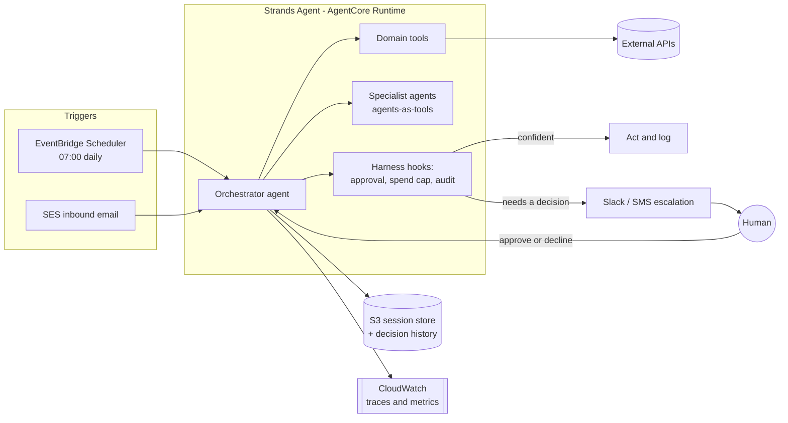

# Rules for building an "Agents for Humans" submission

**This file is the operating manual for the AWS *Agents for Humans* hackathon
(Strands Agents SDK, deadline 15 Sept 2026 05:30 GMT+5:30).** Drop it in your
repo root as `AGENTS.md`, or into `.kiro/steering/` so your coding agent loads it
on every turn. It assumes you have **never built an agent before** and takes you
to a submitted, judgeable project.

Read section 0, then work top to bottom. Every section ends with a **Gate** — a
command or artifact that proves the section is done. Do not move on until the
gate passes.

---

## 0. Read this first (5 minutes, saves you a week)

### 0.1 What the judges are actually buying

There are five scored criteria. They are not equally easy to win, and most
entries lose on the last two, not the first.

| Criterion | What it really measures | Where entries die |
|---|---|---|
| Technological Implementation | Did you use Strands *properly* — tools, hooks, multi-agent, sessions — not just `Agent()("hello")`? Live demo and/or AgentCore deployment lift this. | A single agent with one tool and no harness. |
| Design | Is it a **product** someone could use tomorrow, or a script with a `print()`? | No surface for the human: no UI, no channel, no notification. |
| Potential Impact | Is the problem real, named, and specific — and does the demo actually solve it? | "Helps with productivity." Nobody is a *someone*. |
| Creativity & Originality | Non-obvious use of the SDK plus evidence you understand the domain. | Chatbot #4,000. A wrapper around one API call. |
| Presentation | Does the 5-minute video show it working end to end, and state problem / who / why? | 4 minutes of architecture slides, 40 seconds of demo, no working run. |

### 0.2 The one sentence that decides your score

The brief says it plainly:

> the agent runs autonomously and only surfaces when there's a real decision to make.

So the thing you are building is **not a chat app**. It is a
**background worker with a taste for when to interrupt a human**. Judge-visible
consequences:

- Something must **trigger it that is not a human typing** — a schedule, an
  inbound email, a webhook, a file landing, a threshold crossing.
- It must **decide autonomously** in the common case, and produce a record of
  what it decided.
- It must **escalate** in the uncommon case, to a real channel (Slack, email,
  SMS, web inbox), with enough context that the human answers in one tap.
- The human's answer must **flow back in** and the agent must **finish the job**.

That loop — trigger → autonomous work → selective escalation → resume → done —
is the demo. Section 6 shows how to build it; section 9 shows how to film it.

**If your demo starts with a human typing a prompt, you have built the wrong
thing.** A chat box is allowed as a *secondary* surface. It cannot be the only one.

### 0.3 Read before you touch

Load the row you are working in before you write code. These are the primary
sources; everything in this file is derived from them and pinned to
`strands-agents` 1.54.x and `strands-agents-tools` 0.8.x (Feb 2026). The SDK ships
weekly — when this file and the docs disagree, **the docs win**.

| If you are doing… | Read first |
|---|---|
| first agent, install, credentials | [Python Quickstart](https://strandsagents.com/docs/user-guide/quickstart/python/) |
| custom tools | [Creating Custom Tools](https://strandsagents.com/docs/user-guide/build/creating-custom-tools/) |
| connecting existing tool servers | [Using MCP Tools](https://strandsagents.com/docs/user-guide/build/using-mcp-tools/) |
| remembering across runs | [Session Management](https://strandsagents.com/docs/user-guide/concepts/agents/session-management/) + [State](https://strandsagents.com/docs/user-guide/concepts/agents/state/) |
| approval gates, rate limits, audit | [Hooks](https://strandsagents.com/docs/user-guide/concepts/agents/hooks/) + [Lesson 5](https://strandsagents.com/docs/learning/control-your-agent-with-hooks/) |
| "only surfaces for a real decision" | [Human in the Loop](https://strandsagents.com/docs/user-guide/concepts/agents/interventions/human-in-the-loop/) + [Interrupts](https://strandsagents.com/docs/user-guide/concepts/interrupts/) |
| typed output you can act on | [Structured Output](https://strandsagents.com/docs/user-guide/concepts/agents/structured-output/) |
| more than one agent | [Multi-Agent](https://strandsagents.com/docs/user-guide/concepts/multi-agent/agents-as-tools/), [Swarm](https://strandsagents.com/docs/user-guide/concepts/multi-agent/swarm/), [Graph](https://strandsagents.com/docs/user-guide/concepts/multi-agent/graph/) |
| deploying (score booster) | [AgentCore Runtime — Python](https://strandsagents.com/docs/user-guide/deploy/deploy_to_bedrock_agentcore/python/) |
| traces, metrics, cost | [Observability](https://strandsagents.com/docs/user-guide/observability-evaluation/observability/) + [Metrics](https://strandsagents.com/docs/user-guide/observability-evaluation/metrics/) |
| safety, PII, guardrails | [Responsible AI](https://strandsagents.com/docs/user-guide/safety-security/responsible-ai/) + [Guardrails](https://strandsagents.com/docs/user-guide/safety-security/guardrails/) |
| proving it works | [Strands Evals](https://strandsagents.com/docs/user-guide/evals-sdk/quickstart/) |
| the rules, the prizes, the forms | the Devpost **Rules** and **Resources** tabs — including the **$50 AWS credit** request form |

**Install the docs MCP server on day 1.** It gives your coding agent the current
API instead of a hallucinated one, and it is the single highest-leverage 60
seconds of this build. Add to `~/.kiro/settings/mcp.json` (works the same in
Cursor, Claude Desktop, Cline):

```json
{
  "mcpServers": {
    "strands-agents": {
      "command": "uvx",
      "args": ["strands-agents-mcp-server"]
    }
  }
}
```

### 0.4 Hard requirements — the disqualification gate

Miss one of these and the rest does not matter. Copy this into your issue tracker
today, not on the 14th.

| # | Requirement | Done when |
|---|---|---|
| 1 | **New** agent built with Strands Agents SDK | `strands-agents` in your lockfile; repo history starts inside the contest window |
| 2 | Text description: what / who / how | pasted into Devpost, mirrored in `README.md` |
| 3 | **Public** code repo URL | opened in a logged-out browser and it loads |
| 4 | All source, assets, setup instructions to run it | a stranger runs `README` steps on a clean machine and reaches a working agent |
| 5 | **MIT or Apache-2.0**, visible in the repo **About** section | `LICENSE` file committed **and** GitHub sidebar shows the license name |
| 6 | `README.md` | section 9.2 template filled in |
| 7 | **Architecture diagram** | committed image *and* inlined in the README |
| 8 | Demo video, **max 5:00**, shows it working, covers problem / who / why | unlisted-or-public link that plays with sound for a stranger |
| 9 | **AWS Builder ID** | created at the AWS Builder Center, pasted into the submission |
| 10 | One track chosen: Everyday / Professional / Good Neighbor | stated in the first line of the README |
| 11 | *(optional, scores higher)* live demo link | URL a judge can click and use with no install |
| 12 | *(optional, bonus points)* `builder.aws.com` post, **"Agents for Humans" in the title**, published before deadline | link pasted into the submission |

Requirement 5 has two halves. A `LICENSE` file alone is not enough — the rules
say **visible in the About section**. On GitHub that means the file is named
exactly `LICENSE` (or `LICENSE.md`) and contains an unmodified MIT or Apache-2.0
text, so the sidebar renders "MIT License". Check it in the browser.

Requirement 8 is a hard cap. At 5:01 you are gambling with a rule-based rejection
for zero upside. Cut to 4:30.

**Gate 0:** requirements 1, 3, 5, 9, 10 satisfied *today*, with an empty repo and
a placeholder README. Do this before you write a line of agent code. It removes
the single most common way good projects lose: running out of clock on paperwork.

### 0.5 The 16-day plan

You have 16 days from 29 Aug. This is a working schedule, not an aspiration.
Whatever slips, **do not let day 12 slip** — a finished mediocre demo beats an
unfinished brilliant one, every time.

| Day | Deliverable | Gate |
|---|---|---|
| 1 | Repo, license, Builder ID, track, `$50` credit request submitted, one-paragraph problem statement naming a real person | Gate 0 |
| 2 | Env works; first agent runs; docs MCP installed | Gate 2 |
| 3 | Domain tools stubbed against fake data; typed outputs defined | Gate 3 |
| 4-5 | Real integrations behind the tool interfaces; secrets out of code | Gate 5 |
| 6 | Harness: hooks, approval gate, spend cap, audit log | Gate 4 |
| 7 | Memory across runs (sessions), so run N knows about run N-1 | Gate 3 |
| 8 | Trigger: it runs on a schedule or an event, unattended | Gate 6 |
| 9 | Escalation path round-trips: notify a human, get an answer, resume | Gate 6 |
| 10 | The human surface: inbox / dashboard / channel that shows what it did | Gate 8 |
| 11 | Deploy. AgentCore Runtime if you can, Lambda or Fargate if you cannot | Gate 7 |
| 12 | **Feature freeze.** Seed a believable demo dataset. Rehearse the run. | Gate 12 |
| 13 | README, architecture diagram, setup instructions verified on a clean clone | Gate 9 |
| 14 | Record and cut the video. Second take. Publish `builder.aws.com` post. | Gate 9 |
| 15 | Self-score against section 10. Fix the cheapest gaps. Submit. | Gate 10 |
| 16 | Buffer. Assume you will need it. | — |

**Gate 12 is the real gate.** On day 12, a stranger with your repo and no help
must reach a working agent, and your end-to-end run must succeed three times in a
row. Anything not working on day 12 gets cut from the demo, not fixed.

---

## 1. Zero to a running agent (day 2, 30 minutes)

Never built an agent? This is the whole thing. An agent is a loop: your prompt
plus your tools go to a model, the model either answers or asks to call a tool,
the SDK runs the tool and feeds the result back, repeat until it answers. Strands
owns that loop. You supply the tools, the prompt, and the guardrails.

```
input -> [ model reasons -> picks tool -> SDK runs tool -> result back ] -> answer
              ^_______________________________________________|
```

### 1.1 Python and the virtual environment

Python **3.10 or newer**. Check first, because 3.9 fails with confusing type
errors, not a clear message:

```bash
python3 --version     # need >= 3.10
```

```bash
mkdir -p my_agent && cd my_agent
python3 -m venv .venv
source .venv/bin/activate          # macOS/Linux
# .venv\Scripts\activate.bat       # Windows CMD
# .venv\Scripts\Activate.ps1       # Windows PowerShell
```

Your shell prompt should now show `(.venv)`. If it does not, activation failed and
every later step will install into the wrong place.

### 1.2 Install

```bash
pip install strands-agents strands-agents-tools
```

Pin what you got, so a judge on day 15 installs what you tested on day 2:

```bash
pip freeze | grep -i strands   # -> strands-agents==1.54.0, strands-agents-tools==0.8.7
```

Put exact pins in `requirements.txt`. "Latest" is not a version; the SDK ships
weekly and a minor bump on judging day is an avoidable way to lose.

```
strands-agents==1.54.0
strands-agents-tools==0.8.7
```

To see what is actually available: `pip index versions strands-agents`.

### 1.3 Credentials — pick one lane and stay in it

Strands defaults to the **Amazon Bedrock** model provider (currently Claude
Sonnet 4.x). Four ways to authenticate, in order of "least likely to leak":

| Lane | How | Use for |
|---|---|---|
| IAM role | attach a role to the Lambda / Fargate task / EC2 instance | anything deployed. No keys anywhere. |
| `aws configure` | writes `~/.aws/credentials` | local dev |
| Bedrock API key | `export AWS_BEARER_TOKEN_BEDROCK=...` | fastest start; keys are short-lived, so re-check before you record |
| Env vars | `AWS_ACCESS_KEY_ID`, `AWS_SECRET_ACCESS_KEY`, `AWS_SESSION_TOKEN` | CI, containers |

```bash
export AWS_REGION=us-west-2
```

**Enable model access before you write code.** A fresh AWS account can invoke
nothing. Bedrock console → **Model access** → *Manage model access* → enable the
Claude (or Nova) models you intend to use → wait a few minutes. Skipping this
produces `AccessDeniedException` on your first prompt and sends people
debugging their code for an hour.

Verify credentials and access without touching Python:

```bash
aws sts get-caller-identity
aws bedrock list-foundation-models --region "$AWS_REGION" \
  --query 'modelSummaries[?contains(modelId,`claude`)].modelId' --output table
```

**Never commit a key.** Not in a notebook, not in a screenshot, not in the demo
video. Judges read repos, and a leaked key is both a security failure and an
impact-score conversation you do not want. `.env` goes in `.gitignore` on commit
one; ship `.env.example` with empty values instead.

### 1.4 Your first agent

`agent.py`:

```python
from strands import Agent, tool
from strands_tools import calculator, current_time


@tool
def letter_counter(word: str, letter: str) -> int:
    """Count occurrences of a specific letter in a word.

    Args:
        word: The input word to search in.
        letter: The single letter to count.

    Returns:
        The number of occurrences of the letter in the word.
    """
    if len(letter) != 1:
        raise ValueError("letter must be a single character")
    return word.lower().count(letter.lower())


agent = Agent(tools=[calculator, current_time, letter_counter])

agent("What time is it, and how many r's are in strawberry?")
```

```bash
python -u agent.py
```

You should see it stream its reasoning, call two tools, and answer. That is a
working agent. Everything else in this file is about making it *reliable*,
*unattended*, and *presentable*.

### 1.5 Which model, and how not to break on judging day

```python
from strands import Agent

agent = Agent()
print(agent.model.config)   # {'model_id': 'global.anthropic.claude-sonnet-4-6'}
```

Three ways to choose, increasing control:

```python
# 1. string id
agent = Agent(model="global.anthropic.claude-sonnet-4-6")

# 2. provider instance, with knobs
from strands.models import BedrockModel

model = BedrockModel(
    model_id="global.anthropic.claude-sonnet-4-6",
    region_name="us-west-2",
    temperature=0.2,
    max_tokens=4096,
)
agent = Agent(model=model)

# 3. from the environment — do this one
import os

model = BedrockModel(
    model_id=os.environ["AGENT_MODEL_ID"],
    region_name=os.environ.get("AWS_REGION", "us-west-2"),
    temperature=0.2,
)
```

Rules that will save you:

- **Never hardcode a model id in more than one place.** Read it from env or a
  single config module. Entitlements differ per account and per region; the
  judge's account is not yours, and a hardcoded id that works for you fails
  silently for them until the first prompt.
- **Low temperature for decisions.** 0.0-0.3 for anything that extracts, classifies,
  routes, or decides. 0.7+ only for drafting prose the human will edit.
- **`max_tokens` too low is a silent killer.** The model needs room for tool calls
  *and* the answer. 4096 is a sane floor.
- **Cheap model for the boring hop.** Sub-agents that classify or summarise can
  run a small model (Nova Lite, Haiku-class) while the orchestrator runs a big
  one. This shows cost awareness, which reads as production thinking.
- Other providers are one extra install: `pip install 'strands-agents[anthropic]'`
  (or `openai`, `gemini`, `litellm`, `ollama`) and the matching `*_API_KEY`. Local
  models via **Ollama** are the offline-safe option if you fear a live network
  during recording. If your project is a *privacy* story, Ollama is not a fallback
  — it is the point, and you should say so.

### 1.6 Quiet the console and log properly

Agents print their stream to stdout by default. Great for dev, wrong for a
background worker.

```python
import logging

logging.getLogger("strands").setLevel(logging.DEBUG)   # SDK internals
logging.basicConfig(
    format="%(levelname)s | %(name)s | %(message)s",
    handlers=[logging.StreamHandler()],
)

agent = Agent(callback_handler=None)   # stop printing to stdout
result = agent("...")
print(result.message)
```

`callback_handler=None` plus your own logger is the unattended default. Keep the
streaming handler only on the interactive surface.

### 1.7 Read the result object

Every invocation returns an `AgentResult`. Learn these four fields now; three of
them appear in your demo.

| Field | What it is | Use it for |
|---|---|---|
| `result.message` | the final assistant message | what you show or send |
| `result.stop_reason` | why the loop ended — `"end_turn"`, `"interrupt"`, ... | **`"interrupt"` is how you detect "a human is needed"** |
| `result.structured_output` | your typed object, when you asked for one | acting on the output in code |
| `result.metrics` | tokens, latency, per-tool counts | cost slide, `get_summary()` |

```python
result = agent("...")
print(result.stop_reason)
print(result.metrics.get_summary())
```

**Gate 2:** `python -u agent.py` runs, calls a tool, and answers; `pip freeze`
pins are committed; `aws sts get-caller-identity` succeeds; `.env` is gitignored
and `.env.example` is committed.

---

## 2. Tools: the part that does the actual work

The model does not do your task. **Your tools do the task**; the model decides
which one to call and with what. So tool design *is* product design. Judges can
tell within ten seconds whether your tools are real or decorative.

### 2.1 The `@tool` contract

```python
from strands import tool


@tool
def reschedule_appointment(appointment_id: str, new_iso_time: str, reason: str) -> dict:
    """Move an existing appointment to a new time and notify the other party.

    Use this only after confirming the new time is free with `find_free_slots`.
    Does nothing and returns ok=False if the appointment is already cancelled.

    Args:
        appointment_id: The provider's appointment identifier, e.g. "apt_8813".
        new_iso_time: New start time as ISO-8601 with timezone, e.g.
            "2026-09-03T14:30:00-04:00".
        reason: One short sentence shown to the other party.

    Returns:
        {"ok": bool, "appointment_id": str, "new_iso_time": str, "notified": bool}
    """
```

**The docstring is the API the model programs against.** It is not a comment. It
is the single highest-return text in your repo. Every docstring must carry:

1. One line on what it does — in the domain's words, not yours.
2. **When to use it and when not to**, including ordering constraints.
3. Every argument with its **units and format**. "time" is a bug; "ISO-8601 with
   timezone" is a contract.
4. What comes back, including the failure shape.

Tool rules, each of which fixes a real failure you would otherwise hit at 2am on
day 13:

- **One verb per tool.** `manage_calendar(action=...)` makes the model guess.
  `find_free_slots`, `book_slot`, `cancel_booking` do not.
- **Return structured data, not prose.** `{"ok": false, "error": "slot_taken"}`
  lets the model retry correctly. `"Sorry, that didn't work"` makes it apologise
  to the user and stop.
- **Never raise for expected failures.** Return `ok=False` with a reason. An
  exception ends the useful part of the turn; a typed failure lets the model
  recover, which is exactly the resilience a judge is looking for.
- **Make writes idempotent.** Accept a caller-supplied key and no-op on a repeat.
  Models retry. Unattended agents retry on a schedule. Without idempotency your
  demo double-books, double-pays, or double-emails — live, on camera.
- **Split read from write.** Reads are free to auto-approve, writes are what you
  gate in section 4. If one tool does both, you cannot gate anything.
- **Keep returns small.** A 50k-character API response eats your context and your
  budget. Return the ten fields the decision needs. Summarise or offload the rest.
- **Cap the tool count per agent.** Past roughly 15-20 tools, selection accuracy
  falls off. That is your signal to split into sub-agents (section 5), not to
  write tool #21.

### 2.2 Build against fakes first

Do not start with the real Gmail/Plaid/Twilio integration. Start with the
interface and a fake that returns realistic fixtures:

```python
# tools/calendar.py
from strands import tool

from integrations import calendar_backend   # real or fake, chosen by env


@tool
def find_free_slots(day_iso: str, minutes: int) -> dict:
    """Find open slots of `minutes` length on a given day (ISO date, e.g. 2026-09-03)."""
    return {"ok": True, "slots": calendar_backend().free_slots(day_iso, minutes)}
```

```python
# integrations/__init__.py
import os


def calendar_backend():
    if os.environ.get("USE_FAKES", "1") == "1":
        from .fake_calendar import FakeCalendar
        return FakeCalendar()
    from .google_calendar import GoogleCalendar
    return GoogleCalendar()
```

Three payoffs, all of which matter more than they sound:

1. You build agent logic on day 3 instead of fighting OAuth consent screens.
2. Your demo is **reproducible** — same fixtures, same run, every take.
3. A judge can run your repo **without credentials for six third-party services**,
   which is requirement 4. This alone rescues more submissions than any clever
   prompt. Make `USE_FAKES=1` the default in `.env.example` and say so in the
   README.

Keep the real path working too, and show it once in the video. Fakes for
reproducibility, real for credibility.

### 2.3 Community tools: do not rebuild these

`strands-agents-tools` ships batteries. Import, do not reimplement.

| Tool | What you would otherwise write |
|---|---|
| `http_request` | any REST call, with auth |
| `file_read`, `file_write` | local artifacts, reports, caches |
| `use_aws` | any AWS API — S3, DynamoDB, SES, SNS, Scheduler |
| `python_repl` | ad-hoc data work (asks for confirmation; it executes code — treat as dangerous) |
| `code_interpreter` | sandboxed execution via AgentCore Code Interpreter |
| `agent_core_memory`, `mem0_memory` | long-term user memory across sessions |
| `retrieve` | Bedrock Knowledge Base RAG |
| `image_reader`, `generate_image` | read a photo of a bill; make a graphic |
| `tavily_search`, `exa_search` | live web search built for agents (own API key) |
| `browser` | drive a real Chromium page when there is no API |
| `use_computer` | desktop automation, last resort |
| `journal` | structured run logs |
| `a2a_client` | talk to other agents over Agent2Agent |
| `swarm`, `use_agent` | delegate to other models/agents from inside a run |

```python
from strands import Agent
from strands_tools import http_request, file_write, use_aws

agent = Agent(tools=[http_request, file_write, use_aws])
```

Optional extras need their own install:
`pip install "strands-agents-tools[mem0_memory, use_browser, use_computer]"`.

Two warnings worth heeding. **These tools are explicitly experimental** and several
grant real power — shell, filesystem, AWS APIs, browsers, desktops. And a few
(`shell`, `editor`, `calculator`, `think`, `retrieve`, `memory`, `environment`) are
**deprecated**; check the repo README before you build a centrepiece on one. Never
hand `shell` or `python_repl` to an unattended agent without the gate in section 4.

### 2.4 MCP: borrow someone else's tools

Model Context Protocol servers are pre-built tool bundles. Wiring one in is a
credible way to look integrated without writing ten clients.

```python
from mcp import StdioServerParameters, stdio_client
from strands import Agent
from strands.tools.mcp import MCPClient

aws_docs = MCPClient(
    lambda: stdio_client(
        StdioServerParameters(
            command="uvx", args=["awslabs.aws-documentation-mcp-server@latest"]
        )
    )
)

with aws_docs:
    agent = Agent(tools=aws_docs.list_tools_sync())
    agent("What are the S3 bucket naming rules?")
```

The **context manager matters**: the connection lives inside `with`, so build and
invoke the agent inside it. Calling the agent after the block exits fails with a
closed-transport error that looks nothing like its cause.

Multiple servers from one config file, transport auto-detected (`command` means
stdio, `url` means streamable-http), `${VAR}` interpolated from the environment,
`"disabled": true` skipped:

```python
clients = MCPClient.load_servers("mcp.json")
tools = [t for c in clients for t in (c.start(), c.list_tools_sync())[1]]
```

Do not let an agent connect to **arbitrary** MCP servers it discovers at runtime
(that is what the `mcp_client` *tool* enables). Pre-declare your servers. An agent
that can load remote code on a whim is a finding, not a feature.

### 2.5 Structured output: stop parsing prose

Anything your code has to act on should come back typed. This is the difference
between a demo that works and a demo that works *sometimes*.

```python
from typing import Literal

from pydantic import BaseModel, Field
from strands import Agent


class BillDecision(BaseModel):
    vendor: str
    amount_cents: int = Field(description="Amount in cents, never a float")
    due_date: str = Field(description="ISO-8601 date")
    action: Literal["pay_now", "schedule", "ask_human", "ignore"]
    confidence: float = Field(ge=0.0, le=1.0)
    reasoning: str = Field(description="One sentence the human will read")


result = agent(
    "Here is the bill text: ...",
    structured_output_model=BillDecision,
)

decision = result.structured_output
if decision.action == "ask_human" or decision.confidence < 0.8:
    escalate(decision)          # section 4
else:
    execute(decision)           # your tools
```

That `if` is your entire "only surfaces when there's a real decision" claim, made
concrete in four lines. Put a `confidence` and an explicit `ask_human` branch in
every decision model you define, and put this snippet on a slide.

Money in **integers of the minor unit**. Dates as **ISO-8601 strings**. Enums as
`Literal`, never free text. `Field(description=...)` on anything ambiguous — the
model reads those descriptions.

### 2.6 Memory: what makes it an assistant instead of a script

Two different things, and mixing them up is the most common architecture mistake
in agent projects.

**Conversation state within and across runs — session managers.** The SDK persists
messages and state for you:

```python
from strands import Agent
from strands.session.file_session_manager import FileSessionManager

agent = Agent(session_manager=FileSessionManager(
    session_id=f"user-{user_id}",
    storage_dir="./sessions",
))
agent("Hello!")   # persisted; a later process with the same id continues it
```

Swap the backend for deployment, nothing else changes:

```python
from strands.session.s3_session_manager import S3SessionManager

agent = Agent(session_manager=S3SessionManager(
    session_id=f"user-{user_id}", bucket="my-agent-sessions", prefix="prod/",
))
```

Needs `s3:PutObject`, `s3:GetObject`, `s3:DeleteObject`, `s3:ListBucket`.

The rules that bite:

- **One conversation per `session_id`.** Two live agents on the same
  session id + agent id silently interleave and corrupt history. There is no lock
  and no error. The default `agent_id="default"` makes this easy to do by
  accident — set an explicit `agent_id` per role.
- **Build a fresh `Agent` per request.** Construction is cheap and makes no model
  call. Reuse the **model provider** across requests (it builds an HTTP client in
  its constructor), not the agent.
- **In a Graph or Swarm, only the orchestrator gets a session manager.** Giving one
  to a member agent raises `ValueError`.
- **Direct edits to `agent.messages` are not persisted.** Use the conversation
  manager instead.

**Durable facts you own — agent state and your own store.** For "Priya prefers
morning appointments" or "the food bank's van holds 40 crates", use
`agent.state` (key-value, persisted with the session, invisible to the model
unless you inject it) or your own DynamoDB/SQLite table exposed through a tool.
For LLM-managed long-term memory, `agent_core_memory` (Bedrock AgentCore Memory)
or `mem0_memory` handle extraction and retrieval with strategies for preferences,
facts and summaries.

Keep long context under control with a conversation manager (sliding window or
summarising) so a long-running agent does not blow its context and your budget.

**Gate 3:** your agent calls at least three domain tools, returns one Pydantic
model with a `confidence`/`ask_human` branch, and a second process with the same
`session_id` demonstrably remembers the first run. Show the remembering in the
video — it is the cheapest "this is a real assistant" proof you have.

---

## 3. The harness: reliability you cannot get from a prompt

An agent left to a model's judgement is a probability distribution over outcomes.
Some of those outcomes spend your money, delete your files, or email your users
forty times. **Prompts are requests; hooks are guarantees.** Judges scoring
Technical Implementation are looking for exactly this distinction, and almost no
entry has it.

### 3.1 Hooks

A hook is deterministic code you register on a lifecycle event. It runs every
time, regardless of what the model decided.

```python
from strands.hooks import HookProvider, HookRegistry
from strands.hooks.events import BeforeToolCallEvent


class SpendCap(HookProvider):
    """Hard ceiling on money-moving tool calls per run."""

    def __init__(self, max_cents: int) -> None:
        self.max_cents = max_cents
        self.spent = 0

    def register_hooks(self, registry: HookRegistry) -> None:
        registry.add_callback(BeforeToolCallEvent, self.check)

    def check(self, event: BeforeToolCallEvent) -> None:
        if event.tool_use["name"] != "make_payment":
            return
        amount = int(event.tool_use["input"].get("amount_cents", 0))
        if self.spent + amount > self.max_cents:
            # The model sees this string as the tool result and adapts.
            event.cancel_tool = (
                f"Blocked: run cap of {self.max_cents} cents would be exceeded. "
                "Escalate to the human instead of retrying."
            )
            return
        self.spent += amount


agent = Agent(tools=[make_payment], hooks=[SpendCap(max_cents=20_000)])
```

Two mechanics carry most of the value:

- **`event.cancel_tool = "<message>"`** stops the call and hands that message back
  as the tool result. The model reads it and adjusts. This is how you enforce a
  rule without killing the run.
- **`event.interrupt()`** pauses the whole loop and returns control to your
  application, which is how approval gates work (next section).

Hooks stack. Register several for one event and they all run, so logging,
validation, and approval compose without knowing about each other.

The four hooks worth having in a hackathon build, and what each one prevents:

| Hook | Prevents |
|---|---|
| Approval gate on write tools | the agent doing something irreversible unattended |
| Per-tool call cap (`max_calls`) | a retry loop burning $40 of tokens overnight |
| Spend / quantity cap | a decimal-point bug becoming a real payment |
| Audit log on every tool call | "I cannot explain what it did" — the worst answer in a Q&A |

The call-count limiter, straight from the docs' Lesson 5 pattern:

```python
class LimitToolCounts(HookProvider):
    def __init__(self, max_calls: int = 5) -> None:
        self.max_calls = max_calls
        self.counts: dict[str, int] = {}

    def register_hooks(self, registry: HookRegistry) -> None:
        registry.add_callback(BeforeToolCallEvent, self.check)

    def check(self, event: BeforeToolCallEvent) -> None:
        name = event.tool_use["name"]
        self.counts[name] = self.counts.get(name, 0) + 1
        if self.counts[name] > self.max_calls:
            event.cancel_tool = f"Stop calling {name}; limit of {self.max_calls} reached."
```

Ship both of these on day 6. They cost twenty minutes and they are the difference
between "we thought about failure" and "we hoped for the best".

### 3.2 The audit log is a demo asset

Log every tool call to an append-only file or table: timestamp, tool, inputs,
outcome, whether a human approved, model, tokens. Then put it on screen in the
video for five seconds.

```python
import json
import logging
import time

audit = logging.getLogger("audit")


class AuditLog(HookProvider):
    def register_hooks(self, registry: HookRegistry) -> None:
        registry.add_callback(BeforeToolCallEvent, self.record)

    def record(self, event: BeforeToolCallEvent) -> None:
        audit.info(json.dumps({
            "ts": time.time(),
            "tool": event.tool_use["name"],
            "input": event.tool_use["input"],
        }))
```

Trust is the unspoken criterion in every "agent acts on my behalf" pitch. A judge
who can see the ledger believes the rest of your claims. A judge who cannot,
discounts all of them.

### 3.3 Human in the loop: the theme, in code

This is the mechanism the brief describes. Learn it properly; it is your headline
feature, not a nicety.

The drop-in handler gates tool calls and collects the human's answer however you
choose:

```python
from strands import Agent
from strands.vended_interventions.hitl import HumanInTheLoop

agent = Agent(
    tools=[read_calendar, send_email, make_payment],
    interventions=[HumanInTheLoop(
        allowed_tools=["read_calendar"],   # reads bypass approval
        classifier=True,                   # an LLM judges the rest per call
    )],
)
```

`allowed_tools` is the fast path for known-safe tools. `classifier=True` lets a
model decide per call whether *this* invocation is risky — a genuinely non-obvious
use of the SDK, and a good line in your Creativity narrative. You can override its
prompt (`LLMClassifierConfig(system_prompt=...)`) or replace it with your own
function returning `ClassifierResult(requires_human_in_the_loop=..., reason=...)`.

Three collection modes, and the right one depends on your surface:

**Interrupt/resume — use this for anything deployed.** The agent pauses and returns;
you notify the human out of band; you resume later, possibly in a different
process, which is why it pairs with a session manager.

```python
result = agent("Pay the outstanding bills")

if result.stop_reason == "interrupt":
    interrupt = result.interrupts[0]
    send_to_slack(interrupt.reason)          # or SMS, email, push, web inbox
    answer = wait_for_human_reply()          # minutes or hours later

    result = agent([{
        "interruptResponse": {
            "interruptId": interrupt.id,
            "response": answer,              # "yes" / "y" / True -> approved
        }
    }])
```

**Custom UI callback** — for a web app or a bot, when you can block on the answer:

```python
async def ask(prompt: str) -> str:
    return await ask_user_via_slack(prompt)

agent = Agent(tools=[...], interventions=[HumanInTheLoop(ask=ask)])
```

**Stdio** — CLI only, blocks on stdin. Fine for local dev, wrong for the video:

```python
agent = Agent(tools=[...], interventions=[HumanInTheLoop(ask="stdio")])
```

If your installed SDK predates `interventions`, build the same thing with a hook
that calls `event.interrupt()` on write tools — same semantics, ten more lines.
Check with `pip show strands-agents` and the docs MCP server rather than guessing.

**Design the escalation, not just the mechanism.** A judge sees the message, not
your code. Every escalation must answer, in one screen:

1. What did you decide to do, in one sentence?
2. Why are you asking me instead of just doing it?
3. What are the stakes — the amount, the deadline, what is irreversible?
4. What happens if I ignore this? (Have a default. Say what it is.)
5. One tap to approve, one to decline.

Bad: `Tool make_payment requires approval. Input: {...} (y/n)`.

Good: `Con Edison bill is $147.20, due Thursday. That is 38% above your
3-month average, so I did not pay it automatically. Pay now / Hold / Show me
the bill. If I hear nothing by Wednesday 6pm I will pay it to avoid the late
fee.`

The second one *is* the product. Write those strings by hand; do not let the model
improvise them.

### 3.4 Safety, and the small print that scores

- **Bedrock Guardrails** on the model provider for content filtering and PII
  handling: `BedrockModel(guardrail_id=..., guardrail_version=...)`. Cheap to add,
  and it is a real answer to "what stops it saying something harmful".
- **Confirm before irreversible.** Delete, pay, send, publish, cancel. All gated.
- **Least privilege IAM.** Scope the role to the buckets and tables you use. Do not
  deploy with an admin role and hope nobody looks at the template.
- **Redact secrets from logs and traces.** Your audit log will otherwise contain
  the account numbers you were being careful about.
- **Say what it will not do.** One README section listing the boundaries you
  deliberately enforced reads as maturity. Judges include AWS engineers who have
  shipped agents; they know the failure modes and they are checking whether you do.
- If you touch health, money, or minors, keep the agent **advisory** on anything
  regulated and put a one-line disclaimer in the UI and the video. This costs you
  nothing and removes a whole class of objection.

**Gate 4:** an unattended run tries a write, gets blocked by your gate, sends a
real notification to a real channel, waits, receives an approval, and completes.
Record this on day 9 as insurance, even if you re-record later.

---

## 4. Multi-agent: only when one agent stops working

Multi-agent is not a bonus point. It is a fix for three specific problems: too
many tools for reliable selection, conflicting system prompts, or a context window
under pressure. **If one agent with eight good tools solves your problem, ship
that** and spend the time on the demo. A judge would rather see one agent that
works than four that argue.

When you do need it, Strands gives you four patterns. Pick on shape of control,
not on vibes.

| Pattern | Who decides the order | Use when |
|---|---|---|
| **Agents as tools** | an orchestrator model, at runtime | one front door, several specialists, request-dependent routing |
| **Graph** | you, at build time | fixed pipeline with real dependencies and parallel branches |
| **Swarm** | the agents, by handing off | exploratory work where the path is not knowable up front |
| **Workflow** | you, as ordered tasks | plain sequential stages |

### 4.1 Agents as tools — the default for "one front door"

Wrap a specialist agent in a `@tool` and give it to a coordinator.

```python
from strands import Agent, tool

BILLS_PROMPT = "You are a bills specialist. Extract amounts and due dates. Never pay."


@tool
def bills_specialist(query: str) -> str:
    """Analyse a bill or statement and return amount, due date, and anomalies.

    Args:
        query: The bill text or a description of what to check.
    """
    specialist = Agent(system_prompt=BILLS_PROMPT, tools=[fetch_bill, parse_pdf])
    return str(specialist(query))


coordinator = Agent(
    system_prompt="Route each request to the right specialist. Never act directly.",
    tools=[bills_specialist, calendar_specialist, comms_specialist],
)
```

Cheap, obvious, and easy to debug because each specialist is independently
runnable. Give the specialist a small model and the coordinator a big one.

### 4.2 Graph — a pipeline you control

```python
from strands import Agent
from strands.multiagent import GraphBuilder

intake = Agent(name="intake", system_prompt="Normalise the incoming document...")
verify = Agent(name="verify", system_prompt="Check the numbers against history...")
policy = Agent(name="policy", system_prompt="Apply the household's rules...")
decide = Agent(name="decide", system_prompt="Produce the final decision...")

builder = GraphBuilder()
builder.add_node(intake, "intake")
builder.add_node(verify, "verify")
builder.add_node(policy, "policy")
builder.add_node(decide, "decide")

builder.add_edge("intake", "verify")
builder.add_edge("intake", "policy")     # verify and policy run in parallel
builder.add_edge("verify", "decide")
builder.add_edge("policy", "decide")

builder.set_entry_point("intake")
builder.set_execution_timeout(600)

graph = builder.build()
result = graph("Process the utility bill that just arrived")

print(result.status)
print([n.node_id for n in result.execution_order])
```

`GraphBuilder` also gives you `set_max_node_executions()` (essential if you add a
cyclic edge), `set_node_timeout()`, `reset_on_revisit()`, and conditional edges via
a `condition` function. Nodes can be agents *or* other graphs and swarms.

The parallel fan-out is a strong 20-second beat in the video: two branches running
at once, converging on one decision. And `result.execution_order` is a free
visualisation — print it.

### 4.3 Swarm — agents hand off to each other

```python
from strands import Agent
from strands.multiagent import Swarm

researcher = Agent(name="researcher", system_prompt="Find the relevant facts...")
planner = Agent(name="planner", system_prompt="Turn facts into a plan...")
reviewer = Agent(name="reviewer", system_prompt="Check the plan. Do not hand off.")

swarm = Swarm(
    [researcher, planner, reviewer],
    entry_point=researcher,
    max_handoffs=20,
    max_iterations=20,
    execution_timeout=900.0,
    node_timeout=300.0,
    repetitive_handoff_detection_window=8,
    repetitive_handoff_min_unique_agents=3,
)

result = swarm("Work out how to cover Saturday's delivery route with two vans down")
print(result.status, [n.node_id for n in result.node_history])
```

Members get handoff tools automatically and share working memory. **Set the limits.**
Left unbounded, two agents will hand a task back and forth until your budget
notices — which is what `repetitive_handoff_detection_window` exists to stop. Tell
the terminal agent explicitly not to hand off, or it will.

### 4.4 Choosing, honestly

Ask three questions:

1. **Do I know the steps in advance?** Yes → Graph or Workflow. No → Swarm.
2. **Is there one entry point with many possible paths?** → Agents as tools.
3. **Am I adding an agent because the system needs it, or because "multi-agent"
   sounds impressive?** If the second, delete it. Reviewers can tell, and a
   pointless orchestrator costs you on Design *and* Creativity.

The strongest structure for this hackathon is usually: **one orchestrator, two or
three specialists as tools, one graph for the fixed pipeline.** Explainable in
thirty seconds, defensible in Q&A, and it fits on one architecture slide.

Enable multi-agent logs while developing:

```python
import logging
logging.getLogger("strands.multiagent").setLevel(logging.DEBUG)
```

---

## 5. The autonomy loop — what actually wins this hackathon

Everything so far is table stakes. **This section is the differentiator.** The brief
asks for an agent that "runs autonomously and only surfaces when there's a real
decision to make". Four moving parts.

```
   TRIGGER              WORK                 JUDGE               SURFACE
 (not a human)   ->  tools + memory  ->  confident?  --yes-->  act, log
 schedule/event                            |                     |
                                           no                    v
                                           v                 digest / audit trail
                                    escalate to human ---> resume ---> act, log
```

### 5.1 Trigger: something other than a human starts the run

Pick one and make it real. Cron on a laptop counts if you show it firing.

| Trigger | Mechanism | Fits |
|---|---|---|
| Schedule | EventBridge Scheduler → Lambda; or `cron` locally | daily sweeps, weekly digests |
| Inbound email | SES receipt rule → S3/SNS → Lambda | bills, invoices, RSVPs |
| Webhook | API Gateway → Lambda | forms, GitHub, Stripe, Typeform |
| File arrival | S3 `ObjectCreated` → Lambda | statements, spreadsheets, photos |
| Threshold | scheduled poll comparing against stored state | inventory, prices, deadlines |
| Message | Slack/Discord event subscription | team-facing agents |

Minimum viable schedule, entirely in AWS, no servers:

```bash
aws scheduler create-schedule \
  --name daily-agent-sweep \
  --schedule-expression "cron(0 7 * * ? *)" \
  --schedule-expression-timezone "America/New_York" \
  --flexible-time-window '{"Mode":"OFF"}' \
  --target '{
    "Arn":"arn:aws:lambda:us-west-2:123456789012:function:my-agent",
    "RoleArn":"arn:aws:iam::123456789012:role/SchedulerInvokeRole",
    "Input":"{\"mode\":\"daily_sweep\"}"
  }'
```

In the video, **show the trigger**. A cron line, a schedule in the console, an
email arriving. Ten seconds. It converts "you typed a prompt" into "it woke up on
its own", which is the entire premise of your entry.

### 5.2 Work: idempotent, resumable, bounded

An unattended run has no human to notice it failed. So:

- **Idempotency keys on every write.** Re-running the 7am sweep at 7:04 must not
  send the email twice.
- **Persist progress**, not just results. Session manager plus your own "processed"
  table. A crash mid-run should resume, not restart.
- **Bound the run.** Timeouts, max iterations, spend cap. An unbounded overnight
  loop is a real bill and a real risk.
- **Never fail silently.** A run that dies must leave a record and, if it matters,
  tell the human. "It quietly stopped working three days ago" is the failure mode
  users of background agents actually fear.

### 5.3 Judge: the confidence policy is your product

This is the design decision judges will remember. Write it down explicitly — in
code and in the README:

```python
# Escalation policy. One place, deliberately readable.
AUTO_APPROVE_UNDER_CENTS = 5_000       # under $50: just do it
ANOMALY_RATIO = 1.25                   # 25% above the 3-month average: ask
MIN_CONFIDENCE = 0.80                  # below this: ask
ALWAYS_ASK = {"new_payee", "legal_document", "irreversible_cancel"}
NEVER_ASK = {"read_only", "draft_only"}
```

Then a one-line rationale per rule. This is what "makes a credible, specific case"
looks like in practice, and it takes ten minutes.

Tune it so the demo shows **both branches**: several things handled silently, one
thing escalated. If everything escalates, you built a notification app. If nothing
does, you built something nobody will trust with their money.

State the numbers out loud in the video: "it handled six of seven automatically and
asked me about the one that was 40% over normal". That sentence is worth more than
any architecture slide.

### 5.4 Surface: where the human meets it

The agent runs in the background, so the human needs somewhere to look. Pick one,
build it thin, make it real:

- **A channel** — Slack DM, Discord, SMS via SNS, email digest. Fastest to build,
  most natural for "pings me only when needed". Approve by replying or by button.
- **A one-page dashboard** — a list of what it did, what it is waiting on, one
  button per pending decision. A single HTML page served by FastAPI is enough.
- **A daily digest** — one message: handled, waiting, upcoming. Strongest fit for
  the "runs quietly" framing, and trivially screenshot-able.

Build exactly one, properly. Two half-built surfaces score worse than one that
works, and this is where the Design criterion is won or lost. A CLI-only project
with no human surface will not place, no matter how good the agent is.

**Gate 6:** with no human involved, a trigger fires, the agent runs, handles the
routine cases, escalates exactly one, notifies a real channel, waits, accepts the
reply, finishes, and logs everything. That is your demo. Everything after this is
packaging.

---

## 6. Deploy: the cheapest points on the board

The rules say it twice: AgentCore deployment **strengthens Technical
Implementation**, and a live demo link **scores higher**. Neither is required.
Both are a day's work at most. Do them on day 11, not day 15.

### 6.1 Option A — AgentCore Runtime via the CLI (recommended)

Amazon Bedrock AgentCore Runtime is managed, session-isolated compute for agents.
The `bedrock-agentcore` SDK wraps your function as an HTTP service, and the
AgentCore CLI does the packaging and deploying.

```bash
pip install bedrock-agentcore
```

`my_agent.py` — three lines around your existing agent:

```python
from bedrock_agentcore.runtime import BedrockAgentCoreApp
from strands import Agent

app = BedrockAgentCoreApp()
agent = Agent()


@app.entrypoint
def invoke(payload):
    """Handle one invocation."""
    result = agent(payload.get("prompt", "Hello"))
    return {"result": result.message}


if __name__ == "__main__":
    app.run()
```

Streaming variant, if your surface shows progress:

```python
@app.entrypoint
async def invoke(payload):
    async for event in agent.stream_async(payload.get("prompt", "")):
        yield event
```

Test locally before you deploy anything:

```bash
python my_agent.py
curl -X POST http://localhost:8080/invocations \
  -H "Content-Type: application/json" \
  -d '{"prompt": "Run the daily sweep"}'
```

Then the CLI:

```bash
npm install -g @aws/agentcore

agentcore create      # interactive scaffold: framework, model, config
cd myproject
agentcore dev         # local dev loop
agentcore deploy      # to AWS
agentcore invoke      # smoke-test the deployed runtime
```

**The CLI replaces the older `bedrock-agentcore-starter-toolkit`.** If you followed
a tutorial from last year, uninstall it or the two will fight:
`pip uninstall bedrock-agentcore-starter-toolkit`.

`agentcore create` generates roughly:

```
myproject/
├── agentcore/
│   ├── agentcore.json     # resource specs
│   └── aws-targets.json   # deployment targets
└── app/
    └── MyAgent/
        ├── main.py        # entry point — your agent goes here
        ├── pyproject.toml
        └── model/
```

### 6.2 Option B — your own container (full control)

Needed if you want custom routing, middleware, or a web UI in the same service.
AgentCore Runtime requires all four of these, and each one is a real failure if
missed:

| Requirement | Value |
|---|---|
| Platform | **`linux/arm64`** — an x86 image fails to start |
| Endpoints | **`POST /invocations`** and **`GET /ping`**, both mandatory |
| Port | **8080** |
| Registry | image in **ECR** |

```python
from datetime import datetime, timezone
from typing import Any

from fastapi import FastAPI, HTTPException
from pydantic import BaseModel
from strands import Agent

app = FastAPI(title="Agent Server", version="1.0.0")
strands_agent = Agent()


class InvocationRequest(BaseModel):
    input: dict[str, Any]


class InvocationResponse(BaseModel):
    output: dict[str, Any]


@app.post("/invocations", response_model=InvocationResponse)
async def invoke_agent(request: InvocationRequest) -> InvocationResponse:
    prompt = request.input.get("prompt", "")
    if not prompt:
        raise HTTPException(status_code=400, detail="missing 'prompt' in input")
    result = strands_agent(prompt)
    return InvocationResponse(output={
        "message": result.message,
        "timestamp": datetime.now(timezone.utc).isoformat(),
    })


@app.get("/ping")
async def ping() -> dict[str, str]:
    return {"status": "healthy"}
```

```dockerfile
FROM --platform=linux/arm64 ghcr.io/astral-sh/uv:python3.11-bookworm-slim
WORKDIR /app
COPY pyproject.toml uv.lock ./
RUN uv sync --frozen --no-cache
COPY agent.py ./
EXPOSE 8080
CMD ["uv", "run", "uvicorn", "agent:app", "--host", "0.0.0.0", "--port", "8080"]
```

```bash
docker buildx create --use
aws ecr create-repository --repository-name my-strands-agent --region us-west-2
aws ecr get-login-password --region us-west-2 \
  | docker login --username AWS --password-stdin "$ACCOUNT.dkr.ecr.us-west-2.amazonaws.com"
docker buildx build --platform linux/arm64 \
  -t "$ACCOUNT.dkr.ecr.us-west-2.amazonaws.com/my-strands-agent:latest" --push .
```

```python
import boto3

client = boto3.client("bedrock-agentcore-control", region_name="us-west-2")
resp = client.create_agent_runtime(
    agentRuntimeName="strands_agent",
    agentRuntimeArtifact={"containerConfiguration": {
        "containerUri": f"{ACCOUNT}.dkr.ecr.us-west-2.amazonaws.com/my-strands-agent:latest"
    }},
    networkConfiguration={"networkMode": "PUBLIC"},
    roleArn=f"arn:aws:iam::{ACCOUNT}:role/AgentRuntimeRole",
)
print(resp["agentRuntimeArn"], resp["status"])
```

Invoking it — note the session id length, which is a real and unhelpful error if
you get it wrong:

```python
import json

client = boto3.client("bedrock-agentcore", region_name="us-west-2")
resp = client.invoke_agent_runtime(
    agentRuntimeArn=arn,
    runtimeSessionId="a" * 40,   # must be 33+ characters
    payload=json.dumps({"input": {"prompt": "Run the daily sweep"}}),
    qualifier="DEFAULT",
)
print(json.loads(resp["response"].read()))
```

### 6.3 Option C — Lambda or Fargate

Perfectly acceptable, and often the better fit for a *scheduled* agent. Lambda
plus EventBridge Scheduler is the smallest thing that satisfies section 5.1. Watch
three things: the **15-minute** Lambda ceiling (long agent runs need Fargate or
Step Functions), package size (use a container image or a layer), and cold-start
latency if a human is waiting. The Strands docs have per-target guides for Lambda,
Fargate, App Runner, EKS, EC2, and Kubernetes.

### 6.4 The live demo link

Any URL a judge can click and use without installing anything:

- the deployed AgentCore Runtime plus a tiny hosted page that calls it,
- a Slack workspace they can join, or a Discord bot in a public server,
- a public dashboard with seeded demo data and a "trigger a run" button.

Two non-negotiables: **it must work when they click it**, and it must **not require
their credentials**. A broken live link is worse than no live link — it converts a
bonus into a demonstrated failure. Seed it with believable data, give it a reset
button, and re-check it the morning of the deadline. If you cannot keep it up,
drop the link and lean on the video.

Cost control: you have **$50 in AWS credits** (request form on the Resources tab —
do it on day 1, not when you need it). Set a **budget alarm** at $20 anyway. Do
not leave a swarm looping on a schedule after the deadline; delete the schedule
when you submit, *after* the judging window if the live link depends on it.

### 6.5 Observability

Two layers. The SDK's own metrics are free and instant:

```python
result = agent("...")
print(result.metrics.get_summary())   # tokens, latency, per-tool counts, cycles
```

Screenshot that for the video. "Average run: 11 seconds, 8,400 tokens, $0.03" is a
sentence that makes an AWS judge nod.

For traces in CloudWatch, use ADOT auto-instrumentation:

```
aws-opentelemetry-distro>=0.10.1
boto3
```

```bash
opentelemetry-instrument python my_agent.py
```

```dockerfile
CMD ["opentelemetry-instrument", "uvicorn", "agent:app", "--host", "0.0.0.0", "--port", "8080"]
```

One-time setup: CloudWatch console → **Application Signals (APM) → Transaction
search → Enable**, and tick "ingest spans as structured logs". Then CloudWatch →
**GenAI Observability** shows your agent's traces, spans, latency and token usage.
This also works for agents running **outside** AgentCore.

To tie traces to a user session:

```python
from opentelemetry import baggage, context

context.attach(baggage.set_baggage("session.id", session_id))
```

If you have time on day 12, run **Strands Evals** (`strands-agents-evals`) over ten
recorded cases and put the pass rate in the README. Almost nobody does this, and
"84% goal success across 25 scenarios" is the single most credible number you can
put in front of a judge.

**Gate 7:** the agent runs somewhere that is not your laptop, and you have either
a clickable live URL or a recorded invocation of the deployed runtime.

---

## 7. Track playbooks

Three tracks, identical prize ladders ($5k / $3k / $2k), plus one $10k Grand Prize
across all of them. So **pick the track where your idea is strongest, not the one
you assume is least crowded.** Everyday will be the most entered; Good Neighbor
will be the least, and its entries are usually weakest on Technical
Implementation — which is an opening if you can build.

### 7.0 Choosing an idea — the four-question filter

Answer all four in writing before you commit. If you cannot, the idea is not ready.

1. **Name the person.** Not "busy professionals". "My mother, who runs a two-chair
   salon and re-types the same appointment three times." If you cannot name someone,
   your Potential Impact score is already capped.
2. **What is the repetition?** How many times a week, how many minutes each? Ten
   minutes a day is 60 hours a year. Say the number.
3. **What is the judgement call?** The moment a human must decide. No judgement
   call means no escalation, which means you are building automation, not an agent —
   and you will not match the brief.
4. **Can you demo the whole loop in 4 minutes with fake data?** If the loop needs
   three weeks of history to be interesting, redesign it now, not on day 13.

Then sanity-check the *shape*: the strongest entries handle something **boring,
recurring, and consequential**. Boring means the audience is real. Recurring means
the agent earns its keep. Consequential means the escalation matters.

### 7.1 Everyday Agents

Home, money, health, errands, family. Highest entry count, so originality is the
scarce resource.

**Patterns that work**

- **The anomaly watcher.** Reads recurring bills or statements, learns the normal
  range, pays or files the routine ones, escalates only outliers with the
  comparison shown. Hits the brief exactly.
- **The paperwork memory.** Renewals, warranties, registrations, school forms. It
  knows what expires when, drafts the form from stored details, asks only for the
  one field it cannot infer, then files the confirmation.
- **The multi-party scheduler.** Three calendars and a phone tree collapsed into one
  approval. Escalates the trade-off, not the mechanics.
- **The medication and appointment shepherd.** Keep it advisory on anything clinical;
  the value is the logistics and the follow-up, not the medicine.
- **The handoff coordinator.** Two working parents, one child, a week of pickups.
  Reconciles calendars, proposes the split, texts both, escalates the conflict.

**What loses:** a chatbot with a to-do list. A recipe generator. A "personal
assistant" that only answers questions. Anything where the demo is you typing.

**The unfair advantage in this track:** make it about *someone specific and not
you*. An agent built for a grandparent, a newly-arrived immigrant filling out
unfamiliar forms, or a carer juggling two households carries an impact story that
a generic productivity agent cannot buy.

### 7.2 Professional Agents

"Dramatically better at the work they already do." The bar is *dramatically*.
Target the repetitive, judgement-heavy hour, not the whole job.

**Patterns that work**

- **The intake normaliser.** Inbound leads, tickets, referrals, applications arrive
  in six formats; the agent extracts a typed record, files it, drafts the first
  reply, and escalates the ambiguous ones with the ambiguity named.
- **The follow-up engine.** Small businesses lose money to unsent follow-ups. The
  agent tracks what is owed, drafts in the owner's voice, sends the routine ones,
  and asks before the sensitive one.
- **The compliance pre-checker.** Runs the checklist a human would run at 6pm,
  flags only what fails, cites the rule. Boring, valuable, easy to verify on camera.
- **The estimate/quote assembler.** Photos and notes in, a priced draft out, with
  the assumptions listed and the risky line items flagged for the human.
- **The handover brief.** Reads yesterday's activity across tools and produces the
  one page the next shift actually needs.

**Choose a niche you know.** "Small law firm intake" beats "business automation".
Domain specificity is the *only* reliable way to score on Creativity here, because
the judges know when a workflow is real.

**What loses:** another code reviewer. A meeting summariser with no action.
Anything where the "professional" is an abstraction and the workflow is invented.

### 7.3 Good Neighbor Agents

Groups, not individuals — neighbourhoods, nonprofits, food banks, schools,
libraries, small local orgs. Lowest expected competition, highest ceiling on
Impact, and it is where a multi-agent design earns its keep because there are
genuinely multiple stakeholders.

**Patterns that work**

- **The volunteer matcher.** Shifts, skills, availability, no-shows. Auto-fills the
  routine gaps, escalates the Saturday hole to the coordinator with the two best
  options and the phone numbers.
- **The surplus router.** A donation arrives; the agent works out who can take it
  before it spoils, accounting for storage, transport, and dietary constraints, and
  asks the coordinator only when it must choose between two good options.
- **The grant and deadline watcher.** Small nonprofits miss filings because nobody
  owns the calendar. The agent watches, drafts, and escalates with the stakes
  spelled out.
- **The multilingual comms desk.** One announcement, five languages, three
  channels, correct tone per channel. Escalates anything sensitive before sending.
- **The mutual-aid dispatcher.** Requests in, capacity known, matches made, humans
  looped in on anything involving vulnerable people.

**Two things to nail in this track.** First, **name the org** — even a fictional but
specific one with real constraints ("a food bank with one van and 40 crates of
cold storage") beats "nonprofits". Second, respect **privacy**: you are handling
data about people who did not choose to be in your demo. Use synthetic data, say
so, and make data minimisation a design point. That is a differentiator, not a
disclaimer.

**What loses:** a donation-page generator. A "community chatbot". Anything that
would need a legal review before a real org could touch it.

### 7.4 Cross-track anti-patterns

Every one of these has sunk otherwise-good entries. None of them are subtle from
the outside.

| Anti-pattern | Why it costs you |
|---|---|
| Chat-first | contradicts the brief's central premise |
| One tool, one API call | Technical Implementation floor |
| Demo is a terminal only | Design floor; no product experience |
| Everything escalates | you built notifications, not autonomy |
| Nothing escalates | nobody trusts it with anything that matters |
| Fake screenshots, no live run | Presentation collapse; judges look for the run |
| Multi-agent for its own sake | reads as padding; costs Creativity *and* Design |
| Demo needs 6 API keys to run | fails requirement 4 outright |
| 7-minute video | rules violation, zero upside |
| No license visible in About | rules violation, and it is a 2-minute fix |
| Repo has secrets in it | security failure in front of AWS engineers |
| README written in the last hour | it shows, and it is the first thing they read |

---

## 8. The submission package

Judges spend minutes, not hours. Order of contact is almost always: **video →
README → repo → live demo.** Optimise in that order.

### 8.1 Repo layout

Legible beats clever. A judge should understand the shape in fifteen seconds.

```
my-agent/
├── README.md                  # the pitch + setup, section 8.2
├── LICENSE                    # MIT or Apache-2.0, exact text
├── ARCHITECTURE.md            # optional; diagram + flow if README gets long
├── requirements.txt           # pinned
├── .env.example               # every var, no values
├── .gitignore                 # .env, .venv, __pycache__, sessions/
├── docs/
│   └── architecture.png       # the required diagram
├── src/
│   ├── agent.py               # orchestrator: prompt, tools, hooks, interventions
│   ├── config.py              # model id, thresholds, escalation policy
│   ├── tools/                 # one module per capability
│   ├── integrations/          # real clients + fakes behind one interface
│   ├── harness/               # hooks: approval, caps, audit
│   ├── surface/               # dashboard / bot / digest
│   └── triggers/              # scheduler, webhook, email handlers
├── fixtures/                  # seeded demo data (synthetic, committed)
├── evals/                     # optional: recorded cases + results
└── scripts/
    ├── demo.sh                # one command that runs the whole loop
    └── seed.sh                # reset to a known demo state
```

`scripts/demo.sh` is not decoration. It is what a judge runs, and it is what you
run before each video take. One command, known state, full loop.

### 8.2 README template

Fill every bracket. This is your highest-traffic artifact after the video.

````markdown
# <Name> — <one line: what it does for whom>

**Track:** Everyday Agents | Professional Agents | Good Neighbor Agents
**Built with:** Strands Agents SDK <version> · Amazon Bedrock · <AgentCore Runtime>
**Live demo:** <url or "n/a">  ·  **Demo video:** <url>  ·  **AWS Builder ID:** <id>

## The problem

<Two or three sentences. Name a real person and a real, countable repetition.
"Maria runs a two-van food bank. Every Monday she spends 90 minutes re-matching
volunteers to shifts after weekend no-shows, by phone.">

## Who it's for

<The specific audience. Say how many of them there are if you know.>

## What it does

<Bullets, in the order the agent does them. Lead with the trigger, not the chat.>

- Wakes at 07:00 daily via EventBridge Scheduler — no human involved
- Reads <source>, extracts a typed record, checks it against <history>
- Handles the routine cases autonomously: <specifically what>
- Escalates only when <the explicit rule>, via <channel>, with <what context>
- Resumes on the human's reply and completes the action
- Logs every tool call to an audit trail

## Why it matters

<The stakes. Time saved, money at risk, deadline missed, person underserved.>

## Architecture


<Six to ten lines of prose walking the diagram. Name the Strands features you
used and say why each one was necessary.>

## How it uses Strands Agents

| Feature | Where | Why |
|---|---|---|
| `@tool` custom tools | `src/tools/` | <n> domain tools |
| Hooks (`BeforeToolCallEvent`) | `src/harness/` | approval gate, spend cap, audit log |
| `HumanInTheLoop` interventions | `src/agent.py` | selective escalation with a risk classifier |
| Structured output (Pydantic) | `src/schemas.py` | typed decisions with confidence |
| Session management | `src/agent.py` | memory across unattended runs |
| Multi-agent (<pattern>) | `src/agents/` | <why one agent was not enough> |
| MCP tools | `mcp.json` | <server> for <capability> |
| Metrics / traces | CloudWatch GenAI Observability | latency, tokens, cost per run |

## The escalation policy

<The actual thresholds and one line of rationale each. This is the design
decision that matters most; do not bury it.>

## Quickstart (works with no third-party credentials)

```bash
git clone <repo> && cd <repo>
python3 -m venv .venv && source .venv/bin/activate
pip install -r requirements.txt
cp .env.example .env          # USE_FAKES=1 by default
export AWS_REGION=us-west-2   # plus Bedrock credentials
./scripts/seed.sh
./scripts/demo.sh             # runs the full autonomous loop on fixtures
```

<Then a second block for the real integrations, clearly marked optional.>

## Configuration

| Variable | Required | Default | Purpose |
|---|---|---|---|

## What it deliberately will not do

<Boundaries you enforce in code. Reads as maturity; answers the safety question
before it is asked.>

## Limitations and next steps

<Honest. Judges trust honest.>

## License

MIT (see `LICENSE`).
````

Two rules for the README. **The quickstart must work on a clean clone** — test it
by cloning into `/tmp` on day 13 and following your own steps literally, from a
shell with no environment. And **no lies**: an aspirational feature list that the
demo contradicts is worse than a short honest one.

### 8.3 Architecture diagram

Required. It must show the four things a judge is looking for: the **trigger**, the
**agent and its tools**, the **escalation path to a human**, and the **data that
persists**. Boxes and arrows. Not a UML class diagram.

Draw it in whatever you like (draw.io, Excalidraw, Mermaid, `diagram` tool from
`strands-agents-tools`), export a PNG, commit it, and inline it in the README.
Mermaid renders natively on GitHub, so it costs nothing to include both:



Label the escalation arrow with the *actual rule* ("> $50 or > 25% above average"),
not just "if needed". That single label communicates more of your design than the
rest of the diagram combined.

### 8.4 The demo video — the highest-leverage 4 minutes of the whole project

Hard cap 5:00. **Target 4:00-4:30.** More entries lose on the video than on the
code, and the reason is always the same: too much talking, not enough working
software.

Structure that maps 1:1 onto the Presentation criteria:

| Time | Beat | Notes |
|---|---|---|
| 0:00-0:20 | **The problem, as a person.** "Maria spends 90 minutes every Monday re-matching volunteers by phone." | No title card longer than 3 seconds. No logo animation. |
| 0:20-0:35 | **Who it's for, and why it matters.** The stakes in one sentence. | Say the number. |
| 0:35-0:50 | **Architecture, once, briefly.** The one diagram, 15 seconds, narrated. | Do not walk every box. |
| 0:50-3:30 | **The working demo.** This is the video. | See below. |
| 3:30-3:50 | **Proof it is real.** Audit log, metrics summary, deployed runtime or live URL. | 20 seconds of receipts. |
| 3:50-4:15 | **What's next + close.** One honest limitation, one next step. | Confidence, not hype. |

Inside the demo block, in this order:

1. **Show the trigger fire with no human input.** The schedule, the arriving email,
   the webhook. 10 seconds. This is the moment that proves the premise.
2. **Show it handling the routine cases.** Narrate the count: "six of these it
   files itself".
3. **Show the escalation arrive** on a real phone or a real Slack. Read the message
   out loud — the message *is* the product.
4. **Approve it on camera.** One tap.
5. **Show the agent resume and finish**, and show the resulting state change (the
   payment made, the shift filled, the email sent).
6. **Show the memory.** Trigger a second run and show it behaving differently
   because of what it learned in the first.

Production notes, all learned the hard way:

- **Record the terminal and the phone side by side** if you can. Split screen sells
  "background agent" better than any narration.
- **Voiceover beats a face.** Nobody scores you on being on camera; the rules say
  so explicitly. Script it, read it, re-record the one line you fluff.
- **Seed the data first** so the run is fast and legible. A judge will not wait 40
  seconds for an API. Cut dead air ruthlessly, or speed it up with a visible
  timestamp so it is not deceptive.
- **Never fake a result.** If a step is mocked, say "using a synthetic inbox here".
  Judges have seen thousands of demos and they can smell a fabricated screenshot.
  Honesty here is free; getting caught is fatal.
- **Test the link logged out**, with sound, on a phone. Unlisted YouTube is fine.
  A private or region-locked video is a zero.
- **Captions or clear audio.** Some judges will watch muted.

Write the script before you record. Two takes minimum. Your first take is always
40 seconds too long and buries the demo.

### 8.5 The bonus post on builder.aws.com

Bonus points, explicitly. Cheap to earn, and you can submit more than one.

Requirements: published publicly **before the deadline**, covers your build journey
and your use of AWS, and has **"Agents for Humans" in the title**.

An outline that writes itself in an hour, because you already have the material:

1. The problem and the person (lift from the README).
2. Why an agent rather than a script — the judgement call.
3. The architecture, and one decision you got wrong first.
4. The Strands feature that surprised you — the risk classifier, hooks cancelling a
   tool, session resume across processes.
5. What AWS services you used and what each one bought you.
6. Metrics: runs, tokens, latency, cost per run.
7. What you would build next.
8. Link the repo and the video.

Write it on day 14 while the details are fresh, publish immediately, and paste the
link into the submission. Do not leave it for the last hour — the post has to be
live *before* the deadline, not merely written.

---

## 9. Score yourself before they do

Day 15, before you submit. Be harsh; a generous self-score buys you nothing. Total
below 40 means fix the cheapest gaps first — and the cheapest gaps are almost
always README, diagram, and video structure, not code.

### 9.1 Technological Implementation (/10)

| Points | Evidence |
|---|---|
| +2 | Working Strands agent with 3+ real custom `@tool` functions |
| +1 | Structured output driving actual code paths |
| +1 | Session/state persistence across separate processes |
| +2 | Harness: hooks for approval, caps, and audit |
| +1 | `HumanInTheLoop` or interrupt-based escalation that round-trips |
| +1 | Multi-agent where it is genuinely justified |
| +1 | Deployed: AgentCore Runtime, Lambda, or Fargate |
| +1 | Live demo link that works, or traces/metrics in CloudWatch |

### 9.2 Design (/10)

| Points | Evidence |
|---|---|
| +3 | A human surface exists and is usable: dashboard, channel, or digest |
| +2 | Escalation messages are written for a human, with a default if ignored |
| +2 | Runs unattended end to end; no prompt typed to start it |
| +1 | Errors surface as something a person can act on |
| +1 | Setup works on a clean clone with no third-party credentials |
| +1 | Coherent from trigger to outcome — no orphan features |

### 9.3 Potential Impact (/10)

| Points | Evidence |
|---|---|
| +3 | A named, specific audience — not a demographic |
| +2 | The repetition is quantified (times per week, minutes each) |
| +2 | The demo solves the stated problem, not a proxy for it |
| +2 | Plausibly usable by a real person next week |
| +1 | Honest limitations stated |

### 9.4 Creativity & Originality (/10)

| Points | Evidence |
|---|---|
| +3 | Not a chatbot, not an obvious wrapper |
| +3 | Domain understanding a non-practitioner could not fake |
| +2 | A non-obvious use of the SDK (risk classifier, conditional graph, agent-designed escalation) |
| +2 | The escalation policy itself is a considered design artifact |

### 9.5 Presentation (/10)

| Points | Evidence |
|---|---|
| +3 | Video shows the full loop working, unedited enough to be believable |
| +2 | Problem / who / why stated in the first 40 seconds |
| +2 | Under 5:00, ideally 4:15 |
| +1 | Architecture explained once, clearly, briefly |
| +1 | Audio is intelligible; text on screen is readable |
| +1 | README matches what the video shows |

### 9.6 The five questions a judge will ask

Have a one-sentence answer to each. If any answer is "it doesn't", that is your
next task, not a talking point to finesse.

1. What starts this without a human?
2. What does it decide on its own, and what does it refuse to decide?
3. What stops it doing something expensive or irreversible?
4. What does it remember, and where is that stored?
5. Could I run this myself right now?

---

## 10. Debugging: the errors you will actually hit

| Symptom | Cause | Fix |
|---|---|---|
| `AccessDeniedException` on first prompt | model access not enabled in Bedrock | Bedrock console → Model access → enable → wait a few minutes |
| `AWS credentials not found` | no credential lane configured | `aws configure`, or `export AWS_BEARER_TOKEN_BEDROCK=...` |
| `ValidationException` naming a model | model id not available in that region/account | `aws bedrock list-foundation-models`; move the id to env |
| `Module 'strands.models.anthropic' not found` | provider extra not installed | `pip install 'strands-agents[anthropic]'`, restart the interpreter |
| Tool never gets called | vague docstring, or tool not in `tools=[...]` | rewrite the docstring with when-to-use; check registration |
| Tool called with wrong arguments | ambiguous parameter docs | add units and an example value to every `Args:` entry |
| Answer truncated mid-tool-call | `max_tokens` too low | raise to 4096+ |
| Same tool called in a loop | model retrying a failure it cannot see | return typed `{"ok": false, "error": ...}`; add the call-count hook |
| MCP tools vanish / transport closed | agent used outside the `with` block | build *and* invoke inside the context manager |
| Session history interleaved or duplicated | two live agents on one `session_id`+`agent_id` | unique session per conversation, explicit `agent_id` per role |
| `ValueError` adding an agent to a Graph/Swarm | member agent has its own session manager | only the orchestrator gets one |
| Direct edits to `agent.messages` disappear | those are not persisted | use the conversation manager |
| Swarm never terminates | no handoff bounds | set `max_handoffs`, `max_iterations`, `execution_timeout`; tell the last agent not to hand off |
| Graph runs forever | cyclic edge, no ceiling | `set_max_node_executions()` and `set_execution_timeout()` |
| AgentCore container will not start | image is x86, or endpoints missing | build `--platform linux/arm64`; expose `POST /invocations` and `GET /ping` on 8080 |
| `invoke_agent_runtime` rejects the session id | shorter than 33 characters | use a longer id |
| AgentCore CLI behaves oddly | old starter toolkit installed | `pip uninstall bedrock-agentcore-starter-toolkit` |
| No traces in CloudWatch | Transaction Search not enabled, or not run under ADOT | enable it; launch with `opentelemetry-instrument` |
| Costs climbing overnight | unbounded scheduled run | spend cap hook, budget alarm, delete the schedule when done |
| Demo works locally, fails deployed | env vars or IAM missing in the target | diff the env; check the execution role; read CloudWatch logs |

Two habits that will save you a day each: turn on `logging.getLogger("strands")` at
DEBUG the first time anything is strange, and read `result.stop_reason` before
assuming the model misbehaved — half of "it just stopped" is an interrupt you
forgot you registered.

---

## 11. Submission day checklist

Work down it. Do not skip a line because you are sure.

**The repo**

- [ ] Public — verified in a logged-out browser
- [ ] `LICENSE` present, MIT or Apache-2.0, **and the About sidebar shows it**
- [ ] `README.md` complete, quickstart tested on a fresh clone in `/tmp`
- [ ] Architecture diagram committed and inlined
- [ ] `requirements.txt` pinned to exact versions
- [ ] `.env.example` committed; `.env` gitignored
- [ ] **No secrets** in code, history, fixtures, or screenshots
- [ ] `scripts/demo.sh` runs the full loop with `USE_FAKES=1`
- [ ] Repo history is inside the contest window

**The video**

- [ ] Under 5:00
- [ ] Problem / who / why in the first 40 seconds
- [ ] Trigger fires with no human input, on camera
- [ ] Routine cases handled autonomously, on camera
- [ ] One escalation delivered, read out, approved, resumed, completed
- [ ] Audit log or metrics shown
- [ ] Plays for a stranger, with sound, on a phone
- [ ] Link is public or unlisted, not private

**The submission form**

- [ ] Track selected, matching the README
- [ ] Text description: what it does, who it's for, how it works
- [ ] Repo URL
- [ ] Video URL
- [ ] **AWS Builder ID**
- [ ] Live demo link, if you have one, re-tested this morning
- [ ] `builder.aws.com` post link — published, public, "Agents for Humans" in the title
- [ ] Submitted with hours to spare, not minutes

**Housekeeping**

- [ ] Budget alarm still set
- [ ] Any schedule you no longer need is deleted
- [ ] Anything the live demo depends on stays up through judging

---

## 12. The short version

If you read nothing else:

1. **Day 1: repo, license, Builder ID, credits.** Paperwork loses more projects than code.
2. **Build a background worker, not a chatbot.** Something other than a human starts it.
3. **Tool docstrings are the API.** Write them like documentation, because they are.
4. **Type your decisions**, with a `confidence` field and an explicit `ask_human` branch.
5. **Hooks, not hopes.** Approval gate, spend cap, audit log. Twenty minutes, enormous payoff.
6. **The escalation message is the product.** Write those strings by hand.
7. **One surface, built properly.** Slack, a page, or a digest. Not a CLI.
8. **Deploy something.** AgentCore if you can, Lambda if you cannot.
9. **Feature freeze day 12.** Then rehearse the run until it succeeds three times running.
10. **Spend real time on the 4-minute video.** It is the artifact that is judged.

Ship the loop. Show it working. Name the human it helps.
